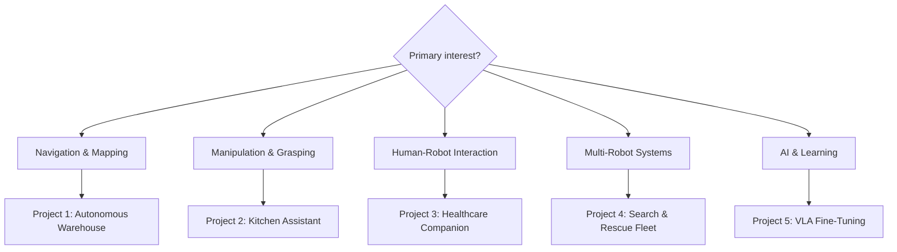
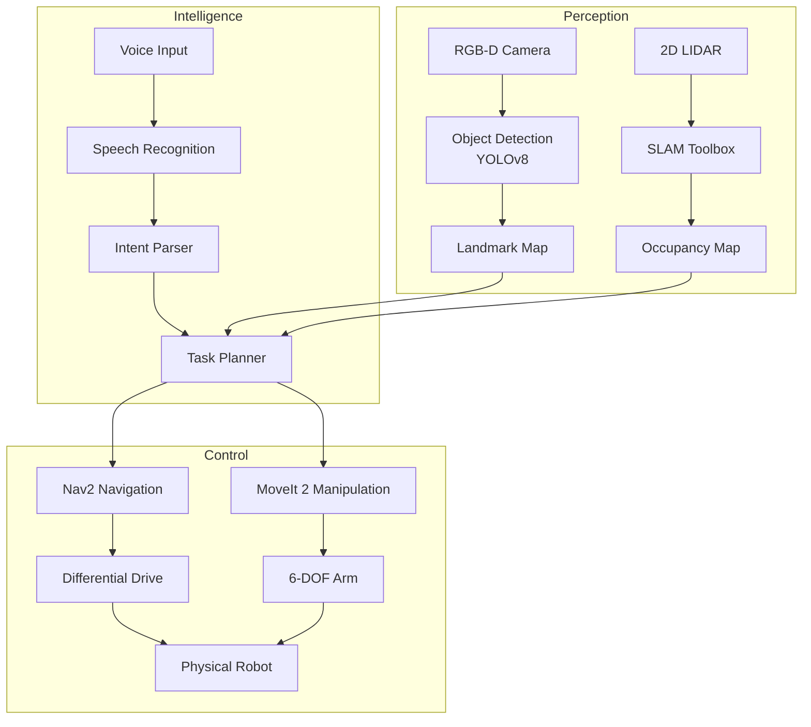
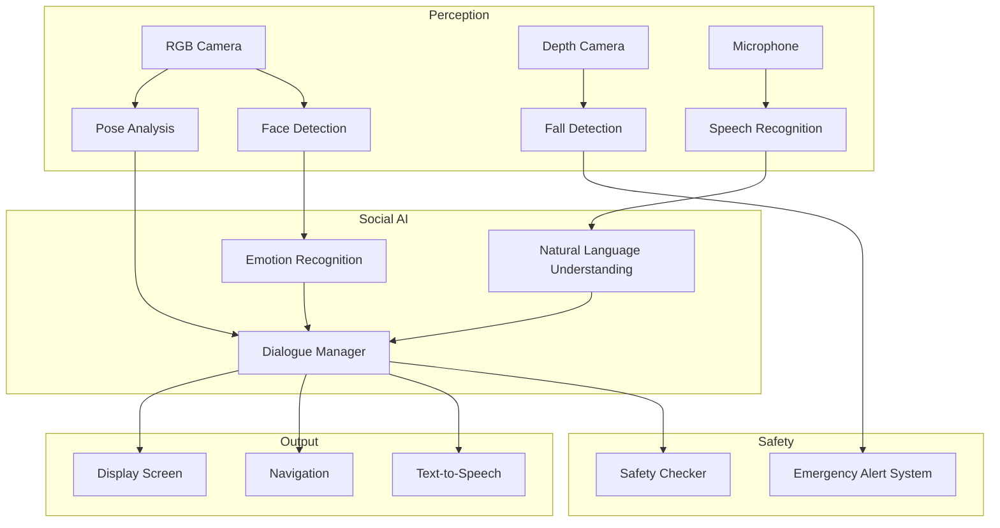
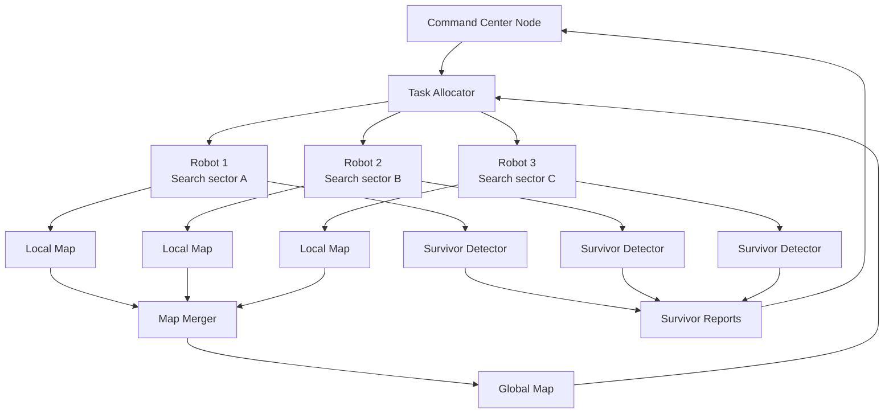

# Capstone Project Ideas

This chapter presents five detailed capstone project ideas that integrate all the technologies covered in this book: ROS 2, Gazebo/Isaac Sim, VLA models, and hardware deployment. Each project is described with difficulty level, required components, implementation phases, and expected outcomes.

## Project Selection Framework



## Project 1: Autonomous Warehouse Assistant

**Difficulty**: Intermediate | **Duration**: 10-12 weeks | **Team size**: 2-4

### Problem Statement

Design and implement an autonomous mobile manipulator that navigates a simulated warehouse, receives voice commands to retrieve specific items, locates them using computer vision, picks them up, and delivers them to a designated area.

### System Architecture



### Hardware Requirements

| Component | Simulation Option | Real Hardware Option |
|-----------|------------------|---------------------|
| Mobile base | Gazebo diff-drive | TurtleBot3 Waffle Pi |
| Robot arm | Simulated UR5 | UR5e or xArm 6 |
| RGB-D Camera | Simulated RealSense | Intel RealSense D435i |
| 2D LIDAR | Simulated RPLiDAR | RPLiDAR A2 or S1 |
| Compute | Any Linux PC | NVIDIA Jetson AGX Orin |

### Implementation Phases

**Phase 1 (Weeks 1-2): Environment Setup**
- Install ROS 2 Humble, Gazebo Harmonic
- Create warehouse world SDF with shelves, bins, items
- Spawn mobile manipulator robot
- Verify sensor topics publish correctly

**Phase 2 (Weeks 3-4): Navigation**
- Deploy SLAM Toolbox for map building
- Configure Nav2 with AMCL localization
- Create named waypoints for warehouse locations
- Test navigation to all waypoints

**Phase 3 (Weeks 5-6): Perception**
- Train or deploy YOLOv8 for warehouse items
- Implement object localization using depth data
- Build item location database
- Test detection across all items

**Phase 4 (Weeks 7-8): Manipulation**
- Configure MoveIt 2 for robot arm
- Implement grasp pose generation
- Test pick-and-place for each item type
- Handle grasp failures with retry logic

**Phase 5 (Weeks 9-10): Integration**
- Connect voice recognition to task planner
- Integrate navigation + manipulation pipeline
- Implement error recovery behaviors
- End-to-end testing

**Phase 6 (Weeks 11-12): Evaluation & Presentation**
- Run standardized evaluation tasks
- Measure completion rate, time, and success
- Record video demonstration
- Write technical report

### Code Skeleton

```python
#!/usr/bin/env python3
"""
Warehouse Assistant - Task Planner Node
Coordinates navigation, perception, and manipulation.
"""

import rclpy
from rclpy.node import Node
from rclpy.action import ActionClient
from std_msgs.msg import String
from geometry_msgs.msg import PoseStamped
from nav2_msgs.action import NavigateToPose
from enum import Enum, auto
from dataclasses import dataclass
from typing import Optional, Dict, Tuple


class TaskState(Enum):
    IDLE = auto()
    NAVIGATING_TO_ITEM = auto()
    DETECTING_ITEM = auto()
    PICKING_ITEM = auto()
    NAVIGATING_TO_DROP = auto()
    DROPPING_ITEM = auto()
    ERROR_RECOVERY = auto()


@dataclass
class WarehouseItem:
    name: str
    location_name: str     # "shelf_A3", "bin_B2", etc.
    waypoint: Tuple[float, float, float]  # (x, y, theta)
    description: str       # For object detection prompt


class WarehouseTaskPlanner(Node):
    """
    Central task planner for the warehouse assistant.
    Orchestrates navigation, perception, and manipulation.
    """

    # Warehouse item catalog (add your items here)
    ITEM_CATALOG: Dict[str, WarehouseItem] = {
        "blue_box": WarehouseItem(
            name="blue_box",
            location_name="shelf_A",
            waypoint=(3.0, 1.5, 0.0),
            description="a blue cardboard box"
        ),
        "red_cylinder": WarehouseItem(
            name="red_cylinder",
            location_name="bin_B",
            waypoint=(5.0, -2.0, 1.57),
            description="a red cylindrical container"
        ),
        "yellow_package": WarehouseItem(
            name="yellow_package",
            location_name="shelf_C",
            waypoint=(7.0, 3.0, 3.14),
            description="a yellow rectangular package"
        ),
    }

    DROP_ZONE_WAYPOINT = (1.0, 0.0, 0.0)

    def __init__(self):
        super().__init__('warehouse_task_planner')

        self.state = TaskState.IDLE
        self.current_item: Optional[WarehouseItem] = None
        self.retry_count = 0
        self.max_retries = 3

        # Navigation action client
        self.nav_client = ActionClient(self, NavigateToPose, '/navigate_to_pose')

        # Subscriptions
        self.create_subscription(
            String, '/warehouse/pick_command', self.pick_command_callback, 10
        )

        # Publishers
        self.status_pub = self.create_publisher(String, '/warehouse/status', 10)

        self.get_logger().info('Warehouse task planner ready')

    def pick_command_callback(self, msg: String):
        """Handle 'fetch [item_name]' commands."""
        command = msg.data.lower().strip()

        if not command.startswith('fetch '):
            self.get_logger().warn(f'Unknown command format: {command}')
            return

        item_name = command[6:].strip().replace(' ', '_')

        if item_name not in self.ITEM_CATALOG:
            self.get_logger().warn(
                f'Unknown item: {item_name}. '
                f'Known items: {list(self.ITEM_CATALOG.keys())}'
            )
            self._publish_status(f'ERROR: Unknown item "{item_name}"')
            return

        if self.state != TaskState.IDLE:
            self._publish_status('BUSY: Already executing a task')
            return

        self.current_item = self.ITEM_CATALOG[item_name]
        self.retry_count = 0
        self.get_logger().info(f'Starting pick task for: {item_name}')
        self._start_navigation_to_item()

    def _start_navigation_to_item(self):
        """Navigate to the item's shelf location."""
        self.state = TaskState.NAVIGATING_TO_ITEM
        item = self.current_item

        self._publish_status(
            f'Navigating to {item.location_name} for {item.name}'
        )

        goal = NavigateToPose.Goal()
        goal.pose.header.frame_id = 'map'
        goal.pose.header.stamp = self.get_clock().now().to_msg()
        goal.pose.pose.position.x = item.waypoint[0]
        goal.pose.pose.position.y = item.waypoint[1]
        goal.pose.pose.orientation.w = 1.0

        future = self.nav_client.send_goal_async(
            goal,
            feedback_callback=self._nav_feedback_callback
        )
        future.add_done_callback(self._nav_goal_response_callback)

    def _nav_feedback_callback(self, feedback_msg):
        """Log navigation progress."""
        remaining = feedback_msg.feedback.distance_remaining
        self.get_logger().debug(f'Distance remaining: {remaining:.2f}m')

    def _nav_goal_response_callback(self, future):
        """Handle navigation goal acceptance."""
        goal_handle = future.result()
        if not goal_handle.accepted:
            self._handle_error('Navigation goal rejected')
            return

        result_future = goal_handle.get_result_async()
        result_future.add_done_callback(self._nav_result_callback)

    def _nav_result_callback(self, future):
        """Handle navigation completion — transition to perception."""
        result = future.result().result
        # Nav2 doesn't have error status in result; check for success
        self.get_logger().info('Arrived at item location')
        self.state = TaskState.DETECTING_ITEM
        self._publish_status(f'Arrived at {self.current_item.location_name}. Detecting item...')
        # Next: call perception service to find item
        # Then: call manipulation service to pick it up
        # Implementation continues in next chapter...

    def _handle_error(self, error_msg: str):
        """Handle task errors with retry logic."""
        self.get_logger().error(f'Task error: {error_msg}')
        self.retry_count += 1

        if self.retry_count < self.max_retries:
            self._publish_status(f'Error: {error_msg}. Retrying ({self.retry_count}/{self.max_retries})')
            self.state = TaskState.ERROR_RECOVERY
            # Retry the current phase
            self.create_timer(2.0, self._retry_current_phase)
        else:
            self._publish_status(f'FAILED after {self.max_retries} retries: {error_msg}')
            self.state = TaskState.IDLE
            self.current_item = None

    def _retry_current_phase(self):
        """Retry the phase that failed."""
        if self.state == TaskState.ERROR_RECOVERY:
            self._start_navigation_to_item()

    def _publish_status(self, status: str):
        msg = String()
        msg.data = status
        self.status_pub.publish(msg)
        self.get_logger().info(f'[STATUS] {status}')


def main(args=None):
    rclpy.init(args=args)
    node = WarehouseTaskPlanner()
    rclpy.spin(node)
    node.destroy_node()
    rclpy.shutdown()

if __name__ == '__main__':
    main()
```

### Evaluation Metrics

| Metric | Target | Excellent |
|--------|--------|-----------|
| Task completion rate | > 70% | > 90% |
| Average task time | < 5 minutes | < 2 minutes |
| Navigation success | > 90% | > 98% |
| Grasp success | > 70% | > 90% |
| Safety incidents | 0 | 0 |

---

## Project 2: VLA-Powered Kitchen Assistant

**Difficulty**: Advanced | **Duration**: 12-16 weeks | **Team size**: 3-5

### Problem Statement

Build a kitchen assistant robot that interprets natural language cooking instructions using a VLA model, manipulates kitchen objects (pots, utensils, ingredients), and prepares simple recipes in a simulated kitchen environment.

### Unique Technical Challenges

1. **Cluttered environments**: Kitchen counters are complex with many objects
2. **Deformable objects**: Handling food items, towels, flexible packaging
3. **Precision requirements**: Pouring, stirring, measuring require precision
4. **Safety**: Near heat sources, sharp objects, liquid handling

### Key Technologies

```mermaid
graph TB
    NLI[Natural Language Instruction<br/>"Make pasta"] --> DECOMP[LLM Task Decomposer<br/>GPT-4 / Llama]
    DECOMP --> STEPS["1. Fill pot with water<br/>2. Boil water<br/>3. Add pasta<br/>4. Stir periodically<br/>5. Drain pasta"]
    STEPS --> VLA[OpenVLA / π0<br/>per-step execution]
    VLA --> ARM[Robot Arm Control<br/>6-DOF with gripper]

    Camera[Wrist Camera] --> VLA
    ForceSensor[Force/Torque Sensor] --> SafetyMon[Safety Monitor]
    SafetyMon --> ARM
```

### Hardware Requirements

- 6-DOF robot arm (UR5e, xArm 6, or simulated)
- Wrist-mounted RGB-D camera
- Force/torque sensor (ATI Mini45)
- Soft gripper (Robotiq 2F-85 or simulation)
- Kitchen scene in Isaac Sim or Gazebo

### Implementation Phases

**Phase 1**: Kitchen scene creation in Isaac Sim
**Phase 2**: Object recognition for kitchen items (fine-tune YOLOv8 on kitchen dataset)
**Phase 3**: Manipulation primitives (grasp, pour, stir, press)
**Phase 4**: LLM task decomposition into primitive sequences
**Phase 5**: VLA integration for each primitive
**Phase 6**: Full recipe execution testing

### Sample Task Specification

```yaml
# tasks/make_coffee.yaml
task_name: "make_coffee"
description: "Prepare a cup of coffee"

ingredients:
  - name: "coffee_mug"
    location: "cabinet_shelf_1"
  - name: "coffee_pod"
    location: "pod_drawer"
  - name: "coffee_machine"
    location: "counter_left"

steps:
  - id: 1
    description: "Get the mug"
    vla_instruction: "pick up the white coffee mug from the cabinet shelf"
    success_criterion: "gripper holding cylindrical object"

  - id: 2
    description: "Place mug under machine"
    vla_instruction: "place the mug on the coffee machine platform"
    success_criterion: "mug on machine platform"

  - id: 3
    description: "Insert coffee pod"
    vla_instruction: "open the coffee machine lid, insert a coffee pod, close the lid"
    success_criterion: "pod in machine"

  - id: 4
    description: "Start brewing"
    vla_instruction: "press the brew button on the coffee machine"
    success_criterion: "machine light turns on"

  - id: 5
    description: "Deliver coffee"
    vla_instruction: "pick up the coffee mug and place it on the table"
    success_criterion: "mug on table with coffee"

expected_duration_seconds: 180
safety_constraints:
  - "never lift mug when it contains hot liquid above 50°C"
  - "keep end-effector speed below 0.1 m/s near machine"
```

---

## Project 3: Healthcare Companion Robot

**Difficulty**: Intermediate-Advanced | **Duration**: 12-14 weeks | **Team size**: 3-4

### Problem Statement

Design a socially-aware companion robot for elderly care or rehabilitation. The robot should monitor the patient, provide reminders for medications and exercises, assist with simple tasks, and alert caregivers in emergency situations.

### System Architecture



### Privacy-First Design

Healthcare robots handle sensitive personal data. Privacy must be designed in from the start:

```python
#!/usr/bin/env python3
"""
Privacy-preserving patient monitoring.
All data processing happens locally — no cloud uploads.
"""

import rclpy
from rclpy.node import Node
import hashlib
import numpy as np
from datetime import datetime, timedelta
from typing import Dict, List, Optional
from dataclasses import dataclass, field


@dataclass
class PatientProfile:
    """Patient profile — ID is hashed, never use real names."""
    patient_hash: str      # SHA256 of patient ID, never store raw ID
    medications: List[Dict]
    exercise_schedule: List[Dict]
    care_escalation_contact: str  # Encrypted phone number

    @classmethod
    def create(cls, patient_id: str, medications: list,
               exercise_schedule: list, emergency_contact: str):
        """Create profile with hashed patient ID for privacy."""
        patient_hash = hashlib.sha256(patient_id.encode()).hexdigest()[:16]
        return cls(
            patient_hash=patient_hash,
            medications=medications,
            exercise_schedule=exercise_schedule,
            care_escalation_contact=emergency_contact
        )


class HealthcareCompanionVLA(Node):
    """
    Privacy-first healthcare companion robot.

    Features:
    - Medication reminders with photo verification
    - Exercise guidance with form monitoring
    - Fall detection with automatic alerts
    - Emotional support conversations
    - All processing local, no cloud required
    """

    def __init__(self):
        super().__init__('healthcare_companion')

        # Declare parameters
        self.declare_parameter('alert_cooldown_minutes', 30)
        self.declare_parameter('medication_reminder_advance_minutes', 5)

        self.alert_cooldown = timedelta(
            minutes=self.get_parameter('alert_cooldown_minutes')
                       .get_parameter_value().integer_value
        )

        self.patient_profile: Optional[PatientProfile] = None
        self.last_alert_time: Optional[datetime] = None

        # Daily health log (in-memory only, not persisted without encryption)
        self.daily_log: List[Dict] = []

        self.get_logger().info('Healthcare Companion VLA started (privacy-first mode)')

    def load_patient_profile(self, patient_id: str, config: dict):
        """Load patient profile safely."""
        self.patient_profile = PatientProfile.create(
            patient_id=patient_id,
            medications=config.get('medications', []),
            exercise_schedule=config.get('exercises', []),
            emergency_contact=config.get('emergency_contact', '')
        )
        self.get_logger().info(
            f'Profile loaded for patient hash: {self.patient_profile.patient_hash}'
        )

    def check_medication_reminders(self):
        """Check if any medications are due."""
        if self.patient_profile is None:
            return

        now = datetime.now()
        advance = timedelta(
            minutes=self.get_parameter('medication_reminder_advance_minutes')
                       .get_parameter_value().integer_value
        )

        for med in self.patient_profile.medications:
            med_time = datetime.strptime(med['time'], '%H:%M').replace(
                year=now.year, month=now.month, day=now.day
            )

            time_until = med_time - now

            if timedelta(0) <= time_until <= advance:
                self._remind_medication(med)

    def _remind_medication(self, medication: dict):
        """Issue medication reminder."""
        msg = (f"Reminder: It's almost time for your {medication['name']}. "
               f"Please take {medication['dose']}. "
               f"I'll check in with you in {medication.get('check_interval', 10)} minutes.")

        self.get_logger().info(f'Medication reminder: {medication["name"]}')
        # Publish to speech synthesizer
        from std_msgs.msg import String
        if hasattr(self, 'speech_pub'):
            speech_msg = String()
            speech_msg.data = msg
            self.speech_pub.publish(speech_msg)

    def handle_fall_detection(self, fall_detected: bool, confidence: float):
        """Handle fall detection event."""
        if not fall_detected:
            return

        now = datetime.now()

        # Prevent alert spam with cooldown
        if self.last_alert_time and (now - self.last_alert_time) < self.alert_cooldown:
            return

        self.last_alert_time = now
        self.get_logger().warn(f'Fall detected! Confidence: {confidence:.1%}')

        # First, check on the patient
        self._speak("Are you okay? I noticed you may have fallen. "
                   "Press the green button if you're alright, "
                   "or I'll call for help.")

        # Schedule caregiver alert if no response in 30 seconds
        self.create_timer(30.0, self._escalate_fall_alert)

    def _escalate_fall_alert(self):
        """Escalate to caregiver if patient doesn't respond."""
        self.get_logger().error('Fall alert escalated — patient unresponsive')
        self._speak("Alerting your caregiver now. Help is on the way.")
        # Send alert to caregiver system
        # (Implementation depends on your alerting infrastructure)

    def _speak(self, text: str):
        """Text-to-speech output."""
        self.get_logger().info(f'[SPEECH] {text}')
```

---

## Project 4: Multi-Robot Search and Rescue Fleet

**Difficulty**: Advanced | **Duration**: 14-18 weeks | **Team size**: 4-6

### Problem Statement

Deploy a fleet of 3-5 ground robots to collaboratively search an unknown environment, locate simulated "survivors" (colored beacons), and report their locations to a central command system.

### Key Technologies

- **Multi-robot navigation**: Nav2 with multi-robot namespace separation
- **Collaborative SLAM**: Distributed mapping across robot fleet
- **Task allocation**: Auction-based or reinforcement-learning-based assignment
- **Communication**: ROS 2 multi-domain communication

### Architecture



---

## Project 5: Fine-Tuning a VLA Model on Custom Data

**Difficulty**: Advanced (ML focus) | **Duration**: 10-12 weeks | **Team size**: 2-4

### Problem Statement

Collect a dataset of robot demonstrations on a specific task, fine-tune OpenVLA or Octo on this data, and evaluate generalization to task variations not seen during training.

### Data Collection Pipeline

```python
#!/usr/bin/env python3
"""
Robot demonstration data collector.
Records synchronized image-action pairs for VLA training.
"""

import rclpy
from rclpy.node import Node
import os
import json
import numpy as np
from datetime import datetime
from pathlib import Path
from cv_bridge import CvBridge
from PIL import Image as PILImage

from sensor_msgs.msg import Image, JointState
from geometry_msgs.msg import WrenchStamped
from std_msgs.msg import Bool, String


class DemonstrationCollector(Node):
    """
    Collects synchronized robot demonstrations for VLA training.

    Records:
    - RGB images (wrist + external cameras)
    - Joint positions and velocities
    - End-effector pose
    - Gripper state
    - Language instruction

    Output format: compatible with RLDS / LeRobot dataset format
    """

    def __init__(self):
        super().__init__('demonstration_collector')

        # Parameters
        self.declare_parameter('output_dir', '/tmp/robot_demos')
        self.declare_parameter('record_freq', 10.0)  # Hz

        output_dir = self.get_parameter('output_dir').get_parameter_value().string_value
        self.output_path = Path(output_dir)
        self.output_path.mkdir(parents=True, exist_ok=True)

        self.record_freq = self.get_parameter('record_freq').get_parameter_value().double_value

        self.bridge = CvBridge()
        self.is_recording = False
        self.current_episode = []
        self.episode_count = self._count_existing_episodes()
        self.current_instruction = ""

        # Data buffers (latest values)
        self.latest_image: Optional[PILImage.Image] = None
        self.latest_joints: Optional[np.ndarray] = None
        self.latest_ee_pose: Optional[np.ndarray] = None
        self.latest_gripper: float = 0.0

        # Subscriptions
        self.create_subscription(Image, '/camera/image_raw', self.image_cb, 1)
        self.create_subscription(JointState, '/joint_states', self.joint_cb, 10)
        self.create_subscription(Bool, '/collector/record', self.record_toggle_cb, 10)
        self.create_subscription(String, '/collector/instruction', self.instruction_cb, 10)

        # Publisher for recording status
        self.status_pub = self.create_publisher(String, '/collector/status', 10)

        # Recording timer
        self.create_timer(1.0 / self.record_freq, self.record_step)

        self.get_logger().info(
            f'Demo collector ready. Output: {self.output_path}. '
            f'Episodes so far: {self.episode_count}'
        )

    def image_cb(self, msg: Image):
        cv_img = self.bridge.imgmsg_to_cv2(msg, desired_encoding='rgb8')
        self.latest_image = PILImage.fromarray(cv_img)

    def joint_cb(self, msg: JointState):
        self.latest_joints = np.array(msg.position)
        if len(msg.velocity) > 0:
            self.latest_joint_vel = np.array(msg.velocity)

        # Gripper state: last joint or separate topic depending on robot
        if 'gripper' in msg.name:
            idx = msg.name.index('gripper')
            self.latest_gripper = float(msg.position[idx])

    def instruction_cb(self, msg: String):
        self.current_instruction = msg.data
        self.get_logger().info(f'Instruction set: "{msg.data}"')

    def record_toggle_cb(self, msg: Bool):
        if msg.data and not self.is_recording:
            if not self.current_instruction:
                self.get_logger().warn('Set instruction before recording!')
                return
            self._start_episode()
        elif not msg.data and self.is_recording:
            self._save_episode()

    def _start_episode(self):
        self.is_recording = True
        self.current_episode = []
        self.get_logger().info(
            f'Recording episode {self.episode_count + 1}: "{self.current_instruction}"'
        )
        self._publish_status(f'RECORDING: {self.current_instruction}')

    def _save_episode(self):
        self.is_recording = False
        if len(self.current_episode) < 10:
            self.get_logger().warn(
                f'Episode too short ({len(self.current_episode)} steps), discarding'
            )
            return

        self.episode_count += 1
        episode_dir = self.output_path / f'episode_{self.episode_count:05d}'
        episode_dir.mkdir(parents=True, exist_ok=True)

        # Save images
        images_dir = episode_dir / 'images'
        images_dir.mkdir(exist_ok=True)

        metadata = {
            'instruction': self.current_instruction,
            'num_steps': len(self.current_episode),
            'timestamp': datetime.now().isoformat(),
            'steps': [],
        }

        for i, step in enumerate(self.current_episode):
            # Save image
            img_path = images_dir / f'{i:06d}.jpg'
            if step['image'] is not None:
                step['image'].save(str(img_path), quality=95)

            # Add step metadata
            metadata['steps'].append({
                'step': i,
                'action': step['action'].tolist(),
                'joint_positions': step['joints'].tolist() if step['joints'] is not None else None,
                'gripper': step['gripper'],
                'image_path': str(img_path.relative_to(self.output_path)),
            })

        # Save metadata JSON
        with open(episode_dir / 'metadata.json', 'w') as f:
            json.dump(metadata, f, indent=2)

        self.get_logger().info(
            f'Episode {self.episode_count} saved: {len(self.current_episode)} steps'
        )
        self._publish_status(f'SAVED episode {self.episode_count}')

    def record_step(self):
        """Record one timestep of demonstration data."""
        if not self.is_recording:
            return

        if self.latest_image is None or self.latest_joints is None:
            return

        # Record current state + action (action = current joint positions for now)
        # In teleoperation, action would be the commanded motion, not current state
        step = {
            'image': self.latest_image.copy(),
            'joints': self.latest_joints.copy() if self.latest_joints is not None else None,
            'action': self.latest_joints.copy() if self.latest_joints is not None else np.zeros(7),
            'gripper': self.latest_gripper,
            'timestamp': datetime.now().isoformat(),
        }

        self.current_episode.append(step)

    def _count_existing_episodes(self) -> int:
        """Count already-saved episodes in output directory."""
        if not self.output_path.exists():
            return 0
        return len(list(self.output_path.glob('episode_*')))

    def _publish_status(self, status: str):
        msg = String()
        msg.data = status
        self.status_pub.publish(msg)


def main(args=None):
    rclpy.init(args=args)
    node = DemonstrationCollector()
    rclpy.spin(node)
    node.destroy_node()
    rclpy.shutdown()

if __name__ == '__main__':
    main()
```

### Training Pipeline

```bash
# After collecting demonstrations, fine-tune OpenVLA:

# Install training dependencies
pip install openvla transformers accelerate peft

# Run fine-tuning
python3 train_openvla.py \
    --base_model "openvla/openvla-7b" \
    --dataset_path "/tmp/robot_demos" \
    --output_dir "./my_robot_vla" \
    --lora_rank 32 \
    --batch_size 4 \
    --num_epochs 5 \
    --learning_rate 2e-4 \
    --report_to wandb
```

## Project Evaluation Rubric

| Criteria | Weight | Beginner (1-3) | Intermediate (4-6) | Advanced (7-10) |
|----------|--------|---------------|-------------------|-----------------|
| Technical Implementation | 30% | Basic functionality | Full pipeline works | Optimized, robust |
| ROS 2 Integration | 20% | Topics only | Topics + services | Full stack incl. actions |
| AI/ML Components | 20% | Pre-built models | Custom inference | Fine-tuned models |
| Safety Design | 15% | Emergency stop | Safety monitors | Formal verification |
| Documentation | 15% | Code comments | README + diagrams | Full technical report |

## Timeline Template

```
Week 1-2:   Requirements, architecture design, literature review
Week 3-4:   Simulation environment setup, robot model
Week 5-6:   Core algorithm implementation (Phase 1)
Week 7-8:   Integration of first subsystem
Week 9-10:  Second subsystem, initial integration testing
Week 11-12: Full system integration, performance optimization
Week 13-14: Evaluation runs, result analysis
Week 15-16: Report writing, video recording, presentation prep
```

The next chapter, **Capstone Implementations**, provides detailed step-by-step code for implementing Projects 1 and 2 from design through evaluation.
