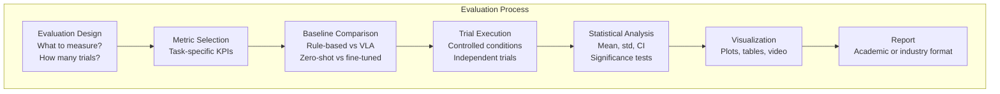
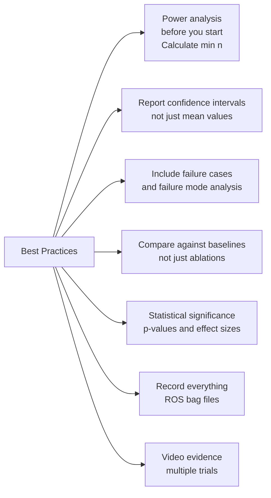

# Evaluating and Presenting Robotics Project Results

Rigorous evaluation is what separates a research-grade project from a demo. This chapter provides complete frameworks for measuring, benchmarking, and presenting your robotics project results in a way that is reproducible, honest, and compelling.

## Why Evaluation Matters

In robotics, it is easy to cherry-pick successful runs and present them as typical performance. Proper evaluation:
- Establishes **reproducible baselines** that others can compare against
- Reveals **failure modes** that guide future improvements
- Provides **honest confidence intervals** rather than best-case numbers
- Demonstrates **statistical rigor** required for academic publication

## Evaluation Framework Overview



## Metrics by Project Type

### Navigation Projects

```python
#!/usr/bin/env python3
"""
Navigation evaluation framework.
Measures task completion, path quality, and safety.
"""

import numpy as np
import math
from dataclasses import dataclass, field
from typing import List, Tuple, Optional


@dataclass
class NavigationTrial:
    """Data from a single navigation trial."""
    trial_id: int
    start_pose: Tuple[float, float, float]     # (x, y, theta)
    goal_pose: Tuple[float, float, float]       # (x, y, theta)
    actual_path: List[Tuple[float, float]]      # List of (x,y) waypoints
    obstacle_positions: List[Tuple[float, float]]

    # Outcomes
    reached_goal: bool = False
    final_pose: Optional[Tuple[float, float, float]] = None
    completion_time_s: float = float('inf')
    collisions: int = 0
    emergency_stops: int = 0
    distance_traveled: float = 0.0

    @property
    def path_length(self) -> float:
        """Total distance traveled along actual path."""
        if len(self.actual_path) < 2:
            return 0.0
        total = 0.0
        for i in range(1, len(self.actual_path)):
            dx = self.actual_path[i][0] - self.actual_path[i-1][0]
            dy = self.actual_path[i][1] - self.actual_path[i-1][1]
            total += math.sqrt(dx**2 + dy**2)
        return total

    @property
    def optimal_path_length(self) -> float:
        """Straight-line distance from start to goal."""
        dx = self.goal_pose[0] - self.start_pose[0]
        dy = self.goal_pose[1] - self.start_pose[1]
        return math.sqrt(dx**2 + dy**2)

    @property
    def path_efficiency(self) -> float:
        """Ratio of optimal to actual path length (1.0 = perfect straight line)."""
        if self.path_length == 0:
            return 0.0
        return self.optimal_path_length / self.path_length

    @property
    def goal_error(self) -> float:
        """Distance between intended and actual final position."""
        if self.final_pose is None:
            return float('inf')
        dx = self.final_pose[0] - self.goal_pose[0]
        dy = self.final_pose[1] - self.goal_pose[1]
        return math.sqrt(dx**2 + dy**2)


class NavigationEvaluator:
    """Computes aggregate navigation performance metrics."""

    def __init__(self, trials: List[NavigationTrial]):
        self.trials = trials
        self.n = len(trials)

    def success_rate(self, goal_tolerance_m: float = 0.1) -> float:
        """Fraction of trials where robot reached goal within tolerance."""
        successes = sum(
            1 for t in self.trials
            if t.reached_goal and t.goal_error <= goal_tolerance_m
        )
        return successes / self.n if self.n > 0 else 0.0

    def mean_completion_time(self) -> Tuple[float, float]:
        """Mean and std of completion time for successful trials."""
        times = [t.completion_time_s for t in self.trials if t.reached_goal]
        if not times:
            return float('inf'), 0.0
        return float(np.mean(times)), float(np.std(times))

    def mean_path_efficiency(self) -> Tuple[float, float]:
        """Mean and std of path efficiency for successful trials."""
        efficiencies = [t.path_efficiency for t in self.trials if t.reached_goal]
        if not efficiencies:
            return 0.0, 0.0
        return float(np.mean(efficiencies)), float(np.std(efficiencies))

    def collision_rate(self) -> float:
        """Collisions per trial."""
        return sum(t.collisions for t in self.trials) / self.n if self.n > 0 else 0.0

    def summary(self) -> dict:
        """Full summary of navigation performance."""
        sr = self.success_rate()
        mean_time, std_time = self.mean_completion_time()
        mean_eff, std_eff = self.mean_path_efficiency()

        return {
            'trials': self.n,
            'success_rate': f'{sr:.1%}',
            'mean_completion_time_s': f'{mean_time:.1f} ± {std_time:.1f}',
            'mean_path_efficiency': f'{mean_eff:.1%} ± {std_eff:.1%}',
            'collision_rate': f'{self.collision_rate():.3f} per trial',
            'mean_goal_error_m': f'{np.mean([t.goal_error for t in self.trials if t.reached_goal]):.3f}',
        }

    def print_summary(self):
        """Print formatted evaluation summary."""
        summary = self.summary()
        print("\n" + "="*50)
        print("NAVIGATION EVALUATION SUMMARY")
        print("="*50)
        for key, value in summary.items():
            print(f"  {key:<35} {value}")
        print("="*50 + "\n")
```

### Manipulation Projects

```python
#!/usr/bin/env python3
"""
Manipulation evaluation framework.
Measures grasp success, cycle time, and precision.
"""

import numpy as np
from dataclasses import dataclass, field
from typing import List, Optional, Dict
import json
from pathlib import Path


@dataclass
class ManipulationTrial:
    """Data from a single pick-and-place trial."""
    trial_id: int
    object_name: str
    object_category: str    # 'seen' or 'unseen' (for generalization eval)
    initial_object_pose: np.ndarray  # 6D pose
    target_placement_pose: np.ndarray

    # Outcomes
    grasp_attempted: bool = False
    grasp_success: bool = False
    placement_success: bool = False
    task_complete: bool = False
    completion_time_s: float = float('inf')
    num_attempts: int = 0
    failure_mode: str = ""

    # Precision metrics
    grasp_pose_error_m: float = float('inf')    # Error from intended grasp
    placement_error_m: float = float('inf')      # Distance from target placement


class ManipulationEvaluator:
    """Comprehensive manipulation performance evaluator."""

    def __init__(self, trials: List[ManipulationTrial]):
        self.trials = trials

    def grasp_success_rate(self, category: Optional[str] = None) -> Dict:
        """
        Grasp success rate, optionally filtered by object category.

        Returns dict with rate and 95% confidence interval.
        """
        filtered = self.trials
        if category:
            filtered = [t for t in self.trials if t.object_category == category]

        n = len(filtered)
        if n == 0:
            return {'rate': 0.0, 'ci_95': (0.0, 0.0), 'n': 0}

        successes = sum(1 for t in filtered if t.grasp_success)
        rate = successes / n

        # Wilson score confidence interval for proportions
        ci = self._wilson_ci(successes, n, confidence=0.95)

        return {
            'rate': rate,
            'ci_95': ci,
            'n': n,
            'formatted': f'{rate:.1%} (95% CI: {ci[0]:.1%} - {ci[1]:.1%}, n={n})'
        }

    def task_completion_rate(self) -> float:
        """Fraction of trials where full task completed (grasp + place)."""
        return sum(1 for t in self.trials if t.task_complete) / len(self.trials)

    def failure_mode_analysis(self) -> Dict[str, int]:
        """Count occurrences of each failure mode."""
        failures = {}
        for trial in self.trials:
            if not trial.task_complete and trial.failure_mode:
                failures[trial.failure_mode] = failures.get(trial.failure_mode, 0) + 1
        return dict(sorted(failures.items(), key=lambda x: -x[1]))

    def generalization_gap(self) -> Optional[float]:
        """
        Performance gap between seen and unseen objects.
        Positive = better on seen objects (expected behavior).
        """
        seen_result = self.grasp_success_rate('seen')
        unseen_result = self.grasp_success_rate('unseen')

        if seen_result['n'] == 0 or unseen_result['n'] == 0:
            return None

        return seen_result['rate'] - unseen_result['rate']

    def _wilson_ci(self, successes: int, n: int, confidence: float) -> tuple:
        """Wilson score confidence interval for a proportion."""
        from scipy import stats
        z = stats.norm.ppf(1 - (1 - confidence) / 2)
        p_hat = successes / n

        center = (p_hat + z**2 / (2*n)) / (1 + z**2 / n)
        margin = z * np.sqrt(p_hat*(1-p_hat)/n + z**2/(4*n**2)) / (1 + z**2/n)

        return (max(0.0, center - margin), min(1.0, center + margin))

    def print_report(self):
        """Print comprehensive manipulation evaluation report."""
        print("\n" + "="*60)
        print("MANIPULATION EVALUATION REPORT")
        print("="*60)

        print(f"\nTotal trials: {len(self.trials)}")

        # Overall performance
        print("\n--- Grasp Success ---")
        overall = self.grasp_success_rate()
        print(f"  Overall: {overall['formatted']}")

        seen = self.grasp_success_rate('seen')
        if seen['n'] > 0:
            print(f"  Seen objects: {seen['formatted']}")

        unseen = self.grasp_success_rate('unseen')
        if unseen['n'] > 0:
            print(f"  Unseen objects: {unseen['formatted']}")

        gap = self.generalization_gap()
        if gap is not None:
            print(f"  Generalization gap: {gap:.1%}")

        # Task completion
        print(f"\n--- Task Completion ---")
        print(f"  Complete task: {self.task_completion_rate():.1%}")

        # Failure modes
        print("\n--- Failure Mode Analysis ---")
        failure_modes = self.failure_mode_analysis()
        for mode, count in failure_modes.items():
            print(f"  {mode}: {count} occurrences")

        print("="*60 + "\n")
```

## Statistical Analysis

Proper statistical analysis is essential for credible results:

```python
#!/usr/bin/env python3
"""
Statistical analysis tools for robotics experiments.
"""

import numpy as np
from scipy import stats
from typing import List, Tuple, Optional
import warnings


def bootstrap_confidence_interval(
    data: List[float],
    statistic=np.mean,
    n_bootstrap: int = 10000,
    confidence: float = 0.95,
) -> Tuple[float, float, float]:
    """
    Bootstrap confidence interval for any statistic.

    Args:
        data: Observed data values
        statistic: Function to compute (mean, median, etc.)
        n_bootstrap: Number of bootstrap samples
        confidence: Confidence level (0.95 = 95% CI)

    Returns:
        (statistic_value, lower_bound, upper_bound)
    """
    data_array = np.array(data)
    n = len(data_array)

    # Bootstrap sampling
    bootstrap_stats = np.array([
        statistic(np.random.choice(data_array, size=n, replace=True))
        for _ in range(n_bootstrap)
    ])

    alpha = 1 - confidence
    lower = np.percentile(bootstrap_stats, 100 * alpha / 2)
    upper = np.percentile(bootstrap_stats, 100 * (1 - alpha / 2))
    observed = statistic(data_array)

    return observed, lower, upper


def compare_conditions(
    condition_a: List[float],
    condition_b: List[float],
    condition_a_name: str = "Condition A",
    condition_b_name: str = "Condition B",
    alpha: float = 0.05,
) -> dict:
    """
    Compare two experimental conditions with appropriate statistical tests.

    Uses Mann-Whitney U test (non-parametric) for robustness.
    Also computes effect size (Cohen's d).
    """
    a = np.array(condition_a)
    b = np.array(condition_b)

    # Descriptive statistics
    a_mean, a_lower, a_upper = bootstrap_confidence_interval(list(a))
    b_mean, b_lower, b_upper = bootstrap_confidence_interval(list(b))

    # Mann-Whitney U test (non-parametric, doesn't assume normality)
    u_stat, p_value = stats.mannwhitneyu(a, b, alternative='two-sided')

    # Effect size (Cohen's d)
    pooled_std = np.sqrt((np.std(a)**2 + np.std(b)**2) / 2)
    cohens_d = (np.mean(a) - np.mean(b)) / pooled_std if pooled_std > 0 else 0

    # Effect size interpretation
    if abs(cohens_d) < 0.2:
        effect_interpretation = "negligible"
    elif abs(cohens_d) < 0.5:
        effect_interpretation = "small"
    elif abs(cohens_d) < 0.8:
        effect_interpretation = "medium"
    else:
        effect_interpretation = "large"

    return {
        condition_a_name: {
            'mean': a_mean,
            'ci_95': (a_lower, a_upper),
            'n': len(a),
            'formatted': f'{a_mean:.3f} (95% CI: {a_lower:.3f}-{a_upper:.3f})'
        },
        condition_b_name: {
            'mean': b_mean,
            'ci_95': (b_lower, b_upper),
            'n': len(b),
            'formatted': f'{b_mean:.3f} (95% CI: {b_lower:.3f}-{b_upper:.3f})'
        },
        'p_value': p_value,
        'significant': p_value < alpha,
        'cohens_d': cohens_d,
        'effect_size': effect_interpretation,
        'interpretation': (
            f"The difference is {'statistically significant' if p_value < alpha else 'not statistically significant'} "
            f"(p={p_value:.4f}, α={alpha}), with a {effect_interpretation} effect size (d={cohens_d:.2f})."
        )
    }


def minimum_sample_size(
    effect_size: float,
    alpha: float = 0.05,
    power: float = 0.80,
) -> int:
    """
    Calculate minimum sample size for detecting an effect.

    Args:
        effect_size: Cohen's d effect size you want to detect
        alpha: Significance level (type I error rate)
        power: Statistical power (1 - type II error rate)

    Returns:
        Minimum n per group
    """
    from statsmodels.stats.power import TTestIndPower
    analysis = TTestIndPower()
    n = analysis.solve_power(
        effect_size=effect_size,
        alpha=alpha,
        power=power,
        ratio=1.0
    )
    return math.ceil(n)


# Example usage
if __name__ == '__main__':
    import math

    # Calculate minimum trials needed before you start
    n_min = minimum_sample_size(effect_size=0.5, alpha=0.05, power=0.80)
    print(f"Minimum trials per condition: {n_min}")

    # Simulate results from two conditions
    np.random.seed(42)
    baseline_times = np.random.normal(180, 30, n_min).tolist()  # 3min avg
    improved_times = np.random.normal(150, 25, n_min).tolist()  # 2.5min avg

    result = compare_conditions(
        baseline_times, improved_times,
        "Baseline (rule-based)", "VLA Model"
    )

    print("\nComparison Results:")
    for key in ["Baseline (rule-based)", "VLA Model"]:
        print(f"  {key}: {result[key]['formatted']}")
    print(f"\n  {result['interpretation']}")
```

## Visualization

```python
#!/usr/bin/env python3
"""
Robotics results visualization.
Generates publication-quality plots.
"""

import numpy as np
import matplotlib.pyplot as plt
import matplotlib.patches as mpatches
from typing import List, Dict, Optional
import seaborn as sns


def plot_success_rates_comparison(
    results: Dict[str, Dict[str, float]],
    title: str = "Task Success Rate by Method",
    output_path: Optional[str] = None,
):
    """
    Bar chart comparing success rates across methods.

    Args:
        results: {method_name: {'rate': 0.85, 'ci_lower': 0.79, 'ci_upper': 0.91}}
    """
    fig, ax = plt.subplots(figsize=(10, 6))

    methods = list(results.keys())
    rates = [results[m]['rate'] for m in methods]
    errors = [
        [results[m]['rate'] - results[m]['ci_lower'] for m in methods],
        [results[m]['ci_upper'] - results[m]['rate'] for m in methods],
    ]

    colors = sns.color_palette("husl", len(methods))
    bars = ax.bar(methods, rates, yerr=errors, capsize=5, color=colors,
                  alpha=0.8, error_kw={'linewidth': 2})

    # Add value labels on bars
    for bar, rate in zip(bars, rates):
        ax.text(
            bar.get_x() + bar.get_width() / 2,
            bar.get_height() + 0.02,
            f'{rate:.1%}',
            ha='center', va='bottom', fontweight='bold', fontsize=12
        )

    ax.set_ylim(0, 1.15)
    ax.set_ylabel('Success Rate', fontsize=13)
    ax.set_title(title, fontsize=14, fontweight='bold')
    ax.yaxis.set_major_formatter(plt.FuncFormatter(lambda y, _: f'{y:.0%}'))
    ax.grid(axis='y', alpha=0.3)
    ax.spines['top'].set_visible(False)
    ax.spines['right'].set_visible(False)

    plt.tight_layout()

    if output_path:
        plt.savefig(output_path, dpi=300, bbox_inches='tight')
        print(f"Plot saved to {output_path}")
    else:
        plt.show()

    return fig


def plot_completion_time_distribution(
    times_by_method: Dict[str, List[float]],
    title: str = "Task Completion Time Distribution",
    output_path: Optional[str] = None,
):
    """Box plot of completion times across methods."""
    fig, ax = plt.subplots(figsize=(10, 6))

    methods = list(times_by_method.keys())
    data = [times_by_method[m] for m in methods]

    bp = ax.boxplot(data, labels=methods, patch_artist=True,
                    medianprops={'linewidth': 2, 'color': 'black'})

    colors = sns.color_palette("husl", len(methods))
    for patch, color in zip(bp['boxes'], colors):
        patch.set_facecolor(color)
        patch.set_alpha(0.7)

    # Overlay individual data points (jittered)
    for i, (method, values) in enumerate(times_by_method.items()):
        x = np.random.normal(i + 1, 0.05, size=len(values))
        ax.scatter(x, values, alpha=0.4, s=20, color=colors[i], zorder=3)

    ax.set_ylabel('Completion Time (seconds)', fontsize=13)
    ax.set_title(title, fontsize=14, fontweight='bold')
    ax.grid(axis='y', alpha=0.3)
    ax.spines['top'].set_visible(False)
    ax.spines['right'].set_visible(False)

    plt.tight_layout()

    if output_path:
        plt.savefig(output_path, dpi=300, bbox_inches='tight')
    else:
        plt.show()

    return fig


def plot_learning_curve(
    episodes: List[int],
    success_rates: List[float],
    confidence_intervals: Optional[List[Tuple[float, float]]] = None,
    title: str = "Learning Curve",
    output_path: Optional[str] = None,
):
    """Plot VLA model performance improvement over training."""
    fig, ax = plt.subplots(figsize=(10, 6))

    ax.plot(episodes, success_rates, 'b-', linewidth=2, label='Success Rate')
    ax.scatter(episodes, success_rates, color='blue', s=50, zorder=5)

    if confidence_intervals:
        lower = [ci[0] for ci in confidence_intervals]
        upper = [ci[1] for ci in confidence_intervals]
        ax.fill_between(episodes, lower, upper, alpha=0.2, color='blue',
                        label='95% CI')

    ax.set_xlabel('Training Episodes', fontsize=13)
    ax.set_ylabel('Task Success Rate', fontsize=13)
    ax.set_title(title, fontsize=14, fontweight='bold')
    ax.yaxis.set_major_formatter(plt.FuncFormatter(lambda y, _: f'{y:.0%}'))
    ax.set_ylim(0, 1.05)
    ax.legend(fontsize=11)
    ax.grid(alpha=0.3)
    ax.spines['top'].set_visible(False)
    ax.spines['right'].set_visible(False)

    plt.tight_layout()

    if output_path:
        plt.savefig(output_path, dpi=300, bbox_inches='tight')
    else:
        plt.show()

    return fig


# Example: Generate evaluation plots
if __name__ == '__main__':
    # Success rate comparison
    results = {
        'Rule-Based': {'rate': 0.71, 'ci_lower': 0.63, 'ci_upper': 0.78},
        'Octo (zero-shot)': {'rate': 0.68, 'ci_lower': 0.60, 'ci_upper': 0.75},
        'OpenVLA (zero-shot)': {'rate': 0.82, 'ci_lower': 0.75, 'ci_upper': 0.88},
        'OpenVLA (fine-tuned)': {'rate': 0.91, 'ci_lower': 0.85, 'ci_upper': 0.95},
    }
    plot_success_rates_comparison(
        results,
        title="Pick-and-Place Success Rate by Method",
        output_path="success_rates.png"
    )

    # Completion time comparison
    np.random.seed(42)
    times = {
        'Rule-Based': np.random.normal(180, 40, 50).clip(60, 400).tolist(),
        'OpenVLA (fine-tuned)': np.random.normal(130, 25, 50).clip(60, 250).tolist(),
    }
    plot_completion_time_distribution(
        times,
        title="Task Completion Time: Rule-Based vs VLA",
        output_path="completion_times.png"
    )
```

## Writing Your Results Section

### Structure for Academic Reporting

```
4. RESULTS
4.1 Experimental Setup
    - Hardware: robot model, sensors, compute
    - Software: ROS 2 version, VLA model, libraries
    - Evaluation scenarios: n=X trials per condition
    - Baseline: what you're comparing against

4.2 Task Completion Performance
    - Primary metric: success rate with CI
    - Secondary metrics: time, efficiency

4.3 Ablation Studies
    - Impact of each component
    - "What happens if we remove X?"

4.4 Failure Mode Analysis
    - Distribution of failure types
    - Representative failure examples

4.5 Comparison with Baselines
    - Statistical significance tests
    - Effect sizes

4.6 Discussion
    - What works well and why
    - Limitations and failure modes
    - Sim-to-real gap (if applicable)
```

### Example Results Table

| Method | Success Rate | Avg Time (s) | Collision Rate |
|--------|-------------|--------------|---------------|
| Rule-Based | 71% ± 6% | 185 ± 42 | 2.1% |
| Octo (zero-shot) | 68% ± 6% | 210 ± 55 | 0.8% |
| OpenVLA (zero-shot) | 82% ± 5% | 160 ± 35 | 0.4% |
| **OpenVLA (fine-tuned)** | **91% ± 4%** | **132 ± 28** | **0.2%** |

*Table: Task completion metrics across methods (n=50 trials each, 95% CI). Best results in bold.*

## Video Demonstration Guide

A compelling video is essential for capstone presentations:

**Recording checklist:**
- [ ] Multiple camera angles (overview + close-up wrist cam)
- [ ] 3-5 successful trials of different tasks
- [ ] 1-2 failure cases with recovery (shows robustness)
- [ ] Side-by-side: baseline vs your method
- [ ] Annotated overlay: show VLA inference, action prediction
- [ ] B-roll: RViz visualization, Isaac Sim view

**Video structure (recommended 3-5 minutes):**
1. (0:00-0:30) Problem statement and motivation
2. (0:30-1:30) System overview with architecture diagram
3. (1:30-3:30) Live demonstration runs
4. (3:30-4:30) Quantitative results summary
5. (4:30-5:00) Limitations and future work

## Presentation Template

```markdown
# [Project Title]

## Motivation (1 slide)
- What problem does this solve?
- Why is it hard? Why does it matter?

## System Architecture (1-2 slides)
- Block diagram of all components
- Integration overview

## Key Technical Contributions (2-3 slides)
- What's novel about your approach?
- Technical details of the most important components

## Experimental Setup (1 slide)
- Environment, hardware, baselines
- Evaluation protocol

## Results (2-3 slides)
- Main table: success rate, time, safety
- Key plots: learning curves, failure mode distribution
- Video demo (embedded or linked)

## Lessons Learned (1 slide)
- What worked better/worse than expected?
- What would you do differently?

## Future Work (1 slide)
- 3 concrete next steps to improve the system

## Conclusion (1 slide)
- Summary of contributions
- Impact on the field
```

## Summary: Evaluation Best Practices



With proper evaluation methodology, your capstone project results will be credible, reproducible, and ready for academic publication or industry deployment. The final chapter provides a comprehensive summary of everything covered and your path forward in physical AI and humanoid robotics.
