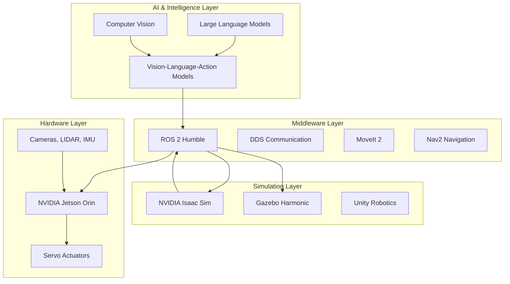
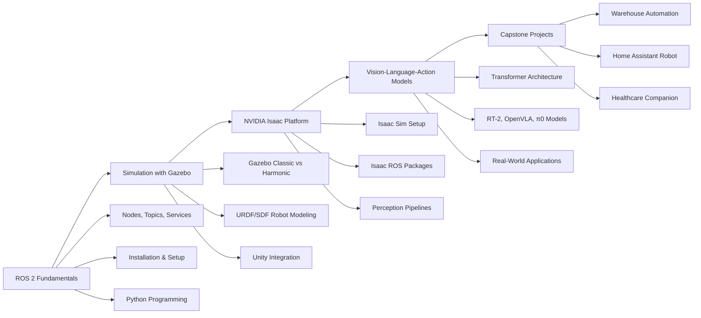

# Introduction to Physical AI & Humanoid Robotics

*Boston Dynamics Atlas — one of the most advanced humanoid robots ever built, capable of dynamic locomotion, parkour, and tool use.*

Welcome to the comprehensive educational platform for **Physical AI & Humanoid Robotics**. This course bridges the gap between theoretical AI and its physical embodiment — robots that perceive, reason, and act in the real world.

## What is Physical AI?

**Physical AI** refers to artificial intelligence systems that are grounded in physical reality — systems that must interact with the physical world through sensors and actuators, subject to real constraints like gravity, friction, energy, and time. Unlike purely digital AI (language models, image classifiers), Physical AI systems must:

- **Perceive** the world through cameras, LIDAR, IMUs, force sensors, and more
- **Reason** about spatial relationships, object properties, and task requirements
- **Plan** sequences of actions to achieve goals
- **Act** by moving joints, grippers, wheels, and limbs with precision and safety
- **Learn** from experience and adapt to new environments

The term gained prominence as foundation models (large transformers trained on internet-scale data) began to be applied to robotics, enabling robots to understand natural language commands and generalize to novel tasks.

## What are Humanoid Robots?

Humanoid robots are machines designed with a body structure resembling the human form — two legs, two arms, a torso, and a head. This design is deliberate: our world is built for humans, so human-shaped robots can use the same tools, navigate the same spaces, and interact in the same ways we do.

### Key Humanoid Platforms (2024-2025)

| Robot | Company | Key Capability |
|-------|---------|---------------|
| Atlas | Boston Dynamics | Dynamic locomotion, parkour, tool manipulation |
| Optimus (Tesla Bot) | Tesla | General-purpose household/factory tasks |
| Figure 01 / 02 | Figure AI | Commercial humanoid for industry |
| Digit | Agility Robotics | Warehouse logistics, bipedal walking |
| Apollo | Apptronik | Industrial and commercial deployment |
| H1 / H1-2 | Unitree | Research platform, agile movement |
| GR-1 | Fourier Intelligence | Rehabilitation and research |
| 1X NEO | 1X Technologies | Household assistance |

### Why Humanoid Form?

The humanoid form factor offers several advantages:

1. **Tool compatibility** — human tools, vehicles, and environments work without modification
2. **Social acceptability** — humans respond naturally to human-like appearance and gesture
3. **Dexterous manipulation** — human hands are remarkably capable; mimicking them unlocks vast manipulation tasks
4. **Locomotion versatility** — bipedal locomotion handles stairs, narrow corridors, and uneven terrain

## Why Physical AI Matters Now

Several converging trends make 2024-2025 a pivotal moment for Physical AI:

### 1. Foundation Models Meet Robotics
Large vision-language models (GPT-4V, Gemini, Claude) can now understand complex scenes and instructions. Vision-Language-Action (VLA) models like RT-2, OpenVLA, and π0 connect this understanding directly to robot control.

### 2. Simulation Quality
NVIDIA Isaac Sim, built on Omniverse, provides photorealistic, physically accurate simulation. This enables training robots on millions of simulated tasks before touching real hardware — dramatically accelerating development.

### 3. Hardware Maturity
Actuator technology, battery energy density, and onboard compute (NVIDIA Jetson Orin) have reached levels that make practical deployment feasible. Costs are falling rapidly.

### 4. Industry Demand
Labor shortages in manufacturing, logistics, elder care, and construction are creating urgent demand for capable robotic workers. The global humanoid robotics market is projected to reach $154 billion by 2035.

## The Technology Stack

Modern humanoid robotics systems are built on a layered technology stack:

### Layer Descriptions

**Hardware Layer**: The physical substrate — motors, sensors, compute boards. NVIDIA Jetson Orin provides up to 275 TOPS of AI performance at the edge, powering real-time perception and control.

**Simulation Layer**: Virtual environments where robots are designed, tested, and trained. NVIDIA Isaac Sim provides physics fidelity critical for sim-to-real transfer. Gazebo Harmonic offers open-source simulation for ROS 2.

**Middleware Layer**: ROS 2 (Robot Operating System 2) is the de facto standard framework for connecting robot components. It handles communication, hardware abstraction, sensor integration, and tool access.

**AI & Intelligence Layer**: Foundation models, vision systems, and VLA models give robots the ability to understand instructions, perceive their environment, and generate appropriate actions.

## Course Overview

This course takes you from foundational concepts to advanced implementations:

### Module 1: ROS 2 Fundamentals
Learn the Robot Operating System 2 from the ground up. Understand nodes, topics, services, and actions. Write your first publisher/subscriber pair in Python. Install ROS 2 Humble on Ubuntu 22.04 and build a functional workspace.

**Estimated time**: 8-10 hours

### Module 2: Simulation Environments
Master Gazebo Harmonic for physics-accurate robot simulation. Learn URDF and SDF robot modeling formats. Build a complete mobile robot with LIDAR and camera sensors. Explore Unity Robotics Hub for high-fidelity visual simulation.

**Estimated time**: 10-12 hours

### Module 3: NVIDIA Isaac Platform
Deploy NVIDIA Isaac Sim for advanced robotics simulation. Set up Isaac ROS packages for GPU-accelerated perception. Build complete perception pipelines using CUDA-accelerated algorithms. Connect Isaac Sim to ROS 2 for hardware-in-the-loop testing.

**Estimated time**: 10-12 hours

### Module 4: Vision-Language-Action Models
Understand the transformer architecture behind modern VLA models. Study RT-2, OpenVLA, π0 (Pi Zero), and Octo in depth. Implement a VLA inference pipeline connected to ROS 2. Learn about imitation learning and reinforcement learning for robotics.

**Estimated time**: 12-15 hours

### Module 5: Capstone Projects
Apply everything you've learned to complete, working robotic systems. Three detailed projects: Autonomous Warehouse Assistant, Home Assistant Robot, and Healthcare Companion. Full implementation guides with code, evaluation, and presentation frameworks.

**Estimated time**: 20-30 hours

## Prerequisites

To get the most from this course, you should have:

- **Python programming** — comfortable writing classes, functions, and working with libraries
- **Linux basics** — navigating the terminal, installing packages, editing files
- **Basic robotics concepts** — understanding what robots are and how they work at a high level
- **Mathematics** — linear algebra, calculus, and basic probability (for AI sections)

Hardware is not required — all projects can be completed entirely in simulation.

## Learning Objectives

By the end of this course, you will be able to:

1. **Build and run ROS 2 systems** with multiple communicating nodes
2. **Create robot models** in URDF/SDF and simulate them in Gazebo and Isaac Sim
3. **Implement perception pipelines** for object detection, pose estimation, and SLAM
4. **Integrate VLA models** into a ROS 2 robotic system
5. **Design and implement** a complete capstone robotics project
6. **Evaluate and benchmark** robotic system performance

## Interactive Features

This platform includes several features to enhance your learning:

- **AI-powered Q&A chatbot** — ask questions about any concept covered in the book
- **Personalization options** — adapt content depth and focus to your background
- **Urdu language support** — full translation available for broader accessibility
- **Mermaid diagrams** — visual representations of architectures and workflows throughout

## How to Use This Book

Each chapter builds on the previous ones, but experienced readers can jump directly to topics of interest. Every technical chapter includes:

- **Conceptual explanations** with diagrams
- **Working code examples** you can run immediately
- **Step-by-step guides** for setup and configuration
- **Best practices** drawn from industry experience

Let's begin our journey into the fascinating world of Physical AI and Humanoid Robotics — where intelligence meets the physical world.
