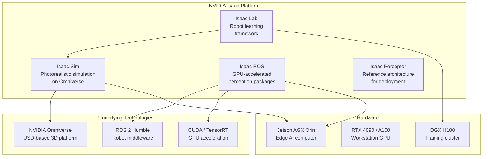
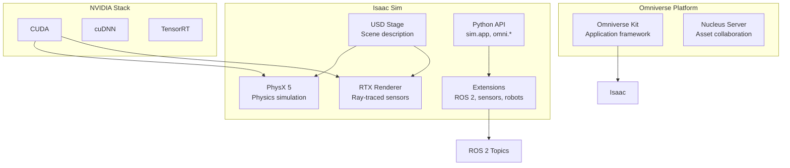
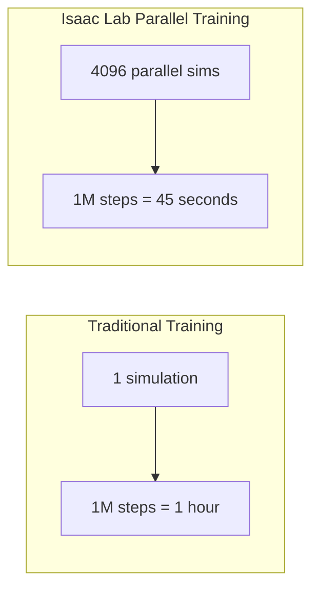
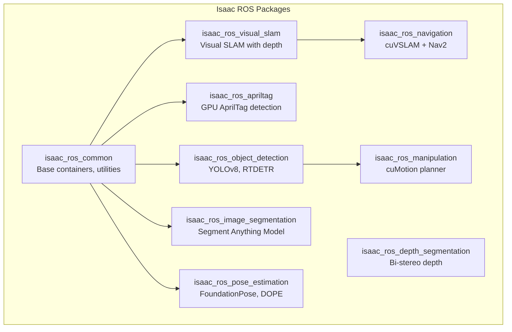
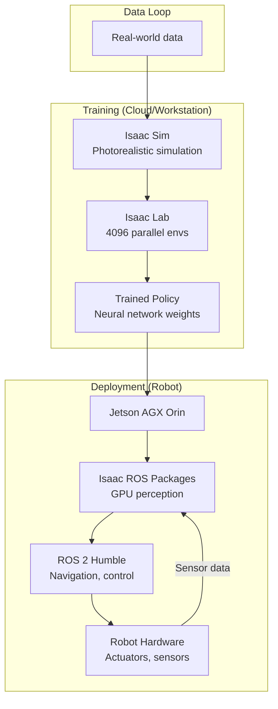

# NVIDIA Isaac Platform

The **NVIDIA Isaac platform** is a comprehensive robotics development ecosystem built on NVIDIA's GPU computing infrastructure. It represents NVIDIA's vision for AI-powered robotics: combining photorealistic simulation, GPU-accelerated perception algorithms, and foundation model integration to dramatically accelerate how humanoid robots and autonomous systems are developed.

In 2024-2025, Isaac has become the dominant platform for humanoid robot development. Companies including Boston Dynamics, Figure AI, Agility Robotics, and 1X Technologies use Isaac Sim for training robot policies. Understanding Isaac is essential for anyone serious about physical AI.

## Platform Overview

The Isaac platform consists of four major components:



## Isaac Sim: Photorealistic Robot Simulation

**Isaac Sim** is a physics-accurate, photorealistic simulation environment built on NVIDIA Omniverse — a real-time 3D collaboration platform based on Pixar's Universal Scene Description (USD) format.

### What Makes Isaac Sim Different

| Feature | Gazebo | Isaac Sim |
|---------|--------|-----------|
| Rendering | OGRE (game-quality) | RTX ray tracing (film-quality) |
| Scene description | SDF/URDF | USD (Universal Scene Description) |
| Physics | DART/ODE | PhysX 5 (NVIDIA) |
| Sensor simulation | Approximate | Ray-traced (camera, LIDAR, depth) |
| GPU usage | CPU-based | Full GPU acceleration |
| Synthetic data | Basic | Production-grade |
| Scale | Hundreds of objects | Millions of objects |
| Cost | Free/open source | Free for research |

The photorealistic rendering is crucial for training perception models with **synthetic data** — images generated in simulation are used to train neural networks that must work in the real world.

### Isaac Sim Architecture



### Key Isaac Sim Capabilities

**Robot Import**: Import robots from URDF, MJCF (MuJoCo), or native USD format. Humanoid robots like the Unitree H1 have pre-built Isaac Sim assets.

**Sensor Simulation**:
- Ray-traced cameras with accurate depth of field, motion blur, noise
- Ray-traced LIDAR with per-ray intensity and noise models
- RTX-based depth cameras
- IMU, contact sensors, force/torque sensors

**Physics**:
- Rigid body dynamics with PhysX 5
- Articulated body simulation (robot joints)
- Soft body and cloth simulation
- Fluid simulation (experimental)

**Synthetic Data Generation**: Perfect ground-truth annotations — bounding boxes, instance segmentation masks, depth maps, surface normals — generated automatically.

## Isaac Lab: Robot Learning Framework

**Isaac Lab** (formerly Isaac Orbit) is the robot learning framework built on Isaac Sim. It provides:

- **RL environments**: Pre-built environments for locomotion, manipulation, navigation
- **Parallel simulation**: Train 4,096+ environments simultaneously on a single GPU
- **Policy learning**: Integration with RL libraries (RSL-RL, SKRL, Stable Baselines3)
- **Curriculum learning**: Progressive difficulty for complex tasks
- **Domain randomization**: Automatic randomization of physics, appearance, lighting

### Why Parallel Simulation Matters

Training walking gaits for a humanoid robot requires millions of simulation steps. Isaac Lab can simulate thousands of robots in parallel on a single GPU:



A gait policy that would take weeks to train on a single simulation can converge in hours with Isaac Lab's parallel simulation.

### Isaac Lab Workflow

```python
# Example: Setting up an Isaac Lab environment for legged locomotion
import isaaclab.sim as sim_utils
from isaaclab.envs import ManagerBasedRLEnv, ManagerBasedRLEnvCfg
from isaaclab.assets import ArticulationCfg, AssetBaseCfg
from isaaclab.managers import (
    ObservationGroupCfg, ObservationTermCfg,
    RewardTermCfg, EventTermCfg, TerminationTermCfg
)

# Define the environment configuration
@dataclass
class UnitreeH1EnvCfg(ManagerBasedRLEnvCfg):
    # Simulation settings
    sim: sim_utils.SimulationCfg = sim_utils.SimulationCfg(
        dt=0.005,           # 200 Hz physics
        render_interval=4,  # Render every 4 physics steps
    )

    # Number of parallel environments
    num_envs: int = 4096
    env_spacing: float = 2.5  # meters between robot instances

    # Robot asset
    robot: ArticulationCfg = UNITREE_H1_CFG.replace(
        prim_path="{ENV_REGEX_NS}/Robot"
    )

    # Episode length
    episode_length_s: float = 20.0

# The framework handles spawning 4096 instances, stepping physics,
# collecting observations, applying actions, and computing rewards
# — all on the GPU
```

## Isaac ROS: GPU-Accelerated Perception

**Isaac ROS** is a collection of ROS 2 packages that provide GPU-accelerated alternatives to common perception algorithms. These packages use CUDA, TensorRT, and custom NVIDIA hardware features to achieve 10-100x speedups over CPU implementations.

### Isaac ROS Package Ecosystem



### Performance Comparison

| Algorithm | CPU Implementation | Isaac ROS (GPU) | Speedup |
|-----------|-------------------|-----------------|---------|
| AprilTag Detection | 15 FPS | 220 FPS | 14.7x |
| Visual SLAM | 30 FPS | 120+ FPS | 4x+ |
| Object Detection (YOLOv8) | 20 FPS | 240 FPS | 12x |
| Image Segmentation | 5 FPS | 60 FPS | 12x |
| Stereo Depth | 15 FPS | 180 FPS | 12x |

### Target Hardware

Isaac ROS is optimized for:

**Jetson AGX Orin** (64GB) — NVIDIA's flagship edge AI computer
- 12-core Arm Cortex-A78AE CPU
- 2048-core Ampere GPU
- 275 TOPS AI performance
- Used in production humanoid robots

**Jetson Orin NX** (16GB) — Mid-range edge compute
- 8-core CPU, 1024-core GPU
- 100 TOPS

**RTX Workstations** — Development and simulation
- RTX 4090 / 4080 for development
- Full Isaac Sim simulation

## Integration Architecture

The complete Isaac platform integration for a humanoid robot:



## Getting Started Path

Isaac has different entry points depending on your goal:

| Goal | Start With |
|------|-----------|
| Learn simulation basics | Isaac Sim tutorial scenes |
| Train a walking robot | Isaac Lab locomotion examples |
| Build a perception pipeline | Isaac ROS Docker containers |
| Deploy to Jetson | Isaac ROS Jetson setup guide |
| Generate training data | Isaac Replicator (synthetic data) |

## System Requirements

| Component | Minimum | Recommended |
|-----------|---------|-------------|
| OS | Ubuntu 22.04 | Ubuntu 22.04 |
| CPU | 8 cores | 16+ cores |
| RAM | 32 GB | 64 GB |
| GPU | RTX 3080 10GB | RTX 4090 24GB |
| Storage | 100 GB SSD | 500 GB NVMe |
| CUDA | 11.8 | 12.2+ |
| Driver | 525+ | 545+ |

## Next Steps

The following chapters provide:
- **Setup** — Complete installation of Isaac Sim, Isaac Lab, and Isaac ROS
- **Examples** — Practical code for navigation, manipulation, and perception pipelines

These tools represent the state of the art in robot simulation and GPU-accelerated robotics. Proficiency with the Isaac platform is increasingly a required skill for physical AI engineers.
