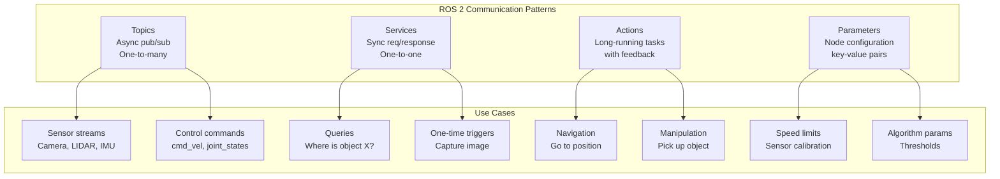

# Basic ROS 2 Concepts: Hands-On Guide

This chapter provides complete, working code examples for every core ROS 2 communication pattern. By the end, you will have implemented nodes, topics, services, actions, parameters, and launch files — the complete toolkit for building any ROS 2 application.

## Architecture Overview

Before diving into code, understand how all the pieces fit together:



## Nodes: The Fundamental Unit

Every ROS 2 program is structured around nodes. A well-designed node:
- Has a **single responsibility** (camera driver, object detector, path planner)
- **Declares** its topics, services, and parameters in `__init__`
- **Handles** failures gracefully
- **Cleans up** on shutdown

### Minimal Node Template

```python
#!/usr/bin/env python3
"""Template for a ROS 2 node."""

import rclpy
from rclpy.node import Node


class MyRobotNode(Node):
    """
    A template ROS 2 node.

    This node demonstrates the basic structure that all ROS 2 nodes follow.
    """

    def __init__(self):
        # Initialize the node with a unique name
        super().__init__('my_robot_node')

        # Declare parameters (with defaults)
        self.declare_parameter('update_rate', 10.0)
        self.declare_parameter('robot_name', 'robot_1')

        # Read parameter values
        update_rate = self.get_parameter('update_rate').get_parameter_value().double_value
        self.robot_name = self.get_parameter('robot_name').get_parameter_value().string_value

        # Create a timer
        self.timer = self.create_timer(1.0 / update_rate, self.update_callback)

        self.get_logger().info(f'Node started: {self.robot_name}')

    def update_callback(self):
        """Main update loop called at the configured rate."""
        self.get_logger().debug('Update tick')

    def destroy_node(self):
        """Clean up resources on shutdown."""
        self.get_logger().info('Node shutting down')
        super().destroy_node()


def main(args=None):
    rclpy.init(args=args)
    node = MyRobotNode()
    try:
        rclpy.spin(node)
    except KeyboardInterrupt:
        pass
    finally:
        node.destroy_node()
        rclpy.shutdown()


if __name__ == '__main__':
    main()
```

## Topics: Asynchronous Data Streaming

Topics are used for continuous data streams: sensor readings, velocity commands, state information.

### Publisher/Subscriber with Sensor Data

A realistic example: publishing simulated sensor data and processing it:

```python
#!/usr/bin/env python3
"""
Sensor publisher node - simulates a distance sensor.
Publishes to /sensor/distance at 10 Hz.
"""

import rclpy
from rclpy.node import Node
from rclpy.qos import QoSProfile, ReliabilityPolicy, HistoryPolicy
import math
import random
from std_msgs.msg import Float32
from sensor_msgs.msg import Range


class DistanceSensorNode(Node):
    """Publishes simulated distance sensor readings."""

    def __init__(self):
        super().__init__('distance_sensor')

        # QoS profile suitable for sensor data
        sensor_qos = QoSProfile(
            reliability=ReliabilityPolicy.BEST_EFFORT,
            history=HistoryPolicy.KEEP_LAST,
            depth=5
        )

        # Publisher for range data (standard sensor_msgs type)
        self.range_pub = self.create_publisher(
            Range,
            '/sensor/distance',
            sensor_qos
        )

        # 10 Hz update rate
        self.timer = self.create_timer(0.1, self.publish_reading)
        self.sim_time = 0.0

        self.get_logger().info('Distance sensor node started')

    def publish_reading(self):
        """Publish a simulated distance reading."""
        msg = Range()
        msg.header.stamp = self.get_clock().now().to_msg()
        msg.header.frame_id = 'sensor_frame'
        msg.radiation_type = Range.ULTRASOUND
        msg.field_of_view = 0.5236  # 30 degrees in radians
        msg.min_range = 0.02        # 2 cm
        msg.max_range = 4.0         # 4 meters

        # Simulate a moving obstacle (sine wave) with noise
        true_distance = 1.0 + 0.5 * math.sin(self.sim_time)
        noise = random.gauss(0.0, 0.01)  # Gaussian noise, std=1cm
        msg.range = max(msg.min_range, min(msg.max_range, true_distance + noise))

        self.range_pub.publish(msg)
        self.sim_time += 0.1


def main(args=None):
    rclpy.init(args=args)
    node = DistanceSensorNode()
    rclpy.spin(node)
    node.destroy_node()
    rclpy.shutdown()

if __name__ == '__main__':
    main()
```

```python
#!/usr/bin/env python3
"""
Obstacle detector node.
Subscribes to /sensor/distance and publishes warnings.
"""

import rclpy
from rclpy.node import Node
from rclpy.qos import QoSProfile, ReliabilityPolicy, HistoryPolicy
from sensor_msgs.msg import Range
from std_msgs.msg import String


class ObstacleDetectorNode(Node):
    """Processes range data and publishes obstacle warnings."""

    def __init__(self):
        super().__init__('obstacle_detector')

        # Declare configurable threshold
        self.declare_parameter('warning_threshold', 0.5)  # meters
        self.declare_parameter('danger_threshold', 0.2)   # meters

        self.warning_dist = self.get_parameter('warning_threshold').get_parameter_value().double_value
        self.danger_dist = self.get_parameter('danger_threshold').get_parameter_value().double_value

        # QoS matching the publisher
        sensor_qos = QoSProfile(
            reliability=ReliabilityPolicy.BEST_EFFORT,
            history=HistoryPolicy.KEEP_LAST,
            depth=5
        )

        # Subscribe to range sensor
        self.range_sub = self.create_subscription(
            Range,
            '/sensor/distance',
            self.range_callback,
            sensor_qos
        )

        # Publish status messages
        self.status_pub = self.create_publisher(String, '/obstacle_status', 10)

        self.get_logger().info(
            f'Obstacle detector started. Warning: {self.warning_dist}m, '
            f'Danger: {self.danger_dist}m'
        )

    def range_callback(self, msg: Range):
        """Process incoming range reading."""
        distance = msg.range

        status = String()

        if distance < self.danger_dist:
            status.data = f'DANGER: Obstacle at {distance:.3f}m!'
            self.get_logger().warn(status.data)
        elif distance < self.warning_dist:
            status.data = f'WARNING: Obstacle at {distance:.3f}m'
            self.get_logger().info(status.data)
        else:
            status.data = f'CLEAR: {distance:.3f}m'

        self.status_pub.publish(status)


def main(args=None):
    rclpy.init(args=args)
    node = ObstacleDetectorNode()
    rclpy.spin(node)
    node.destroy_node()
    rclpy.shutdown()

if __name__ == '__main__':
    main()
```

## Services: Request-Response Communication

Services are used when you need a specific answer before continuing. Use them for queries, one-time triggers, and short computations.

### Custom Service Definition

First, create a service interface file. Save as `srv/GetObjectLocation.srv` in your package:

```
# Request
string object_name    # Name of object to locate (e.g., "red_cup")
bool use_latest_scan  # Whether to use cached or fresh scan data
---
# Response
bool found                        # Whether the object was found
float64 x                        # X position in robot frame (meters)
float64 y                        # Y position in robot frame (meters)
float64 z                        # Z position in robot frame (meters)
float64 confidence               # Detection confidence (0.0 to 1.0)
string message                   # Human-readable status message
```

### Service Server

```python
#!/usr/bin/env python3
"""
Object locator service server.
Provides a service to find named objects in the scene.
"""

import rclpy
from rclpy.node import Node
import random

# Import the custom service type (after building the package)
from my_robot_interfaces.srv import GetObjectLocation


class ObjectLocatorServer(Node):
    """Provides the /get_object_location service."""

    def __init__(self):
        super().__init__('object_locator')

        # Create the service server
        self.srv = self.create_service(
            GetObjectLocation,
            '/get_object_location',
            self.handle_locate_request
        )

        # Simulated object database
        self.known_objects = {
            'red_cup':    {'x': 0.5, 'y': 0.1, 'z': 0.8, 'confidence': 0.95},
            'blue_box':   {'x': 1.2, 'y': -0.3, 'z': 0.5, 'confidence': 0.87},
            'green_ball': {'x': 0.8, 'y': 0.6, 'z': 0.3, 'confidence': 0.92},
        }

        self.get_logger().info('Object locator service ready at /get_object_location')

    def handle_locate_request(self, request, response):
        """
        Handle a request to locate an object.

        Args:
            request: GetObjectLocation.Request with object_name
            response: GetObjectLocation.Response to populate

        Returns:
            Populated response
        """
        obj_name = request.object_name.lower().strip()
        self.get_logger().info(f'Received request to locate: "{obj_name}"')

        if obj_name in self.known_objects:
            obj = self.known_objects[obj_name]
            response.found = True
            response.x = obj['x']
            response.y = obj['y']
            response.z = obj['z']
            response.confidence = obj['confidence']
            response.message = f'Found {obj_name} at ({obj["x"]:.2f}, {obj["y"]:.2f}, {obj["z"]:.2f})'
            self.get_logger().info(response.message)
        else:
            response.found = False
            response.x = 0.0
            response.y = 0.0
            response.z = 0.0
            response.confidence = 0.0
            response.message = f'Object "{obj_name}" not found in scene'
            self.get_logger().warn(response.message)

        return response


def main(args=None):
    rclpy.init(args=args)
    node = ObjectLocatorServer()
    rclpy.spin(node)
    node.destroy_node()
    rclpy.shutdown()

if __name__ == '__main__':
    main()
```

### Service Client (Async)

```python
#!/usr/bin/env python3
"""
Object locator client — asynchronous version.
Calls /get_object_location service and uses the result.
"""

import rclpy
from rclpy.node import Node
from my_robot_interfaces.srv import GetObjectLocation


class ObjectLocatorClient(Node):
    """Calls the object location service."""

    def __init__(self):
        super().__init__('object_locator_client')

        # Create service client
        self.client = self.create_client(GetObjectLocation, '/get_object_location')

        # Wait for service to become available (with timeout)
        while not self.client.wait_for_service(timeout_sec=2.0):
            self.get_logger().warn('Service /get_object_location not available, waiting...')

        self.get_logger().info('Service client ready')

    def locate_object(self, object_name: str, use_latest: bool = True):
        """
        Asynchronously request the location of a named object.

        Returns a Future that resolves to the response.
        """
        request = GetObjectLocation.Request()
        request.object_name = object_name
        request.use_latest_scan = use_latest

        # Send request — returns immediately with a Future
        future = self.client.call_async(request)
        return future

    def locate_and_print(self, object_name: str):
        """Locate an object and print the result (blocking version)."""
        future = self.locate_object(object_name)

        # Spin until the future is complete
        rclpy.spin_until_future_complete(self, future)

        if future.done():
            response = future.result()
            if response.found:
                print(f'Found {object_name}:')
                print(f'  Position: ({response.x:.3f}, {response.y:.3f}, {response.z:.3f}) m')
                print(f'  Confidence: {response.confidence:.1%}')
            else:
                print(f'Object "{object_name}" not found: {response.message}')
        else:
            self.get_logger().error('Service call failed (future not done)')


def main(args=None):
    rclpy.init(args=args)
    client = ObjectLocatorClient()

    # Locate several objects
    for obj in ['red_cup', 'blue_box', 'yellow_chair']:
        client.locate_and_print(obj)

    client.destroy_node()
    rclpy.shutdown()

if __name__ == '__main__':
    main()
```

## Actions: Long-Running Tasks with Feedback

Actions are perfect for robot navigation, arm trajectories, and any multi-second task where progress feedback is useful.

### Custom Action Definition

Save as `action/NavigateToPoint.action` in your package:

```
# Goal — what the client wants
float64 target_x   # Target X coordinate in map frame
float64 target_y   # Target Y coordinate in map frame
float64 tolerance  # Acceptable distance from target (meters)
---
# Result — returned when action completes
bool success
float64 final_x          # Actual final position
float64 final_y
float64 distance_from_goal
string message
---
# Feedback — periodic updates during execution
float64 current_x         # Current robot position
float64 current_y
float64 distance_remaining
float64 estimated_time_remaining  # seconds
```

### Action Server

```python
#!/usr/bin/env python3
"""
Navigation action server.
Provides the /navigate_to_point action.
"""

import rclpy
from rclpy.node import Node
from rclpy.action import ActionServer, GoalResponse, CancelResponse
from rclpy.callback_groups import ReentrantCallbackGroup
import math
import time

from my_robot_interfaces.action import NavigateToPoint


class NavigationActionServer(Node):
    """Provides navigation action with position feedback."""

    def __init__(self):
        super().__init__('navigation_server')

        # Use ReentrantCallbackGroup to allow concurrent execution
        self._callback_group = ReentrantCallbackGroup()

        # Create the action server
        self._action_server = ActionServer(
            self,
            NavigateToPoint,
            '/navigate_to_point',
            execute_callback=self.execute_callback,
            goal_callback=self.goal_callback,
            cancel_callback=self.cancel_callback,
            callback_group=self._callback_group
        )

        # Simulated robot state
        self.robot_x = 0.0
        self.robot_y = 0.0
        self.robot_speed = 0.3  # m/s

        self.get_logger().info('Navigation action server ready at /navigate_to_point')

    def goal_callback(self, goal_request):
        """Accept or reject incoming goals."""
        self.get_logger().info(
            f'Received goal: navigate to ({goal_request.target_x:.2f}, {goal_request.target_y:.2f})'
        )
        # Accept all goals (in real system, check if safe/feasible)
        return GoalResponse.ACCEPT

    def cancel_callback(self, goal_handle):
        """Handle cancellation requests."""
        self.get_logger().info('Cancellation requested')
        return CancelResponse.ACCEPT

    async def execute_callback(self, goal_handle):
        """
        Execute the navigation goal.
        This runs asynchronously and sends feedback until complete.
        """
        goal = goal_handle.request
        target_x = goal.target_x
        target_y = goal.target_y
        tolerance = goal.tolerance if goal.tolerance > 0 else 0.1

        self.get_logger().info(
            f'Executing: navigate to ({target_x:.2f}, {target_y:.2f}), '
            f'tolerance={tolerance:.2f}m'
        )

        feedback_msg = NavigateToPoint.Feedback()
        result = NavigateToPoint.Result()

        # Simulate navigation with step-by-step movement
        rate_hz = 10  # feedback at 10 Hz
        step_size = self.robot_speed / rate_hz  # distance per step

        while True:
            # Check if cancelled
            if goal_handle.is_cancel_requested:
                goal_handle.canceled()
                result.success = False
                result.message = 'Navigation cancelled by client'
                self.get_logger().info('Goal cancelled')
                return result

            # Calculate distance to target
            dx = target_x - self.robot_x
            dy = target_y - self.robot_y
            distance = math.sqrt(dx**2 + dy**2)

            # Check if we've reached the goal
            if distance <= tolerance:
                break

            # Move towards target
            if distance > 0:
                self.robot_x += (dx / distance) * min(step_size, distance)
                self.robot_y += (dy / distance) * min(step_size, distance)

            # Publish feedback
            feedback_msg.current_x = self.robot_x
            feedback_msg.current_y = self.robot_y
            feedback_msg.distance_remaining = distance
            feedback_msg.estimated_time_remaining = distance / self.robot_speed

            goal_handle.publish_feedback(feedback_msg)

            # Sleep to simulate real movement time
            time.sleep(1.0 / rate_hz)

        # Goal reached — publish success result
        goal_handle.succeed()
        result.success = True
        result.final_x = self.robot_x
        result.final_y = self.robot_y
        result.distance_from_goal = math.sqrt(
            (target_x - self.robot_x)**2 + (target_y - self.robot_y)**2
        )
        result.message = f'Reached target in {result.distance_from_goal:.3f}m of goal'

        self.get_logger().info(result.message)
        return result


def main(args=None):
    rclpy.init(args=args)
    node = NavigationActionServer()
    rclpy.spin(node)
    node.destroy_node()
    rclpy.shutdown()

if __name__ == '__main__':
    main()
```

### Action Client

```python
#!/usr/bin/env python3
"""
Navigation action client.
Sends navigation goals and monitors progress.
"""

import rclpy
from rclpy.node import Node
from rclpy.action import ActionClient

from my_robot_interfaces.action import NavigateToPoint


class NavigationClient(Node):
    """Sends navigation goals and monitors progress."""

    def __init__(self):
        super().__init__('navigation_client')
        self._action_client = ActionClient(self, NavigateToPoint, '/navigate_to_point')

    def send_goal(self, x: float, y: float, tolerance: float = 0.1):
        """Send a navigation goal and wait for completion."""

        # Wait for action server
        self.get_logger().info('Waiting for navigation server...')
        self._action_client.wait_for_server()

        # Build the goal
        goal_msg = NavigateToPoint.Goal()
        goal_msg.target_x = x
        goal_msg.target_y = y
        goal_msg.tolerance = tolerance

        self.get_logger().info(f'Sending goal: navigate to ({x:.2f}, {y:.2f})')

        # Send goal with feedback callback
        self._send_goal_future = self._action_client.send_goal_async(
            goal_msg,
            feedback_callback=self.feedback_callback
        )
        self._send_goal_future.add_done_callback(self.goal_response_callback)

    def goal_response_callback(self, future):
        """Called when the server accepts or rejects the goal."""
        goal_handle = future.result()
        if not goal_handle.accepted:
            self.get_logger().error('Goal rejected!')
            return

        self.get_logger().info('Goal accepted, waiting for result...')

        # Get the result asynchronously
        self._get_result_future = goal_handle.get_result_async()
        self._get_result_future.add_done_callback(self.get_result_callback)

    def feedback_callback(self, feedback_msg):
        """Called periodically with navigation progress."""
        feedback = feedback_msg.feedback
        self.get_logger().info(
            f'Position: ({feedback.current_x:.2f}, {feedback.current_y:.2f}) | '
            f'Remaining: {feedback.distance_remaining:.2f}m | '
            f'ETA: {feedback.estimated_time_remaining:.1f}s'
        )

    def get_result_callback(self, future):
        """Called when the action completes."""
        result = future.result().result
        status = future.result().status

        if result.success:
            self.get_logger().info(
                f'Navigation succeeded! Final position: '
                f'({result.final_x:.3f}, {result.final_y:.3f}), '
                f'{result.message}'
            )
        else:
            self.get_logger().error(f'Navigation failed: {result.message}')


def main(args=None):
    rclpy.init(args=args)
    client = NavigationClient()

    # Send a goal to navigate to (5.0, 3.0)
    client.send_goal(5.0, 3.0, tolerance=0.15)

    # Spin to process callbacks
    rclpy.spin(client)
    client.destroy_node()
    rclpy.shutdown()

if __name__ == '__main__':
    main()
```

## Parameters: Runtime Configuration

Parameters allow nodes to be configured without recompilation. They are critical for:
- Physics parameters (speeds, distances, timeouts)
- Algorithm thresholds (confidence scores, iteration counts)
- Environment-specific settings (map frame names, topic names)

```python
#!/usr/bin/env python3
"""
Demonstrates ROS 2 parameter usage.
Shows declaration, reading, and dynamic updates.
"""

import rclpy
from rclpy.node import Node
from rcl_interfaces.msg import ParameterDescriptor, ParameterType, SetParametersResult


class ParameterDemoNode(Node):
    """Node demonstrating comprehensive parameter usage."""

    def __init__(self):
        super().__init__('parameter_demo')

        # --- Declare parameters with types, defaults, and descriptions ---

        self.declare_parameter(
            'max_linear_speed',
            0.5,
            ParameterDescriptor(
                description='Maximum linear velocity in m/s',
                type=ParameterType.PARAMETER_DOUBLE
            )
        )

        self.declare_parameter(
            'max_angular_speed',
            1.0,
            ParameterDescriptor(
                description='Maximum angular velocity in rad/s',
                type=ParameterType.PARAMETER_DOUBLE
            )
        )

        self.declare_parameter(
            'robot_name',
            'my_robot',
            ParameterDescriptor(
                description='Unique name for this robot',
                type=ParameterType.PARAMETER_STRING
            )
        )

        self.declare_parameter(
            'sensor_topics',
            ['lidar', 'camera'],
            ParameterDescriptor(
                description='List of sensor topic names',
                type=ParameterType.PARAMETER_STRING_ARRAY
            )
        )

        self.declare_parameter(
            'debug_mode',
            False,
            ParameterDescriptor(
                description='Enable verbose debug output',
                type=ParameterType.PARAMETER_BOOL
            )
        )

        # --- Read parameter values ---
        self.update_params()

        # --- Register callback for dynamic parameter changes ---
        self.add_on_set_parameters_callback(self.parameter_change_callback)

        # Timer to periodically display current params
        self.timer = self.create_timer(5.0, self.print_params)

        self.get_logger().info(f'Parameter demo node started: {self.robot_name}')

    def update_params(self):
        """Read all current parameter values into instance variables."""
        self.max_linear = self.get_parameter('max_linear_speed').get_parameter_value().double_value
        self.max_angular = self.get_parameter('max_angular_speed').get_parameter_value().double_value
        self.robot_name = self.get_parameter('robot_name').get_parameter_value().string_value
        self.sensor_topics = self.get_parameter('sensor_topics').get_parameter_value().string_array_value
        self.debug_mode = self.get_parameter('debug_mode').get_parameter_value().bool_value

    def parameter_change_callback(self, params):
        """
        Called whenever parameters are changed at runtime.
        Validate and apply changes.
        """
        for param in params:
            self.get_logger().info(f'Parameter changed: {param.name} = {param.value}')

            # Validate specific parameters
            if param.name == 'max_linear_speed':
                if param.value < 0.0 or param.value > 2.0:
                    return SetParametersResult(
                        successful=False,
                        reason=f'max_linear_speed must be in [0.0, 2.0], got {param.value}'
                    )

        # Apply changes
        self.update_params()

        return SetParametersResult(successful=True)

    def print_params(self):
        """Display current parameter values."""
        self.get_logger().info(
            f'Current params: name={self.robot_name}, '
            f'max_linear={self.max_linear}m/s, '
            f'max_angular={self.max_angular}rad/s, '
            f'sensors={self.sensor_topics}, '
            f'debug={self.debug_mode}'
        )


def main(args=None):
    rclpy.init(args=args)
    node = ParameterDemoNode()
    rclpy.spin(node)
    node.destroy_node()
    rclpy.shutdown()

if __name__ == '__main__':
    main()
```

Test parameter changes at runtime:
```bash
# Run the node
ros2 run my_robot_pkg parameter_demo

# In another terminal, change parameters live
ros2 param set /parameter_demo max_linear_speed 1.2
ros2 param set /parameter_demo robot_name "fast_robot"
ros2 param set /parameter_demo debug_mode true

# List all parameters
ros2 param list /parameter_demo

# Get a specific parameter
ros2 param get /parameter_demo max_linear_speed

# Dump all params to YAML
ros2 param dump /parameter_demo
```

## Launch Files: Starting Multiple Nodes

Launch files allow you to start a complete robotic system with a single command, configure all parameters, and set up the namespace and remapping.

```python
# launch/robot_system.launch.py
from launch import LaunchDescription
from launch.actions import DeclareLaunchArgument, LogInfo, GroupAction
from launch.conditions import IfCondition
from launch.substitutions import LaunchConfiguration, PythonExpression
from launch_ros.actions import Node, PushRosNamespace
import os
from ament_index_python.packages import get_package_share_directory


def generate_launch_description():
    """Generate the launch description for the robot system."""

    # Declare launch arguments (can be overridden from command line)
    robot_name_arg = DeclareLaunchArgument(
        'robot_name',
        default_value='robot_1',
        description='Unique name for this robot instance'
    )

    use_sim_time_arg = DeclareLaunchArgument(
        'use_sim_time',
        default_value='false',
        description='Use simulation clock from /clock topic'
    )

    debug_arg = DeclareLaunchArgument(
        'debug',
        default_value='false',
        description='Enable debug output'
    )

    # Reference the launch configurations
    robot_name = LaunchConfiguration('robot_name')
    use_sim_time = LaunchConfiguration('use_sim_time')
    debug = LaunchConfiguration('debug')

    # Package directory for finding config files
    pkg_dir = get_package_share_directory('my_robot_pkg')
    params_file = os.path.join(pkg_dir, 'config', 'robot_params.yaml')

    # Sensor node
    sensor_node = Node(
        package='my_robot_pkg',
        executable='distance_sensor',
        name='distance_sensor',
        namespace=robot_name,
        parameters=[
            params_file,
            {'use_sim_time': use_sim_time}
        ],
        remappings=[
            ('/sensor/distance', ['/', robot_name, '/sensor/distance'])
        ],
        output='screen'
    )

    # Obstacle detector node
    detector_node = Node(
        package='my_robot_pkg',
        executable='obstacle_detector',
        name='obstacle_detector',
        namespace=robot_name,
        parameters=[
            {'warning_threshold': 0.5},
            {'danger_threshold': 0.2},
            {'use_sim_time': use_sim_time}
        ],
        output='screen'
    )

    # Navigation server
    nav_server = Node(
        package='my_robot_pkg',
        executable='navigation_server',
        name='navigation_server',
        namespace=robot_name,
        parameters=[{'use_sim_time': use_sim_time}],
        output='screen'
    )

    # Debug node (only launched if debug=true)
    debug_node = Node(
        package='my_robot_pkg',
        executable='debug_visualizer',
        name='debug_visualizer',
        namespace=robot_name,
        condition=IfCondition(debug),
        output='screen'
    )

    return LaunchDescription([
        robot_name_arg,
        use_sim_time_arg,
        debug_arg,
        LogInfo(msg=['Launching robot system for: ', robot_name]),
        sensor_node,
        detector_node,
        nav_server,
        debug_node,
    ])
```

Run the launch file:
```bash
# Default launch
ros2 launch my_robot_pkg robot_system.launch.py

# Override arguments
ros2 launch my_robot_pkg robot_system.launch.py \
    robot_name:=robot_2 \
    use_sim_time:=true \
    debug:=true
```

## Parameter Files (YAML)

Store default parameters in YAML files for easy configuration management:

```yaml
# config/robot_params.yaml
/robot_1:
  distance_sensor:
    ros__parameters:
      update_rate: 10.0
      noise_std_dev: 0.01

  obstacle_detector:
    ros__parameters:
      warning_threshold: 0.5
      danger_threshold: 0.2

# Wildcard for any namespace
/**:
  navigation_server:
    ros__parameters:
      robot_speed: 0.3
      update_rate: 10.0
```

Load a parameter file at runtime:
```bash
ros2 run my_robot_pkg navigation_server \
    --ros-args --params-file /path/to/config/robot_params.yaml
```

## Summary

The four ROS 2 communication patterns each serve a distinct purpose:

```mermaid
graph TB
    subgraph "Choose the Right Pattern"
        Q1{Continuous data<br/>stream?}
        Q1 -->|Yes| Topics
        Q1 -->|No| Q2{Need a<br/>response?}
        Q2 -->|No| Topics
        Q2 -->|Yes| Q3{Long-running<br/>with feedback?}
        Q3 -->|Yes| Actions
        Q3 -->|No| Services
    end

    subgraph "Config"
        Config[Configuration values] --> Parameters
    end
```

| Pattern | Use When | Duration | Direction |
|---------|----------|----------|-----------|
| **Topics** | Streaming data, sensor readings, commands | Continuous | One-to-many |
| **Services** | Queries, one-shot actions, short computations | Milliseconds | Request/response |
| **Actions** | Navigation, manipulation, long tasks | Seconds to minutes | Goal/feedback/result |
| **Parameters** | Node configuration, tunable values | Runtime | Read/write |

With these patterns mastered, you can build any robotic system in ROS 2. The next chapter covers Gazebo simulation — where you will apply these concepts to a complete simulated robot environment.
