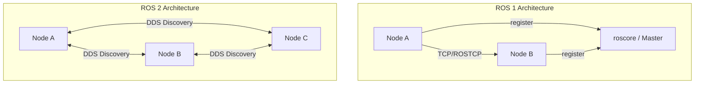
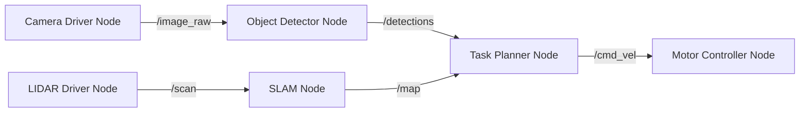
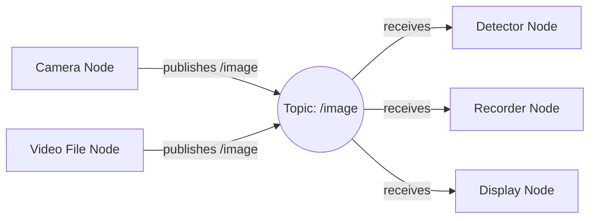
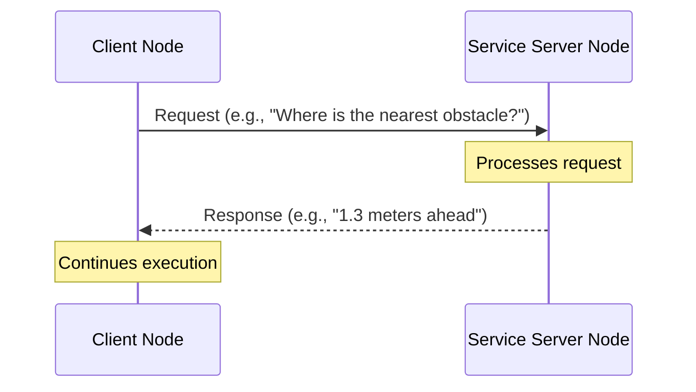
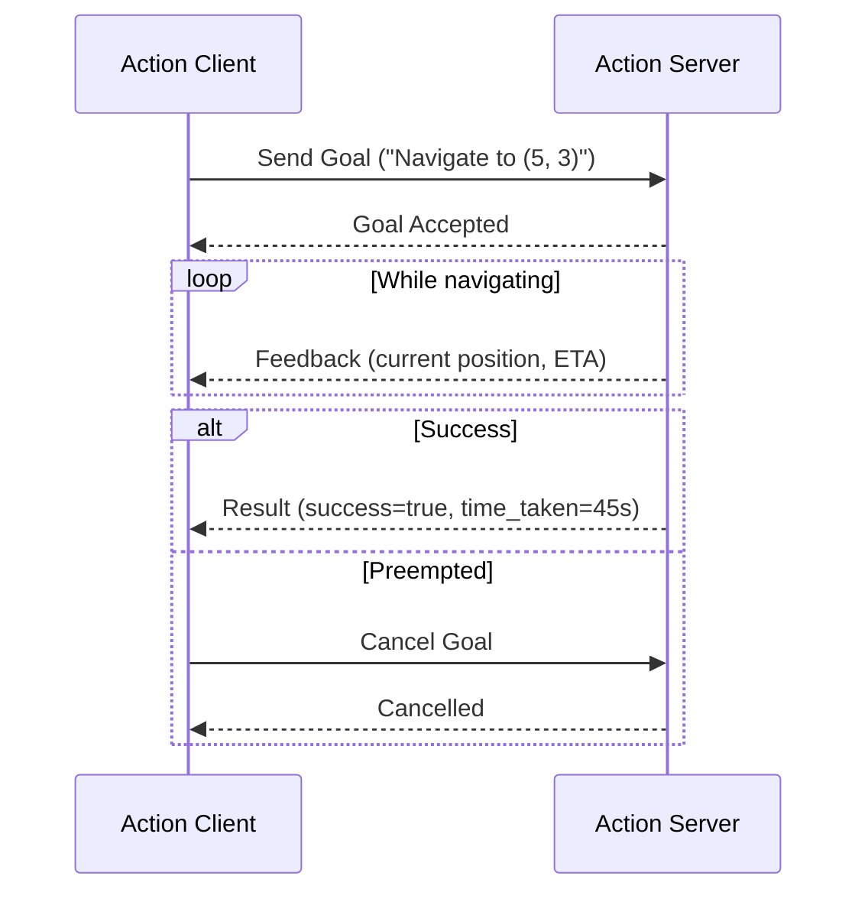
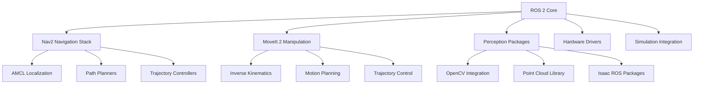

# Introduction to ROS 2


**Robot Operating System 2 (ROS 2)** is the industry-standard middleware framework for building robot applications. It is not an operating system in the traditional sense — rather, it is a collection of software libraries, tools, and conventions that help developers create complex robotic systems from reusable components.

ROS 2 is used by researchers, startups, and major robotics companies worldwide. From autonomous vehicles (Autoware) to humanoid robots (Boston Dynamics, Agility Robotics) to surgical robots (Intuitive Surgical), ROS 2 provides the communication backbone and tooling that modern robotics depends on.

## Why ROS 2? The Case Against ROS 1

ROS 1 (the original Robot Operating System) was created at Willow Garage in 2007. It revolutionized robotics software by providing shared tools, standardized interfaces, and a large community. However, ROS 1 has fundamental architectural limitations that make it unsuitable for production robotics:

| Feature | ROS 1 | ROS 2 |
|---------|-------|-------|
| Communication | Custom TCP/UDP with roscore | DDS (industry standard) |
| Real-time support | No | Yes (with appropriate DDS/OS) |
| Security | None | DDS Security |
| Multi-robot | Difficult | Native support |
| Platform support | Linux only | Linux, Windows, macOS |
| Python version | Python 2 | Python 3 |
| Quality of Service | None | Configurable QoS policies |
| End-of-life | ROS Noetic: May 2025 | Active, long-term support |

### The DDS Architecture Advantage

ROS 2's most important architectural change is the adoption of **Data Distribution Service (DDS)** as its communication layer. DDS is a proven, industrial-grade middleware standard used in aircraft, medical devices, financial trading systems, and defense.



In ROS 2, there is **no central broker or master**. Nodes discover each other automatically using DDS discovery protocols. If a node crashes, the rest of the system continues running. This decentralized design is essential for safety-critical robotic systems.

## Core Concepts

### Nodes

A **node** is the fundamental unit of computation in ROS 2. Each node is a process that performs a specific function:

- A camera driver node reads frames from a USB camera and publishes them
- A detection node subscribes to camera frames and publishes detected objects
- A navigation node subscribes to detections and publishes velocity commands
- A motor controller node subscribes to velocity commands and drives the motors

Nodes communicate with each other through four mechanisms: **Topics**, **Services**, **Actions**, and **Parameters**.



Each box above is a separate node, potentially running on different computers, written in different languages, yet all communicating seamlessly through ROS 2.

### Topics

**Topics** implement the **publish/subscribe** pattern. A publisher node sends messages to a named topic channel. Any number of subscriber nodes can receive those messages.

Topics are:
- **Asynchronous** — the publisher does not wait for subscribers
- **Anonymous** — publishers and subscribers do not know about each other
- **Many-to-many** — multiple publishers and multiple subscribers can use the same topic



**Common topic message types:**
- `sensor_msgs/msg/Image` — camera images
- `sensor_msgs/msg/LaserScan` — 2D LIDAR data
- `sensor_msgs/msg/PointCloud2` — 3D point cloud data
- `geometry_msgs/msg/Twist` — linear and angular velocity commands
- `nav_msgs/msg/Odometry` — robot position and velocity estimates
- `std_msgs/msg/String` — simple text messages

### Services

**Services** implement the **request/response** pattern. A client node sends a request and waits for a response from a server node. This is appropriate for:

- Triggering a one-time action (e.g., "capture an image")
- Getting a configuration value
- Short computations where the client needs the result before continuing



Unlike topics, services are **synchronous** from the client's perspective. The client blocks (or uses a future/callback) until the response arrives. Services should not be used for high-frequency data streams — use topics for that.

### Actions

**Actions** are for **long-running tasks** that provide feedback during execution and can be cancelled. They are built on top of topics internally but provide a higher-level interface.

An action has three components:
- **Goal** — what the client wants the server to do
- **Feedback** — periodic updates while the task is running
- **Result** — the final outcome when the task completes



**Examples of actions in robotics:**
- Navigate to a map coordinate (Nav2 uses actions)
- Execute a trajectory on a robot arm (MoveIt 2 uses actions)
- Perform a full object detection scan of the environment

### Parameters

**Parameters** allow nodes to be configured without modifying code. They are key-value pairs associated with a node, accessible at runtime.

```python
# Declaring a parameter in a node
self.declare_parameter('max_speed', 0.5)

# Reading the parameter
max_speed = self.get_parameter('max_speed').get_parameter_value().double_value

# Setting a parameter from the command line:
# ros2 param set /my_robot_node max_speed 0.3
```

Parameters can be:
- Set in launch files (common for configuration)
- Changed at runtime via `ros2 param set`
- Read by other nodes via parameter services
- Saved and loaded from YAML files

## The ROS 2 Computation Graph

When a ROS 2 system is running, all nodes and their connections form what is called the **computation graph**. You can visualize this with:

```bash
ros2 run rqt_graph rqt_graph
```

This shows every active node as a circle and every topic as a rectangle, with arrows showing the direction of data flow. It is an invaluable debugging tool.

## Quality of Service (QoS) Policies

One of ROS 2's major advantages over ROS 1 is configurable **Quality of Service** policies. These control how reliable message delivery is:

```python
from rclpy.qos import QoSProfile, ReliabilityPolicy, HistoryPolicy, DurabilityPolicy

# For sensor data (best effort, recent data only)
sensor_qos = QoSProfile(
    reliability=ReliabilityPolicy.BEST_EFFORT,
    history=HistoryPolicy.KEEP_LAST,
    depth=5
)

# For commands (reliable delivery required)
command_qos = QoSProfile(
    reliability=ReliabilityPolicy.RELIABLE,
    history=HistoryPolicy.KEEP_LAST,
    depth=10,
    durability=DurabilityPolicy.VOLATILE
)
```

**Key QoS settings:**
- **Reliability**: `RELIABLE` (guaranteed delivery) vs `BEST_EFFORT` (drop if needed)
- **History**: `KEEP_LAST` (N messages) vs `KEEP_ALL` (unlimited)
- **Durability**: `VOLATILE` (live subscribers only) vs `TRANSIENT_LOCAL` (late joiners get cached messages)

Sensor data typically uses `BEST_EFFORT` — dropping an old camera frame is fine. Safety-critical commands use `RELIABLE` — every stop command must arrive.

## ROS 2 Distributions

ROS 2 follows a release schedule tied to Ubuntu LTS versions:

| Distribution | Ubuntu | Status | End of Life |
|-------------|--------|--------|-------------|
| Humble Hawksbill | 22.04 | **Active LTS** | May 2027 |
| Iron Irwini | 22.04 | Active | November 2024 |
| Jazzy Jalisco | 24.04 | Active LTS | May 2029 |

**This course uses ROS 2 Humble** — the current LTS release with the best ecosystem support for robotics packages including Nav2, MoveIt 2, and Isaac ROS.

## The ROS 2 Ecosystem

The power of ROS 2 comes from its ecosystem of packages:



### Key Ecosystem Packages

**Nav2** (Navigation 2): The standard navigation stack for mobile robots. Includes localization (AMCL), mapping (SLAM Toolbox), path planning (NavFn, Smac), and trajectory control.

**MoveIt 2**: The standard motion planning framework for robot arms. Handles inverse kinematics, collision checking, trajectory optimization, and gripper control.

**ros2_control**: Hardware abstraction layer for actuators and sensors. Provides a standardized interface between ROS 2 and physical hardware.

**Isaac ROS**: NVIDIA's GPU-accelerated perception packages — object detection, segmentation, visual SLAM, and more, optimized for Jetson and RTX GPUs.

## A Complete ROS 2 Publisher Node

Here is a complete, working ROS 2 publisher node in Python — the canonical "Hello World" of ROS:

```python
#!/usr/bin/env python3
"""
Minimal ROS 2 publisher node.
Publishes a String message to the 'chatter' topic at 1 Hz.
"""

import rclpy
from rclpy.node import Node
from std_msgs.msg import String


class MinimalPublisher(Node):
    """A minimal ROS 2 publisher node."""

    def __init__(self):
        super().__init__('minimal_publisher')

        # Create a publisher on the 'chatter' topic
        # The '10' is the queue depth (how many messages to buffer)
        self.publisher_ = self.create_publisher(String, 'chatter', 10)

        # Create a timer that fires every 1.0 seconds
        timer_period = 1.0  # seconds
        self.timer = self.create_timer(timer_period, self.timer_callback)

        self.i = 0
        self.get_logger().info('MinimalPublisher node started')

    def timer_callback(self):
        """Called every timer period to publish a message."""
        msg = String()
        msg.data = f'Hello World: {self.i}'
        self.publisher_.publish(msg)
        self.get_logger().info(f'Publishing: "{msg.data}"')
        self.i += 1


def main(args=None):
    rclpy.init(args=args)

    node = MinimalPublisher()

    try:
        rclpy.spin(node)
    except KeyboardInterrupt:
        pass
    finally:
        node.destroy_node()
        rclpy.shutdown()


if __name__ == '__main__':
    main()
```

## A Complete ROS 2 Subscriber Node

```python
#!/usr/bin/env python3
"""
Minimal ROS 2 subscriber node.
Subscribes to the 'chatter' topic and logs received messages.
"""

import rclpy
from rclpy.node import Node
from std_msgs.msg import String


class MinimalSubscriber(Node):
    """A minimal ROS 2 subscriber node."""

    def __init__(self):
        super().__init__('minimal_subscriber')

        # Create a subscription to the 'chatter' topic
        self.subscription = self.create_subscription(
            String,
            'chatter',
            self.listener_callback,
            10  # QoS depth
        )
        self.get_logger().info('MinimalSubscriber node started, listening on /chatter')

    def listener_callback(self, msg):
        """Called whenever a message arrives on the topic."""
        self.get_logger().info(f'I heard: "{msg.data}"')


def main(args=None):
    rclpy.init(args=args)

    node = MinimalSubscriber()

    try:
        rclpy.spin(node)
    except KeyboardInterrupt:
        pass
    finally:
        node.destroy_node()
        rclpy.shutdown()


if __name__ == '__main__':
    main()
```

To test these nodes:
```bash
# Terminal 1 — run the publisher
ros2 run my_package minimal_publisher

# Terminal 2 — run the subscriber
ros2 run my_package minimal_subscriber

# Terminal 3 — inspect the topic from the command line
ros2 topic echo /chatter
ros2 topic hz /chatter      # message frequency
ros2 topic info /chatter    # type and connections
```

## ROS 2 CLI Tools

ROS 2 provides a powerful command-line interface for inspecting and interacting with running systems:

```bash
# Node management
ros2 node list                          # list all running nodes
ros2 node info /my_node                 # detailed info about a node

# Topic management
ros2 topic list                         # list all active topics
ros2 topic echo /cmd_vel                # print messages on a topic
ros2 topic pub /cmd_vel geometry_msgs/msg/Twist "{linear: {x: 0.5}}"

# Service management
ros2 service list                       # list all active services
ros2 service call /add_two_ints example_interfaces/srv/AddTwoInts "{a: 5, b: 3}"

# Parameter management
ros2 param list /my_node               # list parameters of a node
ros2 param get /my_node max_speed      # get a parameter value
ros2 param set /my_node max_speed 0.3  # set a parameter at runtime

# Package and launch
ros2 pkg list                          # list installed packages
ros2 launch my_package my_launch.py    # run a launch file

# Bag recording/playback (for data logging)
ros2 bag record /camera/image /scan    # record topics to file
ros2 bag play my_recording.bag         # replay recorded data
```

## ROS 2 vs Traditional Robot Software

Before ROS 2, robotic software was often:
- **Monolithic** — one large program with no clear separation of concerns
- **Hardware-coupled** — code written for one robot couldn't be reused on another
- **Non-reusable** — every team wrote their own navigation, visualization, and control code

ROS 2 solves these problems through:
- **Package ecosystem** — thousands of reusable components
- **Standardized interfaces** — message types everyone agrees on
- **Hardware abstraction** — swap hardware by changing a driver node
- **Community** — 10,000+ packages, active forums, major conference (ROSCon)

## Next Steps

With this conceptual foundation, you are ready to install ROS 2 and start coding. The next chapter walks through a complete installation of ROS 2 Humble on Ubuntu 22.04, from a fresh system to a running "Hello World" example.

After installation, the Basic Concepts chapter provides hands-on code for all four communication patterns: topics, services, actions, and parameters.
