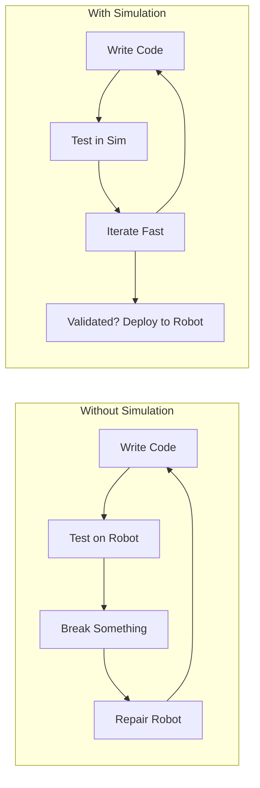
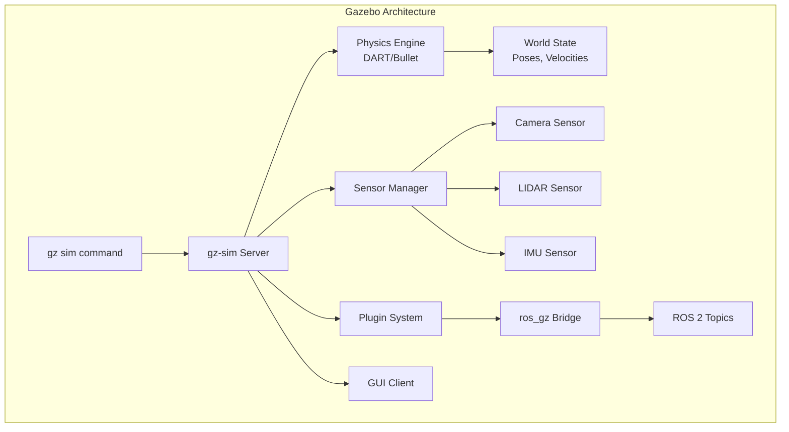

# Introduction to Gazebo Simulation

Gazebo is the leading open-source robot simulator used in academia and industry worldwide. It provides physics-accurate simulation of robots, sensors, and environments — enabling you to develop and test algorithms without physical hardware, then deploy with confidence to real robots.

## Why Use Simulation?

Before diving into Gazebo specifics, understand why simulation is so valuable in robotics development:



**Key advantages of simulation:**
- **Safety** — algorithms that crash a simulated robot don't damage anything
- **Speed** — simulate 10x faster than real time; test thousands of scenarios overnight
- **Repeatability** — exact same conditions every run; no weather, battery, or lighting variation
- **Cost** — simulate expensive hardware (humanoid robots, surgery robots) for free
- **Parallelism** — run 100 simulation instances simultaneously for reinforcement learning

## Gazebo Classic vs. Gazebo Harmonic

There are two major versions of Gazebo currently in use, and understanding the difference is important:

| Feature | Gazebo Classic (11) | Gazebo Harmonic (gz-harmonic) |
|---------|--------------------|-----------------------------|
| Also known as | `gazebo`, `gazebo11` | `gz`, new Gazebo |
| ROS 2 support | `gazebo_ros_pkgs` | `ros_gz` |
| Render engine | OGRE | Ogre2, OptiX |
| Physics engines | ODE, Bullet, DART | DART, Bullet, TPE |
| GUI framework | Qt4/5 | Qt5 with plugins |
| Plugin API | C++ only | C++, Python |
| Docker friendly | Limited | Full support |
| Status | Maintained (EOL 2025) | **Current LTS** |

**This course primarily uses Gazebo Harmonic (the new Gazebo)** when working with ROS 2 Humble, though Gazebo Classic examples are also provided since it remains widely used.



## Installing Gazebo Harmonic

### Install with ROS 2 Humble

```bash
# Install ros_gz (the ROS 2 / Gazebo bridge)
sudo apt update
sudo apt install ros-humble-ros-gz

# Or install Gazebo Harmonic standalone
sudo curl https://packages.osrfoundation.org/gazebo.gpg \
    --output /usr/share/keyrings/pkgs-osrf-archive-keyring.gpg

echo "deb [arch=$(dpkg --print-architecture) signed-by=/usr/share/keyrings/pkgs-osrf-archive-keyring.gpg] \
    http://packages.osrfoundation.org/gazebo/ubuntu-stable \
    $(lsb_release -cs) main" | sudo tee /etc/apt/sources.list.d/gazebo-stable.list > /dev/null

sudo apt update
sudo apt install gz-harmonic
```

### Install Gazebo Classic (Alternative)

```bash
# Gazebo Classic 11 (for ROS 2 Humble compatibility)
sudo apt install gazebo
sudo apt install ros-humble-gazebo-ros-pkgs
```

### Verify Installation

```bash
# Test Gazebo Harmonic
gz sim --version
gz sim shapes.sdf

# Test Gazebo Classic
gazebo --version
rosrun gazebo_ros gazebo  # with ROS sourced
```

## Your First Simulation: Empty World

Launch an empty Gazebo world and explore the interface:

```bash
# Launch empty world (Gazebo Harmonic)
gz sim empty.sdf

# Launch empty world with ROS 2 integration
ros2 launch ros_gz_sim gz_sim.launch.py gz_args:="empty.sdf"
```

### Adding Objects to the World

```bash
# Spawn a simple box into a running simulation
gz service -s /world/empty/create \
    --reqtype gz.msgs.EntityFactory \
    --reptype gz.msgs.Boolean \
    --timeout 1000 \
    --req 'sdf: "<sdf version=\"1.7\"><model name=\"box\"><pose>0 0 0.5 0 0 0</pose><link name=\"link\"><collision name=\"collision\"><geometry><box><size>1 1 1</size></box></geometry></collision><visual name=\"visual\"><geometry><box><size>1 1 1</size></box></geometry></visual></link></model></sdf>"'
```

## Creating a World File (SDF)

World files describe the entire simulation environment: ground plane, lighting, objects, and robots.

```xml
<?xml version="1.0" ?>
<!-- worlds/office_world.sdf -->
<sdf version="1.7">
  <world name="office_world">

    <!-- Physics settings -->
    <physics name="default_physics" default="true" type="dart">
      <max_step_size>0.001</max_step_size>
      <real_time_factor>1.0</real_time_factor>
      <real_time_update_rate>1000</real_time_update_rate>
    </physics>

    <!-- Plugins for ROS 2 integration -->
    <plugin filename="gz-sim-physics-system"
            name="gz::sim::systems::Physics">
    </plugin>
    <plugin filename="gz-sim-user-commands-system"
            name="gz::sim::systems::UserCommands">
    </plugin>
    <plugin filename="gz-sim-scene-broadcaster-system"
            name="gz::sim::systems::SceneBroadcaster">
    </plugin>

    <!-- Lighting -->
    <light type="directional" name="sun">
      <cast_shadows>true</cast_shadows>
      <pose>0 0 10 0 0 0</pose>
      <diffuse>0.8 0.8 0.8 1</diffuse>
      <specular>0.2 0.2 0.2 1</specular>
      <direction>-0.5 0.1 -0.9</direction>
    </light>

    <!-- Ground plane -->
    <model name="ground_plane">
      <static>true</static>
      <link name="link">
        <collision name="collision">
          <geometry>
            <plane>
              <normal>0 0 1</normal>
              <size>100 100</size>
            </plane>
          </geometry>
        </collision>
        <visual name="visual">
          <geometry>
            <plane>
              <normal>0 0 1</normal>
              <size>100 100</size>
            </plane>
          </geometry>
          <material>
            <ambient>0.8 0.8 0.8 1</ambient>
            <diffuse>0.8 0.8 0.8 1</diffuse>
          </material>
        </visual>
      </link>
    </model>

    <!-- Office walls -->
    <model name="wall_north">
      <static>true</static>
      <pose>5 0 1 0 0 0</pose>
      <link name="link">
        <collision name="collision">
          <geometry>
            <box><size>0.2 10 2</size></box>
          </geometry>
        </collision>
        <visual name="visual">
          <geometry>
            <box><size>0.2 10 2</size></box>
          </geometry>
          <material>
            <ambient>0.9 0.9 0.9 1</ambient>
            <diffuse>0.9 0.9 0.9 1</diffuse>
          </material>
        </visual>
      </link>
    </model>

    <!-- Office furniture: a table -->
    <model name="table_1">
      <static>true</static>
      <pose>2 0 0 0 0 0</pose>
      <link name="tabletop">
        <pose>0 0 0.75 0 0 0</pose>
        <collision name="collision">
          <geometry>
            <box><size>1.2 0.8 0.05</size></box>
          </geometry>
        </collision>
        <visual name="visual">
          <geometry>
            <box><size>1.2 0.8 0.05</size></box>
          </geometry>
          <material>
            <ambient>0.6 0.4 0.2 1</ambient>
            <diffuse>0.6 0.4 0.2 1</diffuse>
          </material>
        </visual>
      </link>
    </model>

    <!-- A graspable object: red cup -->
    <model name="red_cup">
      <pose>2 0 0.82 0 0 0</pose>
      <link name="link">
        <inertial>
          <mass>0.1</mass>
          <inertia>
            <ixx>0.0001</ixx> <ixy>0</ixy> <ixz>0</ixz>
            <iyy>0.0001</iyy> <iyz>0</iyz>
            <izz>0.0001</izz>
          </inertia>
        </inertial>
        <collision name="collision">
          <geometry>
            <cylinder><radius>0.04</radius><length>0.1</length></cylinder>
          </geometry>
        </collision>
        <visual name="visual">
          <geometry>
            <cylinder><radius>0.04</radius><length>0.1</length></cylinder>
          </geometry>
          <material>
            <ambient>0.8 0.1 0.1 1</ambient>
            <diffuse>0.8 0.1 0.1 1</diffuse>
          </material>
        </visual>
      </link>
    </model>

  </world>
</sdf>
```

## Launching a Robot in Gazebo

A complete launch file to spawn a robot in Gazebo and connect it to ROS 2:

```python
# launch/robot_in_gazebo.launch.py
import os
from launch import LaunchDescription
from launch.actions import DeclareLaunchArgument, IncludeLaunchDescription
from launch.substitutions import LaunchConfiguration, PathJoinSubstitution
from launch_ros.actions import Node
from launch_ros.substitutions import FindPackageShare
from ament_index_python.packages import get_package_share_directory


def generate_launch_description():

    pkg_dir = get_package_share_directory('my_robot_pkg')

    # Arguments
    world_arg = DeclareLaunchArgument(
        'world',
        default_value=os.path.join(pkg_dir, 'worlds', 'office_world.sdf'),
        description='Path to world SDF file'
    )

    robot_urdf_arg = DeclareLaunchArgument(
        'robot_urdf',
        default_value=os.path.join(pkg_dir, 'urdf', 'my_robot.urdf.xacro'),
        description='Path to robot URDF/xacro file'
    )

    # Launch Gazebo
    gazebo = IncludeLaunchDescription(
        PathJoinSubstitution([
            FindPackageShare('ros_gz_sim'),
            'launch',
            'gz_sim.launch.py'
        ]),
        launch_arguments={
            'gz_args': ['-r ', LaunchConfiguration('world')],
        }.items()
    )

    # Robot state publisher (reads URDF, publishes TF)
    robot_state_publisher = Node(
        package='robot_state_publisher',
        executable='robot_state_publisher',
        name='robot_state_publisher',
        output='screen',
        parameters=[{
            'use_sim_time': True,
            'robot_description': open(
                os.path.join(pkg_dir, 'urdf', 'my_robot.urdf')
            ).read()
        }]
    )

    # Spawn robot into Gazebo
    spawn_robot = Node(
        package='ros_gz_sim',
        executable='create',
        arguments=[
            '-name', 'my_robot',
            '-topic', 'robot_description',
            '-x', '0', '-y', '0', '-z', '0.1'
        ],
        output='screen'
    )

    # Bridge ROS 2 topics to/from Gazebo
    ros_gz_bridge = Node(
        package='ros_gz_bridge',
        executable='parameter_bridge',
        arguments=[
            '/cmd_vel@geometry_msgs/msg/Twist@gz.msgs.Twist',
            '/odom@nav_msgs/msg/Odometry@gz.msgs.Odometry',
            '/scan@sensor_msgs/msg/LaserScan@gz.msgs.LaserScan',
            '/camera/image@sensor_msgs/msg/Image@gz.msgs.Image',
            '/clock@rosgraph_msgs/msg/Clock@gz.msgs.Clock',
        ],
        output='screen'
    )

    return LaunchDescription([
        world_arg,
        robot_urdf_arg,
        gazebo,
        robot_state_publisher,
        spawn_robot,
        ros_gz_bridge,
    ])
```

## Sensor Simulation

### Camera Sensor

Add a camera sensor to your robot in the SDF/URDF:

```xml
<!-- Camera sensor plugin for Gazebo Harmonic -->
<gazebo reference="camera_link">
  <sensor name="rgb_camera" type="camera">
    <pose>0 0 0 0 0 0</pose>
    <update_rate>30</update_rate>
    <always_on>true</always_on>
    <visualize>false</visualize>
    <camera>
      <horizontal_fov>1.047</horizontal_fov>
      <image>
        <width>1280</width>
        <height>720</height>
        <format>R8G8B8</format>
      </image>
      <clip>
        <near>0.05</near>
        <far>300</far>
      </clip>
      <noise>
        <type>gaussian</type>
        <mean>0.0</mean>
        <stddev>0.007</stddev>
      </noise>
    </camera>
    <plugin filename="gz-sim-camera-sensor-system"
            name="gz::sim::systems::CameraSensor">
    </plugin>
  </sensor>
</gazebo>
```

### LIDAR Sensor

```xml
<!-- 2D LIDAR sensor (like RPLiDAR) -->
<gazebo reference="lidar_link">
  <sensor name="lidar_2d" type="ray">
    <pose>0 0 0 0 0 0</pose>
    <update_rate>10</update_rate>
    <always_on>true</always_on>
    <visualize>true</visualize>
    <ray>
      <scan>
        <horizontal>
          <samples>720</samples>
          <resolution>1</resolution>
          <min_angle>-3.14159</min_angle>
          <max_angle>3.14159</max_angle>
        </horizontal>
      </scan>
      <range>
        <min>0.12</min>
        <max>12.0</max>
        <resolution>0.015</resolution>
      </range>
      <noise>
        <type>gaussian</type>
        <mean>0.0</mean>
        <stddev>0.01</stddev>
      </noise>
    </ray>
    <plugin filename="gz-sim-ray-sensor-system"
            name="gz::sim::systems::RaySensor">
    </plugin>
  </sensor>
</gazebo>
```

## Controlling a Robot in Simulation

Once your robot is spawned, you can control it with standard ROS 2 tools:

```bash
# Send velocity commands (move forward at 0.3 m/s)
ros2 topic pub /cmd_vel geometry_msgs/msg/Twist \
    "{linear: {x: 0.3, y: 0.0, z: 0.0}, angular: {x: 0.0, y: 0.0, z: 0.0}}" \
    --once

# Teleoperate with keyboard
ros2 run teleop_twist_keyboard teleop_twist_keyboard

# View camera feed in RViz2
rviz2  # Add Image display, set topic to /camera/image

# View LIDAR in RViz2
rviz2  # Add LaserScan display, set topic to /scan
```

## Gazebo Command-Line Tools

```bash
# List all worlds
gz world --list

# Pause/resume simulation
gz sim --pause
gz sim --resume

# Get model list in running simulation
gz model --list

# Get pose of a specific model
gz model -m my_robot --pose

# Apply a force to a model (useful for testing)
gz model -m my_robot --force 10 0 0

# Record simulation to bag file
ros2 bag record /scan /camera/image /odom /tf /tf_static
```

## Best Practices for Gazebo Simulation

### Physics Tuning

```xml
<!-- Optimize physics for robotics (not games) -->
<physics type="dart">
  <max_step_size>0.001</max_step_size>    <!-- 1ms steps for accuracy -->
  <real_time_factor>1.0</real_time_factor> <!-- 1.0 = real time, >1 = faster -->
  <real_time_update_rate>1000</real_time_update_rate>
  <dart>
    <solver>
      <solver_type>dantzig</solver_type>   <!-- Good for articulated robots -->
      <num_threads>4</num_threads>
    </solver>
  </dart>
</physics>
```

### Performance Tips

1. **Use simplified collision geometry** — collision meshes should be boxes/cylinders, not the full visual mesh
2. **Set appropriate update rates** — 10 Hz for LIDAR is usually sufficient; cameras need 30 Hz only if needed
3. **Disable shadows** in large environments if performance is critical
4. **Use static models** for non-moving objects (walls, tables) — `<static>true</static>`
5. **Reduce texture resolution** for models that don't need fine detail

### Sim-to-Real Transfer

The biggest challenge in simulation is the "sim-to-real gap" — differences between simulated and real behavior. Minimize it by:

- **Accurate mass and inertia** — measure your actual robot links
- **Realistic friction** — calibrate friction coefficients against real surface measurements
- **Sensor noise modeling** — add Gaussian noise matching real sensor specs
- **Domain randomization** — train with randomized physics parameters to improve generalization

## Troubleshooting

### Gazebo won't start
```bash
# Check GPU driver
nvidia-smi

# Launch headless (no GUI) for debugging
gz sim -s empty.sdf  # server only, no GUI

# Check for conflicting Gazebo versions
which gz gazebo
gz --version
gazebo --version
```

### Robot falls through ground
Check that your robot's ground links have `<collision>` elements, and the ground plane `<collision>` is properly defined.

### Camera image is black
Verify the camera plugin is correctly loaded and the bridge topic name matches. Check the `gz topic -l` output for the Gazebo-side camera topic.

## Next Steps

With Gazebo fundamentals covered, the next chapter on **Robot Modeling** dives deep into URDF, SDF, and Xacro — the formats used to describe robot geometry, kinematics, and sensors. You will build a complete mobile manipulator model from scratch.
