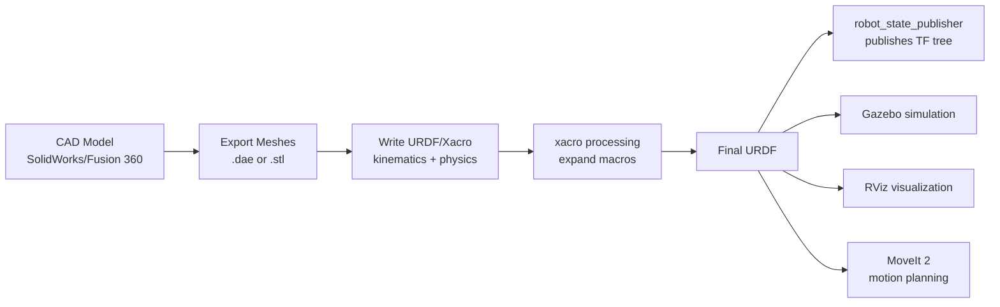
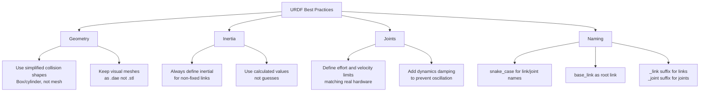

# Robot Modeling: URDF, SDF, and Xacro

Robot modeling is the process of creating a mathematical and geometric description of a robot for use in simulation, visualization, and control. A well-crafted robot model is the foundation of every simulation project — it determines how accurately the simulated robot behaves compared to the real one.

This chapter covers three formats: **URDF** (for ROS), **SDF** (for Gazebo), and **Xacro** (for parametric URDF generation).

## The Robot Description Pipeline



## URDF: Unified Robot Description Format

URDF is an XML format developed for ROS. It describes a robot as a **kinematic tree** of **links** (rigid bodies) connected by **joints** (constraints).

### URDF Concepts

**Links** represent physical rigid bodies:
- Visual geometry (what it looks like)
- Collision geometry (what physics uses for contact detection)
- Inertial properties (mass and moment of inertia)

**Joints** connect links:
- **fixed** — no movement (e.g., camera mounted on robot)
- **revolute** — rotation around an axis with limits (e.g., servo joint)
- **continuous** — unlimited rotation (e.g., wheel)
- **prismatic** — linear sliding (e.g., linear actuator)
- **floating** — 6-DOF free motion
- **planar** — motion in a plane

### Complete Mobile Robot URDF

This is a complete differential-drive mobile robot with LIDAR and camera:

```xml
<?xml version="1.0"?>
<!-- urdf/mobile_robot.urdf -->
<robot name="mobile_robot">

  <!-- ===========================
       MATERIALS
       =========================== -->
  <material name="dark_gray">
    <color rgba="0.2 0.2 0.2 1"/>
  </material>
  <material name="light_gray">
    <color rgba="0.7 0.7 0.7 1"/>
  </material>
  <material name="black">
    <color rgba="0.1 0.1 0.1 1"/>
  </material>
  <material name="blue">
    <color rgba="0.1 0.1 0.8 1"/>
  </material>

  <!-- ===========================
       BASE CHASSIS
       =========================== -->
  <link name="base_footprint"/>

  <joint name="base_footprint_joint" type="fixed">
    <parent link="base_footprint"/>
    <child link="base_link"/>
    <origin xyz="0 0 0.05" rpy="0 0 0"/>
  </joint>

  <link name="base_link">
    <visual>
      <origin xyz="0 0 0" rpy="0 0 0"/>
      <geometry>
        <box size="0.35 0.25 0.10"/>
      </geometry>
      <material name="dark_gray"/>
    </visual>
    <collision>
      <origin xyz="0 0 0" rpy="0 0 0"/>
      <geometry>
        <box size="0.35 0.25 0.10"/>
      </geometry>
    </collision>
    <inertial>
      <origin xyz="0 0 0" rpy="0 0 0"/>
      <mass value="3.0"/>
      <!-- Box inertia: I = (1/12)*m*(h^2+d^2) etc. -->
      <inertia
        ixx="0.0195" ixy="0" ixz="0"
        iyy="0.0357" iyz="0"
        izz="0.0487"/>
    </inertial>
  </link>

  <!-- ===========================
       LEFT WHEEL
       =========================== -->
  <joint name="left_wheel_joint" type="continuous">
    <parent link="base_link"/>
    <child link="left_wheel"/>
    <origin xyz="0.0 0.15 -0.025" rpy="-1.5708 0 0"/>
    <axis xyz="0 0 1"/>
    <dynamics damping="0.01" friction="0.1"/>
  </joint>

  <link name="left_wheel">
    <visual>
      <origin xyz="0 0 0" rpy="0 0 0"/>
      <geometry>
        <cylinder radius="0.05" length="0.04"/>
      </geometry>
      <material name="black"/>
    </visual>
    <collision>
      <origin xyz="0 0 0" rpy="0 0 0"/>
      <geometry>
        <cylinder radius="0.05" length="0.04"/>
      </geometry>
    </collision>
    <inertial>
      <mass value="0.3"/>
      <!-- Cylinder inertia: Ixx=Iyy=(1/12)*m*(3r^2+h^2), Izz=(1/2)*m*r^2 -->
      <inertia
        ixx="0.000208" ixy="0" ixz="0"
        iyy="0.000208" iyz="0"
        izz="0.000375"/>
    </inertial>
  </link>

  <!-- ===========================
       RIGHT WHEEL
       =========================== -->
  <joint name="right_wheel_joint" type="continuous">
    <parent link="base_link"/>
    <child link="right_wheel"/>
    <origin xyz="0.0 -0.15 -0.025" rpy="1.5708 0 0"/>
    <axis xyz="0 0 1"/>
    <dynamics damping="0.01" friction="0.1"/>
  </joint>

  <link name="right_wheel">
    <visual>
      <origin xyz="0 0 0" rpy="0 0 0"/>
      <geometry>
        <cylinder radius="0.05" length="0.04"/>
      </geometry>
      <material name="black"/>
    </visual>
    <collision>
      <geometry>
        <cylinder radius="0.05" length="0.04"/>
      </geometry>
    </collision>
    <inertial>
      <mass value="0.3"/>
      <inertia
        ixx="0.000208" ixy="0" ixz="0"
        iyy="0.000208" iyz="0"
        izz="0.000375"/>
    </inertial>
  </link>

  <!-- ===========================
       CASTER WHEEL (passive)
       =========================== -->
  <joint name="caster_joint" type="fixed">
    <parent link="base_link"/>
    <child link="caster_wheel"/>
    <origin xyz="-0.14 0 -0.04" rpy="0 0 0"/>
  </joint>

  <link name="caster_wheel">
    <visual>
      <geometry>
        <sphere radius="0.02"/>
      </geometry>
      <material name="light_gray"/>
    </visual>
    <collision>
      <geometry>
        <sphere radius="0.02"/>
      </geometry>
    </collision>
    <inertial>
      <mass value="0.05"/>
      <inertia ixx="0.000008" ixy="0" ixz="0"
               iyy="0.000008" iyz="0" izz="0.000008"/>
    </inertial>
  </link>

  <!-- ===========================
       LIDAR SENSOR
       =========================== -->
  <joint name="lidar_joint" type="fixed">
    <parent link="base_link"/>
    <child link="lidar_link"/>
    <origin xyz="0.1 0 0.065" rpy="0 0 0"/>
  </joint>

  <link name="lidar_link">
    <visual>
      <geometry>
        <cylinder radius="0.035" length="0.05"/>
      </geometry>
      <material name="black"/>
    </visual>
    <collision>
      <geometry>
        <cylinder radius="0.035" length="0.05"/>
      </geometry>
    </collision>
    <inertial>
      <mass value="0.1"/>
      <inertia ixx="0.000017" ixy="0" ixz="0"
               iyy="0.000017" iyz="0" izz="0.000006"/>
    </inertial>
  </link>

  <!-- ===========================
       CAMERA SENSOR
       =========================== -->
  <joint name="camera_joint" type="fixed">
    <parent link="base_link"/>
    <child link="camera_link"/>
    <origin xyz="0.16 0 0.04" rpy="0 0.2 0"/>
  </joint>

  <link name="camera_link">
    <visual>
      <geometry>
        <box size="0.02 0.05 0.03"/>
      </geometry>
      <material name="blue"/>
    </visual>
    <collision>
      <geometry>
        <box size="0.02 0.05 0.03"/>
      </geometry>
    </collision>
    <inertial>
      <mass value="0.05"/>
      <inertia ixx="0.000001" ixy="0" ixz="0"
               iyy="0.000001" iyz="0" izz="0.000001"/>
    </inertial>
  </link>

  <!-- Camera optical frame (Z forward for ROS convention) -->
  <joint name="camera_optical_joint" type="fixed">
    <parent link="camera_link"/>
    <child link="camera_optical_frame"/>
    <origin xyz="0 0 0" rpy="-1.5708 0 -1.5708"/>
  </joint>

  <link name="camera_optical_frame"/>

  <!-- ===========================
       GAZEBO PLUGINS
       =========================== -->

  <!-- Differential drive controller -->
  <gazebo>
    <plugin filename="gz-sim-diff-drive-system"
            name="gz::sim::systems::DiffDrive">
      <left_joint>left_wheel_joint</left_joint>
      <right_joint>right_wheel_joint</right_joint>
      <wheel_separation>0.30</wheel_separation>
      <wheel_radius>0.05</wheel_radius>
      <odom_publish_frequency>10</odom_publish_frequency>
      <topic>cmd_vel</topic>
      <odom_topic>odom</odom_topic>
      <frame_id>odom</frame_id>
      <child_frame_id>base_footprint</child_frame_id>
    </plugin>
  </gazebo>

  <!-- LIDAR sensor plugin -->
  <gazebo reference="lidar_link">
    <sensor name="lidar" type="ray">
      <always_on>true</always_on>
      <visualize>false</visualize>
      <update_rate>10</update_rate>
      <ray>
        <scan>
          <horizontal>
            <samples>720</samples>
            <min_angle>-3.14159</min_angle>
            <max_angle>3.14159</max_angle>
          </horizontal>
        </scan>
        <range>
          <min>0.12</min>
          <max>12.0</max>
        </range>
        <noise>
          <type>gaussian</type>
          <stddev>0.01</stddev>
        </noise>
      </ray>
      <plugin filename="gz-sim-ray-sensor-system"
              name="gz::sim::systems::RaySensor">
        <ros>
          <remapping>~/out:=scan</remapping>
        </ros>
      </plugin>
    </sensor>
  </gazebo>

  <!-- RGB Camera plugin -->
  <gazebo reference="camera_link">
    <sensor name="rgb_camera" type="camera">
      <always_on>true</always_on>
      <visualize>false</visualize>
      <update_rate>30</update_rate>
      <camera>
        <horizontal_fov>1.047</horizontal_fov>
        <image>
          <width>640</width>
          <height>480</height>
          <format>R8G8B8</format>
        </image>
        <clip>
          <near>0.05</near>
          <far>300</far>
        </clip>
      </camera>
      <plugin filename="gz-sim-camera-sensor-system"
              name="gz::sim::systems::CameraSensor">
        <ros>
          <remapping>~/image_raw:=camera/image</remapping>
          <remapping>~/camera_info:=camera/camera_info</remapping>
        </ros>
        <frame_name>camera_optical_frame</frame_name>
      </plugin>
    </sensor>
  </gazebo>

</robot>
```

## Xacro: Parametric Robot Description

URDF files can become unwieldy for complex robots. **Xacro** (XML Macros) adds:
- **Variables** — define constants like wheel radius once, use everywhere
- **Macros** — define a leg once, instantiate it 6 times
- **Conditional logic** — include parts only when certain conditions are met
- **Math expressions** — compute values like `${wheel_radius * 2}`

### Xacro Mobile Robot (Parametric)

```xml
<?xml version="1.0"?>
<!-- urdf/mobile_robot.urdf.xacro -->
<robot name="mobile_robot" xmlns:xacro="http://ros.org/wiki/xacro">

  <!-- ===========================
       PARAMETERS (change here!)
       =========================== -->
  <xacro:property name="chassis_length" value="0.35"/>
  <xacro:property name="chassis_width" value="0.25"/>
  <xacro:property name="chassis_height" value="0.10"/>
  <xacro:property name="chassis_mass" value="3.0"/>

  <xacro:property name="wheel_radius" value="0.05"/>
  <xacro:property name="wheel_width" value="0.04"/>
  <xacro:property name="wheel_mass" value="0.3"/>
  <xacro:property name="wheel_separation" value="0.30"/>  <!-- distance between wheels -->
  <xacro:property name="wheel_x_offset" value="0.0"/>

  <xacro:property name="PI" value="3.14159265358979"/>

  <!-- ===========================
       INERTIA MACROS
       (Reusable calculations)
       =========================== -->

  <!-- Solid box inertia -->
  <xacro:macro name="box_inertia" params="m w h d">
    <inertial>
      <origin xyz="0 0 0" rpy="0 0 0"/>
      <mass value="${m}"/>
      <inertia
        ixx="${(1/12)*m*(h*h+d*d)}"
        ixy="0" ixz="0"
        iyy="${(1/12)*m*(w*w+d*d)}"
        iyz="0"
        izz="${(1/12)*m*(w*w+h*h)}"/>
    </inertial>
  </xacro:macro>

  <!-- Solid cylinder inertia -->
  <xacro:macro name="cylinder_inertia" params="m r h">
    <inertial>
      <origin xyz="0 0 0" rpy="0 0 0"/>
      <mass value="${m}"/>
      <inertia
        ixx="${(1/12)*m*(3*r*r+h*h)}"
        ixy="0" ixz="0"
        iyy="${(1/12)*m*(3*r*r+h*h)}"
        iyz="0"
        izz="${(1/2)*m*r*r}"/>
    </inertial>
  </xacro:macro>

  <!-- ===========================
       WHEEL MACRO
       (Instantiated twice)
       =========================== -->
  <xacro:macro name="wheel" params="name x_pos y_pos direction">
    <joint name="${name}_wheel_joint" type="continuous">
      <parent link="base_link"/>
      <child link="${name}_wheel"/>
      <origin xyz="${x_pos} ${y_pos} ${-chassis_height/2 + wheel_radius/2}"
              rpy="${direction * PI/2} 0 0"/>
      <axis xyz="0 0 1"/>
      <dynamics damping="0.01" friction="0.1"/>
    </joint>

    <link name="${name}_wheel">
      <visual>
        <geometry>
          <cylinder radius="${wheel_radius}" length="${wheel_width}"/>
        </geometry>
        <material name="black"/>
      </visual>
      <collision>
        <geometry>
          <cylinder radius="${wheel_radius}" length="${wheel_width}"/>
        </geometry>
      </collision>
      <xacro:cylinder_inertia m="${wheel_mass}" r="${wheel_radius}" h="${wheel_width}"/>
    </link>
  </xacro:macro>

  <!-- ===========================
       ROBOT BODY
       =========================== -->
  <link name="base_footprint"/>

  <joint name="base_footprint_joint" type="fixed">
    <parent link="base_footprint"/>
    <child link="base_link"/>
    <origin xyz="0 0 ${wheel_radius}" rpy="0 0 0"/>
  </joint>

  <link name="base_link">
    <visual>
      <geometry>
        <box size="${chassis_length} ${chassis_width} ${chassis_height}"/>
      </geometry>
      <material name="dark_gray"/>
    </visual>
    <collision>
      <geometry>
        <box size="${chassis_length} ${chassis_width} ${chassis_height}"/>
      </geometry>
    </collision>
    <xacro:box_inertia m="${chassis_mass}" w="${chassis_width}"
                       h="${chassis_height}" d="${chassis_length}"/>
  </link>

  <!-- Instantiate left and right wheels using the macro -->
  <xacro:wheel name="left"
               x_pos="${wheel_x_offset}"
               y_pos="${wheel_separation/2}"
               direction="-1"/>

  <xacro:wheel name="right"
               x_pos="${wheel_x_offset}"
               y_pos="${-wheel_separation/2}"
               direction="1"/>

</robot>
```

Convert Xacro to URDF:
```bash
# Install xacro
sudo apt install ros-humble-xacro

# Convert xacro to URDF
ros2 run xacro xacro mobile_robot.urdf.xacro > mobile_robot.urdf

# Or specify output file
xacro mobile_robot.urdf.xacro -o mobile_robot.urdf

# Validate the URDF
check_urdf mobile_robot.urdf
```

## Kinematics and Dynamics Calculations

### Inertia Tensor Calculation

Correct inertia values are critical for realistic simulation. Incorrect inertia causes oscillation, instability, and "floating" behavior.

```python
#!/usr/bin/env python3
"""
Inertia tensor calculator for common shapes.
Use this to compute correct values for URDF.
"""

import math


def box_inertia(mass: float, width: float, height: float, depth: float) -> dict:
    """
    Compute inertia tensor for a solid box.

    Args:
        mass: mass in kg
        width: dimension along X axis (m)
        height: dimension along Z axis (m)
        depth: dimension along Y axis (m)

    Returns:
        Dictionary with ixx, iyy, izz (ixy=ixz=iyz=0 for uniform box)
    """
    ixx = (1/12) * mass * (height**2 + depth**2)
    iyy = (1/12) * mass * (width**2 + height**2)
    izz = (1/12) * mass * (width**2 + depth**2)
    return {'ixx': ixx, 'iyy': iyy, 'izz': izz, 'ixy': 0, 'ixz': 0, 'iyz': 0}


def cylinder_inertia(mass: float, radius: float, length: float) -> dict:
    """
    Compute inertia tensor for a solid cylinder (axis along Z).

    Args:
        mass: mass in kg
        radius: cylinder radius (m)
        length: cylinder height/length (m)
    """
    ixx = (1/12) * mass * (3 * radius**2 + length**2)
    iyy = ixx  # symmetric
    izz = (1/2) * mass * radius**2
    return {'ixx': ixx, 'iyy': iyy, 'izz': izz, 'ixy': 0, 'ixz': 0, 'iyz': 0}


def sphere_inertia(mass: float, radius: float) -> dict:
    """Compute inertia tensor for a solid sphere."""
    i = (2/5) * mass * radius**2
    return {'ixx': i, 'iyy': i, 'izz': i, 'ixy': 0, 'ixz': 0, 'iyz': 0}


def print_inertia(name: str, inertia: dict):
    """Print inertia in URDF format."""
    print(f"\n<!-- {name} -->")
    print(f"<inertia")
    print(f"  ixx=\"{inertia['ixx']:.8f}\" ixy=\"{inertia['ixy']}\" ixz=\"{inertia['ixz']}\"")
    print(f"  iyy=\"{inertia['iyy']:.8f}\" iyz=\"{inertia['iyz']}\"")
    print(f"  izz=\"{inertia['izz']:.8f}\"/>")


if __name__ == '__main__':
    # Example: mobile robot chassis
    chassis = box_inertia(mass=3.0, width=0.25, height=0.10, depth=0.35)
    print_inertia("Robot chassis (3kg, 35x25x10cm box)", chassis)

    # Wheel
    wheel = cylinder_inertia(mass=0.3, radius=0.05, length=0.04)
    print_inertia("Wheel (0.3kg, r=5cm, h=4cm cylinder)", wheel)

    # Camera housing
    camera = box_inertia(mass=0.05, width=0.05, height=0.03, depth=0.02)
    print_inertia("Camera (0.05kg, 5x3x2cm box)", camera)
```

### 2D Inverse Kinematics

```python
import math
import numpy as np


def ik_2dof_planar(target_x: float, target_y: float, l1: float, l2: float):
    """
    Solve inverse kinematics for a 2-DOF planar robot arm.

    Parameters:
        target_x, target_y: Desired end-effector position
        l1: Length of first link
        l2: Length of second link

    Returns:
        Tuple (theta1, theta2) in radians, or None if unreachable
    """
    # Distance to target
    d = math.sqrt(target_x**2 + target_y**2)

    # Check reachability
    if d > l1 + l2:
        print(f"Target unreachable: distance {d:.3f} > max reach {l1+l2:.3f}")
        return None
    if d < abs(l1 - l2):
        print(f"Target too close: distance {d:.3f} < min reach {abs(l1-l2):.3f}")
        return None

    # Law of cosines: find elbow angle
    cos_theta2 = (target_x**2 + target_y**2 - l1**2 - l2**2) / (2 * l1 * l2)
    cos_theta2 = max(-1.0, min(1.0, cos_theta2))  # Clamp for numerical stability
    theta2 = math.acos(cos_theta2)  # Elbow-up solution

    # Find shoulder angle
    k1 = l1 + l2 * math.cos(theta2)
    k2 = l2 * math.sin(theta2)
    theta1 = math.atan2(target_y, target_x) - math.atan2(k2, k1)

    return (theta1, theta2)


# Test the IK solver
l1, l2 = 0.3, 0.25  # Link lengths in meters

test_targets = [
    (0.3, 0.2, "forward reach"),
    (0.0, 0.4, "straight up"),
    (0.1, 0.1, "close position"),
    (0.6, 0.0, "full extension"),
]

print("2-DOF Planar IK Solutions:")
print(f"{'Target':20} {'theta1 (deg)':15} {'theta2 (deg)':15} {'Status':10}")
print("-" * 65)

for tx, ty, desc in test_targets:
    result = ik_2dof_planar(tx, ty, l1, l2)
    if result:
        t1, t2 = result
        print(f"({tx:+.2f}, {ty:+.2f}) {desc:15} "
              f"{math.degrees(t1):+.1f}°         "
              f"{math.degrees(t2):+.1f}°         OK")
    else:
        print(f"({tx:+.2f}, {ty:+.2f}) {desc:15} {'---':15} {'---':15} UNREACHABLE")
```

## URDF Validation

Always validate your URDF before using it:

```bash
# Install urdf_parser_py if not present
sudo apt install ros-humble-urdfdom-py

# Check URDF validity
check_urdf my_robot.urdf

# Display the link tree
check_urdf my_robot.urdf 2>&1 | grep -A 100 "robot name"

# Visualize in RViz (requires robot_state_publisher)
ros2 launch urdf_tutorial display.launch.py model:=my_robot.urdf
```

```python
#!/usr/bin/env python3
"""Validate a URDF file programmatically."""

import xml.etree.ElementTree as ET


def validate_urdf(urdf_path: str) -> bool:
    """
    Basic URDF validation: check structure and connectivity.

    Returns True if valid, False with printed errors if not.
    """
    try:
        tree = ET.parse(urdf_path)
        root = tree.getroot()
    except ET.ParseError as e:
        print(f"XML parse error: {e}")
        return False

    if root.tag != 'robot':
        print(f"Root element must be 'robot', found '{root.tag}'")
        return False

    robot_name = root.get('name', '<unnamed>')
    links = {link.get('name') for link in root.findall('link')}
    joints = root.findall('joint')

    print(f"Robot: {robot_name}")
    print(f"Links: {len(links)}")
    print(f"Joints: {len(joints)}")

    errors = []

    # Check all joint parent/child links exist
    for joint in joints:
        joint_name = joint.get('name', '<unnamed>')
        parent = joint.find('parent')
        child = joint.find('child')

        if parent is None:
            errors.append(f"Joint '{joint_name}' missing <parent>")
            continue
        if child is None:
            errors.append(f"Joint '{joint_name}' missing <child>")
            continue

        parent_link = parent.get('link')
        child_link = child.get('link')

        if parent_link not in links:
            errors.append(f"Joint '{joint_name}': parent link '{parent_link}' not found")
        if child_link not in links:
            errors.append(f"Joint '{joint_name}': child link '{child_link}' not found")

    if errors:
        print("\nValidation errors:")
        for error in errors:
            print(f"  - {error}")
        return False

    print("\nURDF validation passed!")
    return True


if __name__ == '__main__':
    import sys
    path = sys.argv[1] if len(sys.argv) > 1 else 'my_robot.urdf'
    validate_urdf(path)
```

## Joint Types and Limits

Properly defined joint limits prevent physically impossible configurations:

```xml
<!-- Revolute joint (servo motor) with full configuration -->
<joint name="elbow_joint" type="revolute">
  <parent link="upper_arm"/>
  <child link="forearm"/>
  <origin xyz="0 0 0.25" rpy="0 0 0"/>
  <axis xyz="0 1 0"/>

  <!-- Position limits in radians -->
  <limit
    lower="-2.094"    <!-- -120 degrees -->
    upper="2.094"     <!--  120 degrees -->
    effort="50.0"     <!-- Max torque in N*m -->
    velocity="2.094"  <!-- Max speed in rad/s (2 rad/s ≈ 114 deg/s) -->
  />

  <!-- Dynamic properties matching real hardware -->
  <dynamics
    damping="0.5"    <!-- Viscous friction coefficient -->
    friction="0.1"   <!-- Coulomb friction -->
  />

  <!-- Soft limits for safety (optional but recommended) -->
  <safety_controller
    soft_lower_limit="-1.745"   <!-- -100 degrees -->
    soft_upper_limit="1.745"    <!--  100 degrees -->
    k_position="100.0"          <!-- Proportional position gain -->
    k_velocity="10.0"           <!-- Derivative velocity gain -->
  />
</joint>
```

## Best Practices Summary



The next chapter covers **Unity Integration** — using Unity's game engine for high-fidelity visual simulation and synthetic data generation for training AI models.
