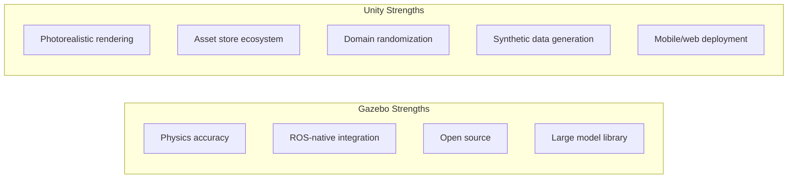
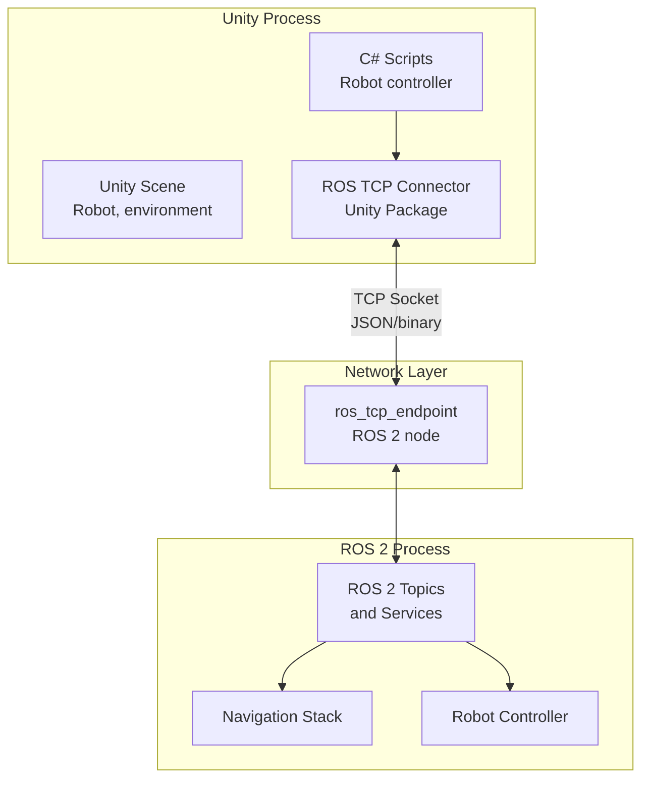

# Unity Robotics Integration

Unity is a powerful game engine that has become a significant tool in robotics simulation and AI training. Unlike Gazebo — which is purpose-built for physics fidelity — Unity excels at **photorealistic rendering**, **synthetic data generation**, and **high-quality visual environments** for training perception models.

## Why Unity for Robotics?



**Unity is the right choice when you need:**
- Photorealistic camera images for training computer vision models
- Large, detailed environments (warehouses, hospitals, outdoor scenes)
- Synthetic dataset generation with perfect ground-truth annotations
- Multi-camera, multi-angle rendering at high resolution
- Deployment to AR/VR platforms for teleoperation

## Unity Robotics Hub

NVIDIA and Unity have developed the **Unity Robotics Hub** — a collection of open-source packages connecting Unity to ROS 2:

| Package | Purpose |
|---------|---------|
| `ROS-TCP-Connector` | Core communication layer between Unity and ROS 2 |
| `ROS-TCP-Endpoint` | ROS 2 node that receives messages from Unity |
| `URDF-Importer` | Import URDF robot models into Unity |
| `Unity Perception` | Synthetic data generation with ground truth labels |

## Architecture



Unity and ROS 2 communicate over a **TCP socket**. The `ros_tcp_endpoint` ROS 2 package acts as a bridge, converting between Unity's serialization format and standard ROS 2 messages.

## Installation

### Step 1: Install Unity Hub and Unity Editor

1. Download Unity Hub from [unity.com/download](https://unity.com/download)
2. Install Unity **2022.3 LTS** or **2023.x** (LTS versions recommended)
3. When creating a project, select the **3D (URP)** template for best rendering quality

### Step 2: Install ROS-TCP-Endpoint in ROS 2

```bash
# Install the ROS 2 TCP endpoint package
sudo apt install ros-humble-ros-tcp-endpoint

# Or build from source
mkdir -p ~/ros2_ws/src
cd ~/ros2_ws/src
git clone https://github.com/Unity-Technologies/ROS-TCP-Endpoint.git
cd ~/ros2_ws
colcon build --packages-select ros_tcp_endpoint
source install/setup.bash
```

### Step 3: Install Unity Packages

In Unity's Package Manager, add these packages by URL:

1. **Window** → **Package Manager** → **+ (Add package from git URL)**
2. Add: `https://github.com/Unity-Technologies/ROS-TCP-Connector.git?path=/com.unity.robotics.ros-tcp-connector`
3. Add: `https://github.com/Unity-Technologies/URDF-Importer.git?path=/com.unity.robotics.urdf-importer`
4. Add: `https://github.com/Unity-Technologies/ROS-TCP-Connector.git?path=/com.unity.robotics.visualizations`

### Step 4: Configure the Connection

In Unity, open **Robotics** → **ROS Settings** and configure:
- **Protocol**: ROS 2
- **ROS IP Address**: `127.0.0.1` (same machine) or your ROS machine's IP
- **ROS Port**: `10000` (default)

## Setting Up the ROS TCP Endpoint

Start the endpoint on the ROS 2 side:

```bash
# Start with default settings (port 10000)
ros2 run ros_tcp_endpoint default_server_endpoint

# Start with custom IP and port
ros2 run ros_tcp_endpoint default_server_endpoint \
    --ros-args -p ROS_IP:=0.0.0.0 -p ROS_TCP_PORT:=10000
```

Or use a launch file:

```python
# launch/unity_ros_bridge.launch.py
from launch import LaunchDescription
from launch_ros.actions import Node


def generate_launch_description():
    return LaunchDescription([
        Node(
            package='ros_tcp_endpoint',
            executable='default_server_endpoint',
            name='ros_tcp_endpoint',
            parameters=[{
                'ROS_IP': '0.0.0.0',
                'ROS_TCP_PORT': 10000,
            }],
            output='screen'
        )
    ])
```

## Importing a URDF Robot into Unity

The URDF Importer converts your ROS robot model into a Unity ArticulationBody hierarchy:

1. **Assets** → **Import Robot from URDF**
2. Select your `.urdf` file
3. The importer creates a prefab with all links and joints

### Manual URDF Import via C#

```csharp
using Unity.Robotics.UrdfImporter;
using UnityEngine;

public class URDFLoader : MonoBehaviour
{
    [SerializeField] private string urdfPath = "Assets/Robots/mobile_robot.urdf";

    void Start()
    {
        // Import URDF at runtime
        ImportSettings settings = new ImportSettings
        {
            chooseMeshDecomposer = false,
            convexMethod = ImportSettings.convexDecomposer.vHACD
        };

        UrdfRobotExtensions.CreateAsync(urdfPath, settings);
    }
}
```

## Core Communication: Publishing and Subscribing

### ROS Publisher in Unity (C#)

```csharp
using System;
using Unity.Robotics.ROSTCPConnector;
using RosMessageTypes.Geometry;
using RosMessageTypes.Std;
using UnityEngine;

/// <summary>
/// Publishes robot odometry data from Unity to ROS 2.
/// Attach this to the robot GameObject.
/// </summary>
public class OdometryPublisher : MonoBehaviour
{
    private ROSConnection ros;
    private const string odomTopic = "/odom";
    private const float publishRate = 10f; // Hz

    private Vector3 previousPosition;
    private float previousTime;
    private float publishTimer;

    void Start()
    {
        ros = ROSConnection.GetOrCreateInstance();

        // Register this publisher
        ros.RegisterPublisher<RosMessageTypes.Nav.OdometryMsg>(odomTopic);

        previousPosition = transform.position;
        previousTime = Time.time;

        Debug.Log($"Odometry publisher started on {odomTopic}");
    }

    void Update()
    {
        publishTimer += Time.deltaTime;

        if (publishTimer >= 1f / publishRate)
        {
            publishTimer = 0f;
            PublishOdometry();
        }
    }

    private void PublishOdometry()
    {
        var currentTime = Time.time;
        var deltaTime = currentTime - previousTime;
        var currentPosition = transform.position;
        var currentRotation = transform.rotation;

        // Calculate velocities
        var linearVelocity = (currentPosition - previousPosition) / deltaTime;

        // Build odometry message
        var odomMsg = new RosMessageTypes.Nav.OdometryMsg
        {
            header = new HeaderMsg
            {
                stamp = new TimeMsg
                {
                    sec = (uint)Time.realtimeSinceStartup,
                    nanosec = (uint)((Time.realtimeSinceStartup % 1f) * 1e9f)
                },
                frame_id = "odom"
            },
            child_frame_id = "base_footprint",
            pose = new RosMessageTypes.Geometry.PoseWithCovarianceMsg
            {
                pose = new RosMessageTypes.Geometry.PoseMsg
                {
                    position = new PointMsg
                    {
                        // Unity uses left-handed coordinates; ROS uses right-handed
                        x = currentPosition.z,   // Unity Z → ROS X
                        y = -currentPosition.x,  // Unity -X → ROS Y
                        z = currentPosition.y    // Unity Y → ROS Z
                    },
                    orientation = new QuaternionMsg
                    {
                        x = currentRotation.z,
                        y = -currentRotation.x,
                        z = currentRotation.y,
                        w = currentRotation.w
                    }
                }
            },
            twist = new RosMessageTypes.Geometry.TwistWithCovarianceMsg
            {
                twist = new RosMessageTypes.Geometry.TwistMsg
                {
                    linear = new Vector3Msg
                    {
                        x = linearVelocity.z,
                        y = -linearVelocity.x,
                        z = linearVelocity.y
                    }
                }
            }
        };

        ros.Publish(odomTopic, odomMsg);

        previousPosition = currentPosition;
        previousTime = currentTime;
    }
}
```

### ROS Subscriber in Unity (C#)

```csharp
using Unity.Robotics.ROSTCPConnector;
using RosMessageTypes.Geometry;
using UnityEngine;

/// <summary>
/// Subscribes to /cmd_vel and moves the robot accordingly.
/// Attach this to the robot's root GameObject.
/// </summary>
public class CmdVelSubscriber : MonoBehaviour
{
    private ROSConnection ros;
    private const string cmdVelTopic = "/cmd_vel";

    // Current command values (set from ROS callback, applied in FixedUpdate)
    private float linearSpeed = 0f;
    private float angularSpeed = 0f;

    // Robot parameters
    [SerializeField] private float maxLinearSpeed = 1.5f;   // m/s
    [SerializeField] private float maxAngularSpeed = 2.0f;  // rad/s

    private ArticulationBody robotRoot;

    void Start()
    {
        ros = ROSConnection.GetOrCreateInstance();

        // Subscribe to velocity commands
        ros.Subscribe<TwistMsg>(cmdVelTopic, OnCmdVelReceived);

        // Get the root ArticulationBody for physics-based movement
        robotRoot = GetComponent<ArticulationBody>();

        Debug.Log($"CmdVel subscriber listening on {cmdVelTopic}");
    }

    // Called from ROS message thread — only set values, don't call Unity APIs
    private void OnCmdVelReceived(TwistMsg msg)
    {
        // Clamp to safe values
        linearSpeed = Mathf.Clamp((float)msg.linear.x, -maxLinearSpeed, maxLinearSpeed);
        angularSpeed = Mathf.Clamp((float)msg.angular.z, -maxAngularSpeed, maxAngularSpeed);
    }

    void FixedUpdate()
    {
        if (robotRoot == null) return;

        // Apply movement in Unity's coordinate system
        // ROS X forward → Unity Z forward
        Vector3 velocity = transform.forward * linearSpeed;

        // Apply via ArticulationBody for physics accuracy
        robotRoot.velocity = new Vector3(-velocity.x, 0f, velocity.z);
        robotRoot.angularVelocity = new Vector3(0f, -angularSpeed, 0f);
    }
}
```

## Camera Sensor with Image Publishing

```csharp
using System;
using Unity.Robotics.ROSTCPConnector;
using RosMessageTypes.Sensor;
using RosMessageTypes.Std;
using UnityEngine;
using UnityEngine.Rendering;

/// <summary>
/// Captures Unity camera images and publishes them as ROS sensor_msgs/Image.
/// </summary>
[RequireComponent(typeof(Camera))]
public class CameraImagePublisher : MonoBehaviour
{
    private ROSConnection ros;
    private Camera cam;
    private RenderTexture renderTexture;
    private Texture2D texture2D;

    [SerializeField] private string imageTopic = "/camera/image_raw";
    [SerializeField] private int imageWidth = 640;
    [SerializeField] private int imageHeight = 480;
    [SerializeField] private float publishRate = 10f;

    private float timer = 0f;

    void Start()
    {
        ros = ROSConnection.GetOrCreateInstance();
        ros.RegisterPublisher<ImageMsg>(imageTopic);

        cam = GetComponent<Camera>();

        // Create render texture for camera capture
        renderTexture = new RenderTexture(imageWidth, imageHeight, 24, RenderTextureFormat.ARGB32);
        cam.targetTexture = renderTexture;

        // Create CPU-side texture for reading pixels
        texture2D = new Texture2D(imageWidth, imageHeight, TextureFormat.RGB24, false);

        Debug.Log($"Camera publisher started on {imageTopic} at {publishRate} Hz");
    }

    void Update()
    {
        timer += Time.deltaTime;
        if (timer >= 1f / publishRate)
        {
            timer = 0f;
            CaptureAndPublish();
        }
    }

    private void CaptureAndPublish()
    {
        // Read pixels from render texture
        RenderTexture.active = renderTexture;
        texture2D.ReadPixels(new Rect(0, 0, imageWidth, imageHeight), 0, 0);
        texture2D.Apply();
        RenderTexture.active = null;

        // Get raw pixel bytes
        byte[] rawBytes = texture2D.GetRawTextureData();

        // Unity stores BGRA; ROS expects RGB — convert
        byte[] rgbBytes = ConvertBGRAtoRGB(rawBytes, imageWidth, imageHeight);

        // Build ROS message
        var imageMsg = new ImageMsg
        {
            header = new HeaderMsg
            {
                frame_id = "camera_optical_frame",
                stamp = new TimeMsg
                {
                    sec = (uint)Time.realtimeSinceStartup
                }
            },
            height = (uint)imageHeight,
            width = (uint)imageWidth,
            encoding = "rgb8",
            is_bigendian = 0,
            step = (uint)(imageWidth * 3),
            data = rgbBytes
        };

        ros.Publish(imageTopic, imageMsg);
    }

    private byte[] ConvertBGRAtoRGB(byte[] bgra, int width, int height)
    {
        byte[] rgb = new byte[width * height * 3];
        for (int i = 0, j = 0; i < bgra.Length; i += 4, j += 3)
        {
            // Unity BGRA → ROS RGB
            rgb[j]     = bgra[i + 2]; // R = B
            rgb[j + 1] = bgra[i + 1]; // G = G
            rgb[j + 2] = bgra[i];     // B = R
        }
        return rgb;
    }

    void OnDestroy()
    {
        if (renderTexture != null) renderTexture.Release();
    }
}
```

## Robotic Arm Control with ArticulationBody

Unity's `ArticulationBody` component provides realistic joint physics without the instability of classic Rigidbody joints:

```csharp
using UnityEngine;

/// <summary>
/// Controls a 6-DOF robot arm using ArticulationBody components.
/// Subscribe to joint position commands from ROS.
/// </summary>
public class RoboticArmController : MonoBehaviour
{
    [System.Serializable]
    public class ArmJoint
    {
        public string name;
        public ArticulationBody artBody;
        public float targetAngleDegrees;
        public float maxSpeed = 90f;  // degrees/second
    }

    [SerializeField] private ArmJoint[] joints;

    private ROSConnection ros;
    private const string jointCmdTopic = "/arm/joint_commands";

    void Start()
    {
        ros = ROSConnection.GetOrCreateInstance();
        ros.Subscribe<RosMessageTypes.Sensor.JointStateMsg>(jointCmdTopic, OnJointCommand);
    }

    private void OnJointCommand(RosMessageTypes.Sensor.JointStateMsg msg)
    {
        for (int i = 0; i < msg.name.Length && i < joints.Length; i++)
        {
            // Convert radians (ROS) to degrees (Unity)
            joints[i].targetAngleDegrees = (float)(msg.position[i] * Mathf.Rad2Deg);
        }
    }

    void FixedUpdate()
    {
        foreach (var joint in joints)
        {
            if (joint.artBody == null) continue;

            // Get current xDrive settings
            var drive = joint.artBody.xDrive;

            // Set target position
            drive.target = joint.targetAngleDegrees;
            drive.stiffness = 10000f;   // Spring stiffness
            drive.damping = 100f;       // Damping
            drive.forceLimit = 1000f;   // Max force (N*m)

            joint.artBody.xDrive = drive;
        }
    }

    /// <summary>
    /// Move all joints to home position (zero angles).
    /// </summary>
    public void MoveToHome()
    {
        foreach (var joint in joints)
        {
            joint.targetAngleDegrees = 0f;
        }
    }

    /// <summary>
    /// Get current joint angles for feedback publishing.
    /// </summary>
    public float[] GetCurrentAngles()
    {
        float[] angles = new float[joints.Length];
        for (int i = 0; i < joints.Length; i++)
        {
            if (joints[i].artBody != null)
                angles[i] = joints[i].artBody.jointPosition[0] * Mathf.Rad2Deg;
        }
        return angles;
    }
}
```

## Unity Perception: Synthetic Data Generation

The Unity Perception package generates photorealistic training data with automatic ground-truth labels — invaluable for training object detection models:

```csharp
using UnityEngine;
using UnityEngine.Perception.GroundTruth;
using UnityEngine.Perception.GroundTruth.Labelers;
using UnityEngine.Perception.GroundTruth.DataModel;

/// <summary>
/// Configures a camera for synthetic dataset generation.
/// Generates RGB images with bounding box and segmentation labels.
/// </summary>
public class SyntheticDataCamera : MonoBehaviour
{
    private PerceptionCamera perceptionCamera;

    void Awake()
    {
        // Get or add the PerceptionCamera component
        perceptionCamera = GetComponent<PerceptionCamera>()
            ?? gameObject.AddComponent<PerceptionCamera>();

        SetupLabelers();
    }

    private void SetupLabelers()
    {
        // Bounding box labeler — 2D bounding boxes around labeled objects
        var bboxLabeler = new BoundingBox2DLabeler();
        perceptionCamera.AddLabeler(bboxLabeler);

        // Instance segmentation — pixel-level masks per object instance
        var instanceSegLabeler = new InstanceSegmentationLabeler();
        perceptionCamera.AddLabeler(instanceSegLabeler);

        // Depth labeler — depth image in meters
        var depthLabeler = new DepthLabeler();
        perceptionCamera.AddLabeler(depthLabeler);

        // Keypoint labeler — for human pose estimation training
        // var keypointLabeler = new KeypointLabeler();
        // perceptionCamera.AddLabeler(keypointLabeler);
    }
}
```

Configure object labels on 3D objects:

```csharp
using UnityEngine;
using UnityEngine.Perception.GroundTruth;

/// <summary>
/// Add this to any GameObject that should be labeled in synthetic data.
/// </summary>
public class ObjectLabelSetup : MonoBehaviour
{
    [SerializeField] private string objectCategory = "cup";

    void Awake()
    {
        // Add labeling component
        var labeling = GetComponent<Labeling>() ?? gameObject.AddComponent<Labeling>();

        // Add label for this object
        labeling.labels.Add(objectCategory);
    }
}
```

## Domain Randomization

Domain randomization improves sim-to-real transfer by training with varied conditions:

```csharp
using UnityEngine;
using UnityEngine.Perception.Randomization.Parameters;
using UnityEngine.Perception.Randomization.Randomizers;
using UnityEngine.Perception.Randomization.Samplers;

/// <summary>
/// Randomizes lighting conditions for robust perception training.
/// </summary>
[Serializable]
[AddRandomizerMenu("Custom/Lighting Randomizer")]
public class LightingRandomizer : Randomizer
{
    // Intensity range
    public FloatParameter lightIntensity = new FloatParameter
    {
        value = new UniformSampler(0.5f, 3.0f)
    };

    // Color temperature (Kelvin): 3000=warm, 6500=daylight, 10000=cold)
    public FloatParameter colorTemperature = new FloatParameter
    {
        value = new UniformSampler(3000f, 7000f)
    };

    // Shadow strength
    public FloatParameter shadowStrength = new FloatParameter
    {
        value = new UniformSampler(0.0f, 1.0f)
    };

    protected override void OnIterationStart()
    {
        // Apply to the main directional light
        Light mainLight = RenderSettings.sun;
        if (mainLight == null) return;

        mainLight.intensity = lightIntensity.Sample();
        mainLight.colorTemperature = colorTemperature.Sample();
        mainLight.shadowStrength = shadowStrength.Sample();

        // Also randomize ambient
        RenderSettings.ambientIntensity = Random.Range(0.3f, 1.5f);
    }
}
```

## Complete Example: Unity Robot Navigation

```csharp
using Unity.Robotics.ROSTCPConnector;
using RosMessageTypes.Nav;
using RosMessageTypes.Geometry;
using UnityEngine;

/// <summary>
/// Full integration: subscribes to nav2 goals, moves robot, publishes feedback.
/// </summary>
public class UnityNavigationBridge : MonoBehaviour
{
    private ROSConnection ros;
    [SerializeField] private float moveSpeed = 1.0f;
    [SerializeField] private float rotateSpeed = 90f;

    private Vector3 targetPosition;
    private bool hasTarget = false;

    void Start()
    {
        ros = ROSConnection.GetOrCreateInstance();

        // Subscribe to navigation goal
        ros.Subscribe<PoseStampedMsg>("/goal_pose", OnGoalReceived);

        // Publisher for current position
        ros.RegisterPublisher<PoseStampedMsg>("/robot_pose");

        // Publish pose at 10 Hz
        InvokeRepeating(nameof(PublishCurrentPose), 0f, 0.1f);
    }

    void OnGoalReceived(PoseStampedMsg msg)
    {
        // Convert ROS coordinates to Unity coordinates
        targetPosition = new Vector3(
            -(float)msg.pose.position.y,   // ROS Y → Unity -X
            0f,
            (float)msg.pose.position.x     // ROS X → Unity Z
        );
        hasTarget = true;
        Debug.Log($"New navigation goal: {targetPosition}");
    }

    void Update()
    {
        if (!hasTarget) return;

        Vector3 direction = targetPosition - transform.position;
        direction.y = 0f;
        float distance = direction.magnitude;

        if (distance < 0.1f)
        {
            hasTarget = false;
            Debug.Log("Goal reached!");
            return;
        }

        // Rotate towards goal
        Quaternion targetRotation = Quaternion.LookRotation(direction);
        transform.rotation = Quaternion.RotateTowards(
            transform.rotation,
            targetRotation,
            rotateSpeed * Time.deltaTime
        );

        // Move forward
        transform.position += transform.forward * moveSpeed * Time.deltaTime;
    }

    void PublishCurrentPose()
    {
        var msg = new PoseStampedMsg
        {
            header = new RosMessageTypes.Std.HeaderMsg { frame_id = "map" },
            pose = new PoseMsg
            {
                position = new PointMsg
                {
                    x = transform.position.z,
                    y = -transform.position.x,
                    z = 0.0
                },
                orientation = new QuaternionMsg
                {
                    x = transform.rotation.z,
                    y = -transform.rotation.x,
                    z = transform.rotation.y,
                    w = transform.rotation.w
                }
            }
        };
        ros.Publish("/robot_pose", msg);
    }
}
```

## Unity vs Gazebo: When to Choose Which

| Scenario | Recommended Tool |
|----------|----------------|
| Physics-accurate dynamics testing | Gazebo |
| ROS 2 native integration | Gazebo |
| Training computer vision models | Unity + Perception |
| Photorealistic rendering | Unity |
| Domain randomization for sim-to-real | Unity |
| SLAM and navigation development | Gazebo |
| Multi-robot environments | Both |
| VR/AR teleoperation interfaces | Unity |
| Quick ROS 2 prototyping | Gazebo |

## Project Structure

A well-organized Unity robotics project:

```
UnityRoboticsProject/
├── Assets/
│   ├── Scenes/
│   │   ├── MainSimulation.unity
│   │   └── DataGeneration.unity
│   ├── Scripts/
│   │   ├── Communication/
│   │   │   ├── OdometryPublisher.cs
│   │   │   ├── CmdVelSubscriber.cs
│   │   │   └── CameraImagePublisher.cs
│   │   ├── Robot/
│   │   │   ├── RoboticArmController.cs
│   │   │   └── DifferentialDriveController.cs
│   │   └── Perception/
│   │       ├── SyntheticDataCamera.cs
│   │       └── LightingRandomizer.cs
│   ├── Prefabs/
│   │   ├── Robots/
│   │   └── Environments/
│   ├── Materials/
│   └── Robots/              # URDF files and meshes
├── Packages/
│   └── manifest.json
└── ProjectSettings/
```

## Next Steps

With simulation environments covered — both Gazebo and Unity — you are ready to explore NVIDIA Isaac, which elevates simulation to photorealistic, GPU-accelerated environments purpose-built for training humanoid robots at scale.
