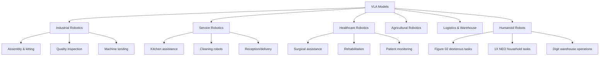
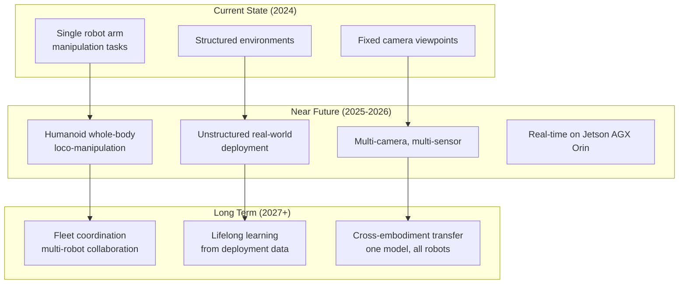

# VLA Model Applications in the Real World

Vision-Language-Action models are transitioning from research labs to production deployments. This chapter explores how VLA models are applied in practice — from industrial manipulation to healthcare — with complete, working implementation examples.

## Application Landscape



## Application 1: Industrial Pick-and-Place with Language Instructions

Traditional pick-and-place systems are hard-coded for specific object geometries and positions. VLA-powered systems generalize to novel objects based on natural language descriptions.

```python
#!/usr/bin/env python3
"""
Industrial pick-and-place VLA application.
Integrates OpenVLA with ROS 2 for a 6-DOF robot arm.
"""

import rclpy
from rclpy.node import Node
from rclpy.action import ActionClient
import numpy as np
import torch
from PIL import Image as PILImage
from cv_bridge import CvBridge

from sensor_msgs.msg import Image, JointState
from std_msgs.msg import String, Bool
from geometry_msgs.msg import PoseStamped, Pose, Point, Quaternion
from control_msgs.action import FollowJointTrajectory
from trajectory_msgs.msg import JointTrajectory, JointTrajectoryPoint
from builtin_interfaces.msg import Duration

from transformers import AutoModelForVision2Seq, AutoProcessor


class IndustrialPickPlaceVLA(Node):
    """
    VLA-powered pick-and-place system for industrial manipulation.

    Workflow:
    1. Receive pick instruction via /pick_command topic
    2. Capture image from wrist-mounted camera
    3. Run OpenVLA inference → get delta EE pose
    4. Convert to joint trajectory via IK
    5. Execute with Follow Joint Trajectory action
    6. Repeat until task complete
    """

    def __init__(self):
        super().__init__('industrial_pick_place_vla')

        # Parameters
        self.declare_parameter('model_name', 'openvla/openvla-7b')
        self.declare_parameter('camera_topic', '/wrist_camera/image_raw')
        self.declare_parameter('max_steps', 50)
        self.declare_parameter('action_scale', 0.05)  # 5cm per action step

        model_name = self.get_parameter('model_name').get_parameter_value().string_value
        camera_topic = self.get_parameter('camera_topic').get_parameter_value().string_value
        self.max_steps = self.get_parameter('max_steps').get_parameter_value().integer_value
        self.action_scale = self.get_parameter('action_scale').get_parameter_value().double_value

        # Load VLA model
        self.get_logger().info(f'Loading VLA model: {model_name}')
        self._load_model(model_name)

        # ROS interfaces
        self.bridge = CvBridge()
        self.current_image = None
        self.is_executing = False

        # Subscribers
        self.img_sub = self.create_subscription(
            Image, camera_topic, self.image_callback, 1
        )
        self.cmd_sub = self.create_subscription(
            String, '/pick_command', self.command_callback, 10
        )

        # Publishers
        self.status_pub = self.create_publisher(String, '/pick_status', 10)
        self.success_pub = self.create_publisher(Bool, '/pick_success', 10)
        self.ee_pose_pub = self.create_publisher(PoseStamped, '/target_ee_pose', 10)

        # Action client for trajectory execution
        self.traj_client = ActionClient(
            self, FollowJointTrajectory, '/arm_controller/follow_joint_trajectory'
        )

        # Current end-effector state
        self.current_ee_pose = np.zeros(7)  # [x, y, z, rx, ry, rz, gripper]
        self.current_ee_pose[2] = 0.5       # Start 50cm above table

        self.get_logger().info('Industrial pick-place VLA ready')

    def _load_model(self, model_name: str):
        """Load VLA model with GPU acceleration."""
        self.processor = AutoProcessor.from_pretrained(
            model_name, trust_remote_code=True
        )
        self.model = AutoModelForVision2Seq.from_pretrained(
            model_name,
            torch_dtype=torch.bfloat16,
            low_cpu_mem_usage=True,
            trust_remote_code=True,
        ).to('cuda' if torch.cuda.is_available() else 'cpu').eval()

        self.get_logger().info(f'Model loaded on {next(self.model.parameters()).device}')

    def image_callback(self, msg: Image):
        """Store latest camera image."""
        try:
            cv_img = self.bridge.imgmsg_to_cv2(msg, desired_encoding='rgb8')
            self.current_image = PILImage.fromarray(cv_img)
        except Exception as e:
            self.get_logger().error(f'Image conversion error: {e}')

    def command_callback(self, msg: String):
        """Handle pick-place command."""
        if self.is_executing:
            self.get_logger().warn('Already executing a task, ignoring new command')
            return

        instruction = msg.data
        self.get_logger().info(f'Received command: "{instruction}"')

        # Execute in background timer to not block callback
        self.pending_instruction = instruction
        self.create_timer(0.1, self._execute_task_once)

    def _execute_task_once(self):
        """Execute task (called once by timer)."""
        self.timer.cancel()  # Cancel self after first call
        self._run_task(self.pending_instruction)

    def _run_task(self, instruction: str):
        """Run complete pick-place task."""
        self.is_executing = True
        self._publish_status(f'Starting: {instruction}')

        success = False

        try:
            for step in range(self.max_steps):
                if self.current_image is None:
                    self.get_logger().warn('No image received yet')
                    rclpy.spin_once(self, timeout_sec=0.5)
                    continue

                # Infer action from VLA model
                action = self._infer_action(self.current_image, instruction)
                self._publish_status(f'Step {step+1}: action={action.round(3)}')

                # Apply action to EE pose
                self.current_ee_pose = self._apply_action(self.current_ee_pose, action)

                # Publish target pose for visualization
                self._publish_ee_pose(self.current_ee_pose)

                # Check if gripper closed (task likely complete)
                gripper_state = action[6]
                if gripper_state < 0.3 and step > 5:
                    # Gripper closed — check if pick succeeded
                    success = self._check_pick_success()
                    if success:
                        self._publish_status('Pick succeeded!')
                        break

                rclpy.spin_once(self, timeout_sec=0.1)

        except Exception as e:
            self.get_logger().error(f'Task execution error: {e}')

        finally:
            self.is_executing = False
            result_msg = Bool()
            result_msg.data = success
            self.success_pub.publish(result_msg)

    def _infer_action(self, image: PILImage.Image, instruction: str) -> np.ndarray:
        """Run VLA model inference."""
        prompt = f"In: What action should the robot take to {instruction}?\nOut:"

        inputs = self.processor(prompt, image).to(
            self.model.device, dtype=torch.bfloat16
        )

        with torch.no_grad():
            action = self.model.predict_action(
                **inputs,
                unnorm_key="bridge_orig",
                do_sample=False,
            )

        return action  # numpy [7]: [dx, dy, dz, drx, dry, drz, gripper]

    def _apply_action(
        self, current_pose: np.ndarray, action: np.ndarray
    ) -> np.ndarray:
        """Apply delta action to current EE pose."""
        new_pose = current_pose.copy()

        # Apply position delta (scaled)
        new_pose[:3] += action[:3] * self.action_scale

        # Apply rotation delta
        new_pose[3:6] += action[3:6] * 0.1  # Smaller rotation scale

        # Gripper state (direct)
        new_pose[6] = action[6]

        # Clamp to workspace limits
        new_pose[0] = np.clip(new_pose[0], -0.5, 0.5)   # X: ±50cm
        new_pose[1] = np.clip(new_pose[1], -0.5, 0.5)   # Y: ±50cm
        new_pose[2] = np.clip(new_pose[2], 0.05, 0.8)   # Z: 5cm to 80cm above table
        new_pose[6] = np.clip(new_pose[6], 0.0, 1.0)    # Gripper: 0 to 1

        return new_pose

    def _publish_ee_pose(self, pose: np.ndarray):
        """Publish EE target pose for RViz visualization."""
        msg = PoseStamped()
        msg.header.stamp = self.get_clock().now().to_msg()
        msg.header.frame_id = 'base_link'
        msg.pose.position.x = float(pose[0])
        msg.pose.position.y = float(pose[1])
        msg.pose.position.z = float(pose[2])

        # Convert Euler angles to quaternion
        from scipy.spatial.transform import Rotation
        r = Rotation.from_euler('xyz', pose[3:6])
        quat = r.as_quat()
        msg.pose.orientation.x = float(quat[0])
        msg.pose.orientation.y = float(quat[1])
        msg.pose.orientation.z = float(quat[2])
        msg.pose.orientation.w = float(quat[3])

        self.ee_pose_pub.publish(msg)

    def _check_pick_success(self) -> bool:
        """Simple heuristic: check if gripper position changed (object grasped)."""
        # In real system: check force/torque sensor or gripper position feedback
        return True  # Simplified for example

    def _publish_status(self, status: str):
        """Publish status message."""
        msg = String()
        msg.data = status
        self.status_pub.publish(msg)
        self.get_logger().info(status)


def main(args=None):
    rclpy.init(args=args)
    node = IndustrialPickPlaceVLA()
    rclpy.spin(node)
    node.destroy_node()
    rclpy.shutdown()

if __name__ == '__main__':
    main()
```

## Application 2: Household Assistant Robot

Home robots must handle enormous task diversity — making coffee, loading dishwashers, folding laundry — that no hand-coded system could cover. VLA models excel here due to their generalization from internet-scale training.

```python
#!/usr/bin/env python3
"""
Household assistant VLA application.
Supports multi-step task execution with natural language instructions.
"""

import rclpy
from rclpy.node import Node
from dataclasses import dataclass
from typing import Optional, List, Dict
import numpy as np
from enum import Enum


class TaskStatus(Enum):
    IDLE = "idle"
    PLANNING = "planning"
    EXECUTING = "executing"
    SUCCESS = "success"
    FAILED = "failed"


@dataclass
class Task:
    instruction: str
    max_steps: int = 100
    success_criteria: Optional[str] = None


class HouseholdAssistantVLA(Node):
    """
    VLA-powered household assistant with multi-step task planning.

    Supports:
    - Single step: "pick up the mug"
    - Multi-step: "make me a coffee" → [find mug, fill with water, ...]
    - Long-horizon: "tidy the kitchen" → [identify mess, sort objects, ...]
    """

    def __init__(self):
        super().__init__('household_assistant_vla')

        from std_msgs.msg import String
        from sensor_msgs.msg import Image

        self.status = TaskStatus.IDLE
        self.task_queue: List[Task] = []
        self.current_task: Optional[Task] = None
        self.step_count = 0

        # Subscribers
        self.create_subscription(
            String, '/assistant/command', self.command_callback, 10
        )
        self.create_subscription(
            Image, '/camera/image_raw', self.image_callback, 1
        )

        # Publishers
        self.status_pub = self.create_publisher(String, '/assistant/status', 10)
        self.speech_pub = self.create_publisher(String, '/assistant/speech', 10)
        self.action_pub = self.create_publisher(
            __import__('std_msgs.msg', fromlist=['Float64MultiArray']).Float64MultiArray,
            '/arm/action', 10
        )

        # Complex task decomposer (uses LLM)
        self.task_decomposer = LLMTaskDecomposer()

        # Main execution timer
        self.create_timer(0.1, self.execution_loop)

        self.get_logger().info('Household Assistant VLA ready')
        self._speak("Hello! I'm your household assistant. How can I help you?")

    def command_callback(self, msg):
        """Handle incoming voice/text command."""
        command = msg.data.strip()
        self.get_logger().info(f'Command received: "{command}"')

        # Decompose into subtasks if needed
        subtasks = self.task_decomposer.decompose(command)

        if len(subtasks) == 1:
            self.task_queue.append(Task(instruction=subtasks[0]))
            self._speak(f"I'll {command}")
        else:
            for subtask in subtasks:
                self.task_queue.append(Task(instruction=subtask))
            steps_text = ", then ".join(subtasks[:3])
            if len(subtasks) > 3:
                steps_text += f", and {len(subtasks)-3} more steps"
            self._speak(f"I'll complete this by: {steps_text}")

    def image_callback(self, msg):
        """Store latest image."""
        from cv_bridge import CvBridge
        from PIL import Image as PILImage
        bridge = CvBridge()
        cv_img = bridge.imgmsg_to_cv2(msg, desired_encoding='rgb8')
        self.current_image = PILImage.fromarray(cv_img)

    def execution_loop(self):
        """Main task execution state machine."""
        if self.status == TaskStatus.IDLE:
            if self.task_queue:
                self.current_task = self.task_queue.pop(0)
                self.status = TaskStatus.EXECUTING
                self.step_count = 0
                self._speak(f"Now I'll {self.current_task.instruction}")
                self._publish_status(f"Executing: {self.current_task.instruction}")

        elif self.status == TaskStatus.EXECUTING:
            if not hasattr(self, 'current_image'):
                return

            # Run VLA inference
            # action = self.vla_model.predict(self.current_image, self.current_task.instruction)
            # self._execute_action(action)

            self.step_count += 1

            # Check completion (gripper state, step limit, etc.)
            if self.step_count >= self.current_task.max_steps:
                self.status = TaskStatus.FAILED
                self._speak(f"I couldn't complete: {self.current_task.instruction}")
            elif self._check_task_complete():
                self.status = TaskStatus.SUCCESS
                self._speak(f"Done with: {self.current_task.instruction}")

        elif self.status in (TaskStatus.SUCCESS, TaskStatus.FAILED):
            # Reset and continue with next task
            if self.task_queue:
                self.status = TaskStatus.IDLE
            else:
                self.status = TaskStatus.IDLE
                self._speak("All tasks complete. What else can I help with?")

    def _check_task_complete(self) -> bool:
        """Check if current task has been completed."""
        # In a real system: use success classifiers or force sensing
        return False  # Simplified

    def _speak(self, text: str):
        """Publish text for text-to-speech output."""
        from std_msgs.msg import String
        msg = String()
        msg.data = text
        self.speech_pub.publish(msg)
        self.get_logger().info(f'[SPEECH] {text}')

    def _publish_status(self, status: str):
        from std_msgs.msg import String
        msg = String()
        msg.data = status
        self.status_pub.publish(msg)


class LLMTaskDecomposer:
    """
    Uses an LLM to decompose complex tasks into atomic robot actions.
    For production, use GPT-4 or a local model via Ollama.
    """

    # Simple rule-based decomposition for offline demo
    TASK_DECOMPOSITIONS = {
        "make coffee": [
            "pick up the coffee mug from the cabinet",
            "place mug under coffee machine spout",
            "press the brew button on the coffee machine",
            "wait for coffee to fill",
            "move mug to the table",
        ],
        "tidy the kitchen": [
            "identify items on the counter that need to be put away",
            "pick up the dishes and put them in the sink",
            "wipe the counter surface with a cloth",
            "put the cloth away in the drawer",
        ],
        "set the table": [
            "pick up a plate from the cabinet",
            "place plate on the table",
            "pick up fork and knife from drawer",
            "place fork and knife next to the plate",
            "pick up a glass",
            "place glass above the plate",
        ]
    }

    def decompose(self, command: str) -> List[str]:
        """Decompose command into atomic subtasks."""
        command_lower = command.lower()

        for key, tasks in self.TASK_DECOMPOSITIONS.items():
            if key in command_lower:
                return tasks

        # Single atomic task (no decomposition needed)
        return [command]
```

## Application 3: Collaborative Robot Quality Inspection

VLA models can perform flexible quality control inspection based on natural language specification of defect criteria — eliminating the need to program specific defect patterns.

```python
#!/usr/bin/env python3
"""
VLA-powered quality inspection system.
Inspects parts based on natural language quality criteria.
"""

import numpy as np
import cv2
from dataclasses import dataclass, field
from typing import List, Tuple, Optional
from datetime import datetime


@dataclass
class InspectionResult:
    part_id: str
    timestamp: str
    instruction: str
    passed: bool
    confidence: float
    defects_found: List[str]
    action_sequence: List[np.ndarray]
    image_path: Optional[str] = None


class QualityInspectionVLA:
    """
    VLA-based quality inspection for manufacturing.

    The robot arm positions a camera over the part,
    then uses VLA to determine if quality criteria are met.
    """

    # Standard quality inspection prompts
    INSPECTION_TEMPLATES = {
        'surface': "Inspect the part surface for scratches, dents, or contamination. "
                   "Move to areas that show defects.",
        'edge': "Inspect the part edges for chips, burrs, or irregular geometry.",
        'color': "Inspect the part color uniformity. Flag any discoloration or spots.",
        'assembly': "Verify all components are correctly assembled and no parts are missing.",
    }

    def __init__(self, vla_model, arm_controller):
        self.vla = vla_model
        self.arm = arm_controller
        self.results_log: List[InspectionResult] = []

    def inspect_part(
        self,
        part_id: str,
        inspection_type: str = 'surface',
        custom_criteria: Optional[str] = None,
    ) -> InspectionResult:
        """
        Perform VLA-guided quality inspection.

        Args:
            part_id: Unique part identifier
            inspection_type: One of 'surface', 'edge', 'color', 'assembly'
            custom_criteria: Optional custom inspection prompt

        Returns:
            InspectionResult with pass/fail determination
        """
        instruction = custom_criteria or self.INSPECTION_TEMPLATES.get(
            inspection_type,
            "Inspect this part for any visible defects."
        )

        self.arm.move_to_inspection_start_pose()

        images = []
        actions = []
        defects = []

        # VLA-guided inspection loop
        for step in range(30):  # Max 30 inspection steps
            image = self.arm.get_camera_image()
            images.append(image)

            # VLA predicts where to look next or signals completion
            action = self.vla.predict_action(image, instruction)
            actions.append(action)

            # Check if model signals inspection complete (e.g., arm returns to start)
            if self._is_inspection_complete(action, step):
                break

            # Apply action (move arm to new inspection viewpoint)
            self.arm.apply_action(action)

            # Run defect classifier on current image
            defect = self._classify_defect(image, instruction)
            if defect:
                defects.append(defect)

        # Determine overall pass/fail
        passed = len(defects) == 0
        confidence = self._calculate_confidence(images, actions)

        result = InspectionResult(
            part_id=part_id,
            timestamp=datetime.now().isoformat(),
            instruction=instruction,
            passed=passed,
            confidence=confidence,
            defects_found=defects,
            action_sequence=actions,
        )

        self.results_log.append(result)
        return result

    def _is_inspection_complete(self, action: np.ndarray, step: int) -> bool:
        """Check if VLA model signals inspection is complete."""
        # Heuristic: arm returning to near-start position
        if step > 10:
            position_magnitude = np.linalg.norm(action[:3])
            return position_magnitude < 0.01  # Very small motion = stopped
        return False

    def _classify_defect(self, image: np.ndarray, criteria: str) -> Optional[str]:
        """
        Classify defects in current image.
        In production: use a fine-tuned classifier for your specific defect types.
        """
        # Simplified color-based defect detection
        if image is None:
            return None

        # Convert to grayscale for analysis
        gray = cv2.cvtColor(image, cv2.COLOR_RGB2GRAY)

        # Detect high-contrast regions (potential scratches/cracks)
        edges = cv2.Canny(gray, 50, 150)
        edge_density = edges.mean()

        if edge_density > 20.0:  # Threshold calibrated for your parts
            return f"High edge density ({edge_density:.1f}) - possible scratches"

        return None

    def _calculate_confidence(
        self, images: list, actions: list
    ) -> float:
        """Calculate inspection confidence based on coverage and consistency."""
        if len(images) < 5:
            return 0.5  # Low confidence if few images captured

        # More images = higher coverage = higher confidence
        coverage_score = min(1.0, len(images) / 20.0)

        # Consistent motion (not erratic) = higher confidence
        if len(actions) > 1:
            action_array = np.array([a[:3] for a in actions])
            motion_variance = action_array.var(axis=0).mean()
            consistency_score = max(0.0, 1.0 - motion_variance)
        else:
            consistency_score = 0.5

        return (coverage_score + consistency_score) / 2.0

    def generate_report(self) -> dict:
        """Generate inspection statistics report."""
        if not self.results_log:
            return {'error': 'No inspections recorded'}

        total = len(self.results_log)
        passed = sum(1 for r in self.results_log if r.passed)
        avg_confidence = np.mean([r.confidence for r in self.results_log])

        defect_counts = {}
        for result in self.results_log:
            for defect in result.defects_found:
                defect_type = defect.split(' - ')[1] if ' - ' in defect else defect
                defect_counts[defect_type] = defect_counts.get(defect_type, 0) + 1

        return {
            'total_inspected': total,
            'passed': passed,
            'failed': total - passed,
            'yield_rate': f"{100 * passed / total:.1f}%",
            'average_confidence': f"{avg_confidence:.1%}",
            'defect_types': defect_counts,
            'timestamp': datetime.now().isoformat(),
        }
```

## Application 4: Healthcare Rehabilitation Robot

```python
#!/usr/bin/env python3
"""
VLA-powered rehabilitation assistance robot.
Guides patients through exercises with visual monitoring and feedback.
"""

import rclpy
from rclpy.node import Node
import numpy as np
from dataclasses import dataclass
from typing import List, Optional


@dataclass
class ExerciseSession:
    patient_id: str
    exercise_name: str
    target_reps: int
    completed_reps: int = 0
    form_scores: List[float] = None

    def __post_init__(self):
        self.form_scores = []

    @property
    def average_form_score(self) -> float:
        if not self.form_scores:
            return 0.0
        return np.mean(self.form_scores)


class RehabilitationVLA(Node):
    """
    VLA-powered rehabilitation robot that:
    1. Demonstrates exercises to patients
    2. Monitors patient form using vision
    3. Provides real-time verbal feedback
    4. Adapts difficulty based on patient progress
    """

    EXERCISES = {
        'shoulder_raise': {
            'instruction': 'Guide the patient to raise their arms to shoulder height',
            'feedback_instruction': 'Evaluate the patient\'s shoulder raise form. '
                                    'Check if arms are at shoulder height and elbows are straight.',
            'target_angle': 90,  # degrees
            'duration': 10,      # seconds
        },
        'knee_extension': {
            'instruction': 'Guide the patient to extend their knee from 90 to 180 degrees',
            'feedback_instruction': 'Check if the patient\'s knee is fully extended '
                                    'and they are maintaining proper posture.',
            'target_angle': 180,
            'duration': 8,
        },
        'grip_strength': {
            'instruction': 'Ask the patient to squeeze the grip sensor as hard as possible',
            'feedback_instruction': 'Monitor the patient\'s grip and encourage maximum effort.',
            'target_angle': None,
            'duration': 5,
        }
    }

    def __init__(self):
        super().__init__('rehabilitation_vla')

        from std_msgs.msg import String, Float32
        from sensor_msgs.msg import Image

        self.current_session: Optional[ExerciseSession] = None

        # Create subscriptions and publishers
        self.create_subscription(String, '/rehab/start_exercise', self.start_exercise, 10)
        self.create_subscription(Image, '/camera/image_raw', self.image_callback, 1)

        self.feedback_pub = self.create_publisher(String, '/rehab/feedback', 10)
        self.speech_pub = self.create_publisher(String, '/rehab/speech', 10)
        self.score_pub = self.create_publisher(Float32, '/rehab/form_score', 10)

        self.create_timer(0.5, self.monitor_and_feedback)

        self.get_logger().info('Rehabilitation VLA node ready')
        self._speak("Rehabilitation system ready. Please choose an exercise to begin.")

    def start_exercise(self, msg):
        """Start a rehabilitation exercise session."""
        parts = msg.data.split(':')
        patient_id = parts[0] if len(parts) > 1 else 'patient_001'
        exercise_name = parts[-1].strip()

        if exercise_name not in self.EXERCISES:
            self._speak(f"Exercise '{exercise_name}' not found. "
                       f"Available: {', '.join(self.EXERCISES.keys())}")
            return

        self.current_session = ExerciseSession(
            patient_id=patient_id,
            exercise_name=exercise_name,
            target_reps=10
        )

        exercise = self.EXERCISES[exercise_name]
        self._speak(f"Starting {exercise_name.replace('_', ' ')}. "
                   f"We'll do {self.current_session.target_reps} repetitions. "
                   f"Follow my guidance.")

        self.get_logger().info(f"Exercise session started: {exercise_name}")

    def image_callback(self, msg):
        """Process camera image for pose estimation."""
        from cv_bridge import CvBridge
        from PIL import Image as PILImage
        try:
            bridge = CvBridge()
            cv_img = bridge.imgmsg_to_cv2(msg, desired_encoding='rgb8')
            self.current_image = PILImage.fromarray(cv_img)
        except Exception as e:
            self.get_logger().error(f'Image callback error: {e}')

    def monitor_and_feedback(self):
        """Monitor patient form and provide feedback."""
        if self.current_session is None:
            return

        if not hasattr(self, 'current_image'):
            return

        exercise = self.EXERCISES[self.current_session.exercise_name]

        # In real system: run VLA inference for form evaluation
        # form_score = self.vla.evaluate_form(
        #     self.current_image,
        #     exercise['feedback_instruction']
        # )

        # Simulate form score for demonstration
        form_score = np.random.uniform(0.6, 0.95)
        self.current_session.form_scores.append(form_score)

        # Publish form score
        from std_msgs.msg import Float32
        score_msg = Float32()
        score_msg.data = float(form_score)
        self.score_pub.publish(score_msg)

        # Generate feedback based on score
        feedback = self._generate_feedback(form_score, exercise)
        self._publish_feedback(feedback)

        # Check if rep is complete (simplified heuristic)
        if len(self.current_session.form_scores) % 20 == 0:
            self.current_session.completed_reps += 1
            self._speak(f"Rep {self.current_session.completed_reps} complete! "
                       f"Form score: {form_score:.0%}")

            if self.current_session.completed_reps >= self.current_session.target_reps:
                self._complete_session()

    def _generate_feedback(self, form_score: float, exercise: dict) -> str:
        """Generate verbal feedback based on form quality."""
        if form_score >= 0.9:
            return "Excellent form! Keep going!"
        elif form_score >= 0.75:
            return "Good form. Try to keep your back straight."
        elif form_score >= 0.6:
            return "Fair form. Slow down and focus on control."
        else:
            return "Please pause. Let me demonstrate the correct position."

    def _complete_session(self):
        """Handle session completion."""
        session = self.current_session
        avg_score = session.average_form_score

        summary = (f"Exercise session complete! "
                  f"You completed {session.completed_reps} reps "
                  f"with an average form score of {avg_score:.0%}. "
                  f"{'Outstanding work!' if avg_score > 0.8 else 'Keep practicing!'}")

        self._speak(summary)
        self.get_logger().info(f"Session complete: {summary}")
        self.current_session = None

    def _speak(self, text: str):
        from std_msgs.msg import String
        msg = String()
        msg.data = text
        self.speech_pub.publish(msg)
        self.get_logger().info(f'[SPEECH] {text}')

    def _publish_feedback(self, feedback: str):
        from std_msgs.msg import String
        msg = String()
        msg.data = feedback
        self.feedback_pub.publish(msg)


def main(args=None):
    rclpy.init(args=args)
    node = RehabilitationVLA()
    rclpy.spin(node)
    node.destroy_node()
    rclpy.shutdown()

if __name__ == '__main__':
    main()
```

## Performance Evaluation Metrics

Evaluating VLA applications requires task-specific and system-level metrics:

```python
import numpy as np
from dataclasses import dataclass, field
from typing import List, Dict
import json


@dataclass
class VLAEvaluationMetrics:
    """
    Comprehensive metrics for VLA robot application evaluation.
    """

    # Task performance
    task_completion_rate: float = 0.0    # Fraction of tasks completed [0,1]
    step_efficiency: float = 0.0         # Completed / max steps ratio [0,1]
    average_completion_time: float = 0.0 # Seconds per task

    # Quality
    success_by_instruction_type: Dict[str, float] = field(default_factory=dict)
    generalization_score: float = 0.0    # Performance on unseen objects/environments
    recovery_rate: float = 0.0           # Rate of recovering from near-failures

    # Safety
    collision_rate: float = 0.0          # Collisions per 100 tasks
    human_safety_score: float = 1.0      # 1.0 = perfect safety
    emergency_stops: int = 0

    # User experience
    user_satisfaction: float = 0.0       # Survey score [0, 10]
    instruction_success_rate: float = 0.0  # % of natural language instructions understood

    def compute_overall_score(self, weights: Dict[str, float] = None) -> float:
        """Compute weighted overall performance score."""
        if weights is None:
            weights = {
                'task_completion': 0.30,
                'efficiency': 0.15,
                'generalization': 0.20,
                'safety': 0.25,
                'user_experience': 0.10,
            }

        safety_score = (1.0 - self.collision_rate / 100) * self.human_safety_score

        score = (
            weights['task_completion'] * self.task_completion_rate +
            weights['efficiency'] * self.step_efficiency +
            weights['generalization'] * self.generalization_score +
            weights['safety'] * safety_score +
            weights['user_experience'] * (self.user_satisfaction / 10.0)
        )
        return score

    def to_report(self) -> str:
        """Generate human-readable evaluation report."""
        return f"""
VLA Application Evaluation Report
==================================
Task Performance:
  Completion Rate:     {self.task_completion_rate:.1%}
  Step Efficiency:     {self.step_efficiency:.1%}
  Avg Completion Time: {self.average_completion_time:.1f}s

Quality:
  Generalization:      {self.generalization_score:.1%}
  Recovery Rate:       {self.recovery_rate:.1%}

Safety:
  Collision Rate:      {self.collision_rate:.2f} per 100 tasks
  Emergency Stops:     {self.emergency_stops}

User Experience:
  Satisfaction:        {self.user_satisfaction:.1f}/10
  Instruction Success: {self.instruction_success_rate:.1%}

Overall Score:         {self.compute_overall_score():.1%}
"""
```

## Future Directions

### Trends in VLA Applications (2025 and Beyond)



**Key research directions:**

1. **Whole-body control**: Extending VLA models to control all joints of a humanoid — legs, arms, torso, and head simultaneously
2. **Long-horizon tasks**: Planning and executing 10-minute tasks with hundreds of steps
3. **Real-time efficiency**: Distilling 7B+ models to sub-100M models that run at 50+ Hz on embedded hardware
4. **Safety guarantees**: Formal safety constraints integrated into the action generation process

The capstone projects in the next section will give you hands-on experience deploying VLA models in complete, integrated robotic systems.
