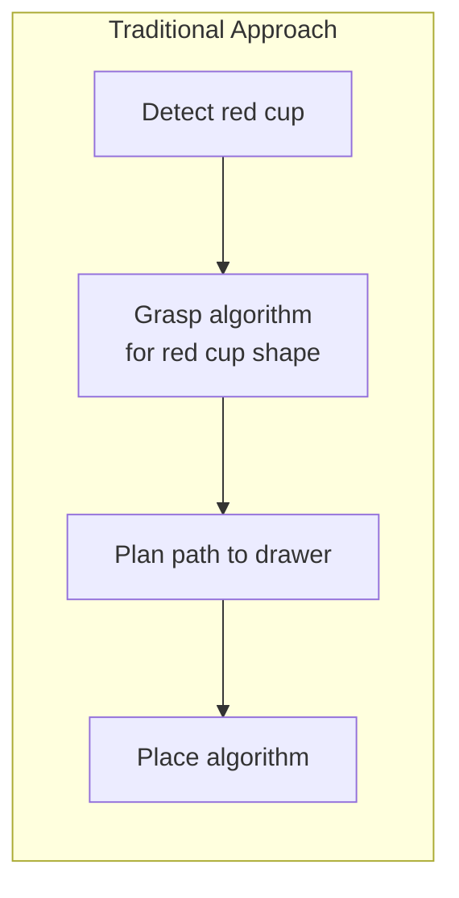
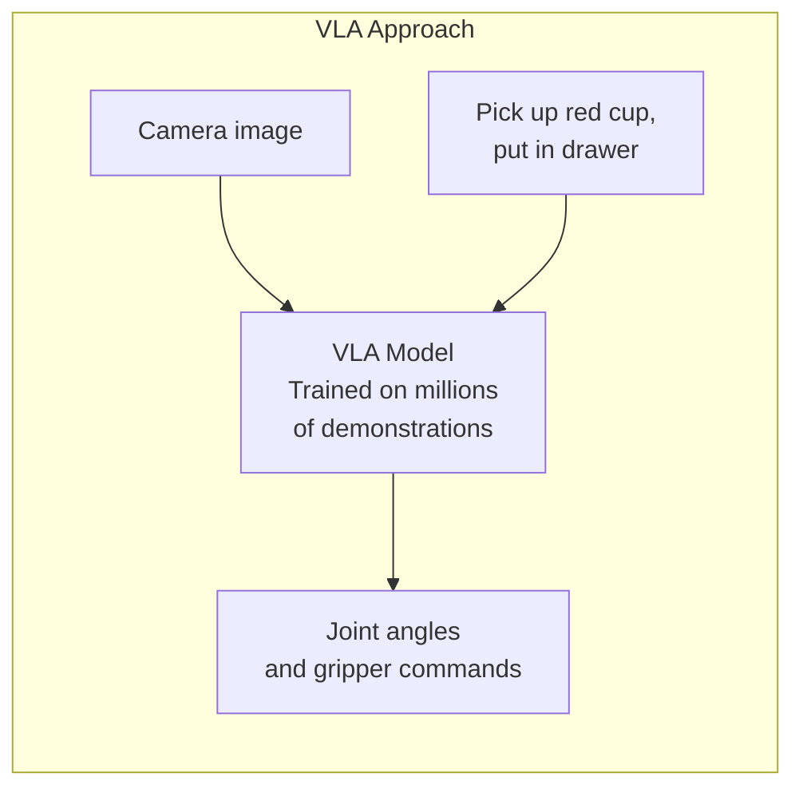
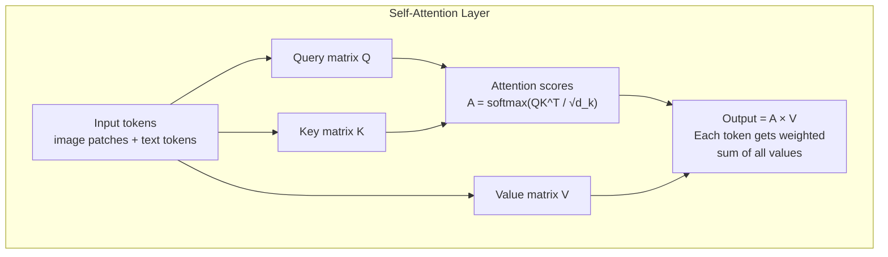
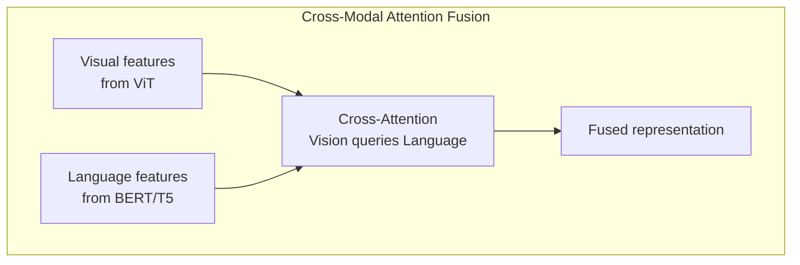
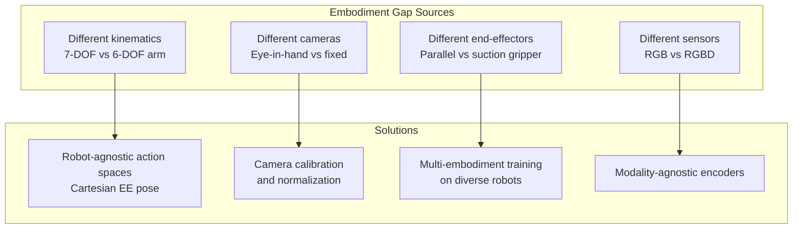

# Vision-Language-Action Models: Concepts and Architecture

**Vision-Language-Action (VLA) models** represent one of the most significant breakthroughs in robotics in the past decade. They combine three previously separate AI capabilities — computer vision, natural language understanding, and robot action generation — into a single unified neural network trained end-to-end.

The result: robots that can be instructed in plain English ("pick up the red cup and put it in the drawer"), see the environment through cameras, and generate the precise motor commands needed to execute the task — without hand-coded logic for any specific object or scenario.

## The Revolution: From Programmed to Learned Behavior

Traditional robotics requires explicit programming for each scenario:



This breaks whenever objects change, lighting changes, or a new task is introduced. Every scenario requires new code.

VLA models learn general policies from data:



The model generalizes from training data to new objects, new environments, and new instructions it has never seen before.

## Transformer Architecture for Robotics

VLA models are built on the **transformer architecture** — the same foundation powering ChatGPT, DALL-E, and other large AI systems. Understanding transformers is essential for understanding how VLA models work.

### The Attention Mechanism

The core innovation of transformers is **self-attention**: every element in a sequence can "attend to" (draw information from) every other element, regardless of distance. This enables the model to understand long-range relationships.



For a robot perception task, attention allows:
- The "cup" text token to attend to the red cylinder in the image
- The "drawer" token to attend to the cabinet region
- Action tokens to attend to both the object location and instruction

### Vision Transformer (ViT) for Image Processing

VLA models process images as sequences of patches, similar to how language models process word tokens:

```python
import torch
import torch.nn as nn
import math


class VisionTransformer(nn.Module):
    """
    Vision Transformer (ViT) - processes images as patch sequences.
    Each image is divided into fixed-size patches, linearly embedded,
    then processed by transformer layers.
    """

    def __init__(
        self,
        image_size: int = 224,
        patch_size: int = 16,
        embed_dim: int = 768,
        num_heads: int = 12,
        num_layers: int = 12,
        mlp_ratio: float = 4.0,
        dropout: float = 0.1,
    ):
        super().__init__()

        # Number of patches
        assert image_size % patch_size == 0, "Image size must be divisible by patch size"
        num_patches = (image_size // patch_size) ** 2

        self.patch_size = patch_size
        self.embed_dim = embed_dim

        # Patch embedding: flatten patch → embed_dim vector
        self.patch_embed = nn.Conv2d(
            in_channels=3,          # RGB
            out_channels=embed_dim,
            kernel_size=patch_size,
            stride=patch_size
        )

        # Class token: prepended to patch sequence, used for classification
        self.cls_token = nn.Parameter(torch.zeros(1, 1, embed_dim))

        # Positional embedding: tells model where each patch is
        self.pos_embed = nn.Parameter(torch.zeros(1, num_patches + 1, embed_dim))

        # Transformer encoder layers
        self.transformer = nn.TransformerEncoder(
            encoder_layer=nn.TransformerEncoderLayer(
                d_model=embed_dim,
                nhead=num_heads,
                dim_feedforward=int(embed_dim * mlp_ratio),
                dropout=dropout,
                batch_first=True,
                norm_first=True  # Pre-norm for stability
            ),
            num_layers=num_layers,
        )

        self.norm = nn.LayerNorm(embed_dim)

        # Initialize weights
        self._init_weights()

    def _init_weights(self):
        nn.init.trunc_normal_(self.cls_token, std=0.02)
        nn.init.trunc_normal_(self.pos_embed, std=0.02)

    def forward(self, x: torch.Tensor) -> torch.Tensor:
        """
        Args:
            x: Image tensor [batch, 3, H, W]

        Returns:
            Patch features [batch, num_patches+1, embed_dim]
        """
        batch_size = x.shape[0]

        # Embed patches: [B, embed_dim, H/P, W/P]
        x = self.patch_embed(x)

        # Flatten spatial dims: [B, num_patches, embed_dim]
        x = x.flatten(2).transpose(1, 2)

        # Prepend class token
        cls_tokens = self.cls_token.expand(batch_size, -1, -1)
        x = torch.cat((cls_tokens, x), dim=1)  # [B, num_patches+1, embed_dim]

        # Add positional embedding
        x = x + self.pos_embed

        # Transformer encoder
        x = self.transformer(x)
        x = self.norm(x)

        return x  # [B, num_patches+1, embed_dim]

    def get_image_features(self, x: torch.Tensor) -> torch.Tensor:
        """Get global image representation (cls token output)."""
        return self.forward(x)[:, 0, :]  # CLS token
```

### Multi-Modal Fusion

The key challenge in VLA models is fusing visual features with language features. There are several approaches:



```python
class CrossModalAttention(nn.Module):
    """
    Cross-attention between vision and language features.
    Vision features query language features to find relevant text context.
    """

    def __init__(self, embed_dim: int = 768, num_heads: int = 8):
        super().__init__()

        self.embed_dim = embed_dim
        self.num_heads = num_heads
        self.head_dim = embed_dim // num_heads
        self.scale = self.head_dim ** -0.5

        # Query from vision, Key/Value from language
        self.q_proj = nn.Linear(embed_dim, embed_dim)
        self.k_proj = nn.Linear(embed_dim, embed_dim)
        self.v_proj = nn.Linear(embed_dim, embed_dim)
        self.out_proj = nn.Linear(embed_dim, embed_dim)

    def forward(
        self,
        vision_features: torch.Tensor,   # [B, num_patches, D]
        language_features: torch.Tensor,  # [B, seq_len, D]
    ) -> torch.Tensor:
        B, Nv, D = vision_features.shape
        _, Nl, _ = language_features.shape

        # Project to queries (from vision), keys/values (from language)
        Q = self.q_proj(vision_features).reshape(B, Nv, self.num_heads, self.head_dim).transpose(1, 2)
        K = self.k_proj(language_features).reshape(B, Nl, self.num_heads, self.head_dim).transpose(1, 2)
        V = self.v_proj(language_features).reshape(B, Nl, self.num_heads, self.head_dim).transpose(1, 2)

        # Attention: vision queries attend to language tokens
        attn = torch.matmul(Q, K.transpose(-2, -1)) * self.scale  # [B, heads, Nv, Nl]
        attn = torch.softmax(attn, dim=-1)

        # Weighted sum of language values
        out = torch.matmul(attn, V)  # [B, heads, Nv, head_dim]
        out = out.transpose(1, 2).reshape(B, Nv, D)

        return self.out_proj(out)  # [B, Nv, D]
```

## Action Tokenization

A fundamental insight of models like RT-2 is that **robot actions can be tokenized** just like text. This allows standard language model architectures to predict actions:

```python
class ActionTokenizer:
    """
    Discretizes continuous robot actions into discrete tokens.
    This allows a language model to "speak" robot commands.

    For a 7-DOF arm + 1 gripper = 8-dimensional action space.
    Each dimension is discretized into 256 bins.
    """

    def __init__(self, action_dim: int = 8, num_bins: int = 256):
        self.action_dim = action_dim
        self.num_bins = num_bins

        # Action ranges (adjust to your robot)
        # Format: [min, max] for each DOF
        self.action_ranges = torch.tensor([
            [-3.14, 3.14],   # Joint 1 (rad)
            [-3.14, 3.14],   # Joint 2 (rad)
            [-3.14, 3.14],   # Joint 3 (rad)
            [-3.14, 3.14],   # Joint 4 (rad)
            [-3.14, 3.14],   # Joint 5 (rad)
            [-3.14, 3.14],   # Joint 6 (rad)
            [-3.14, 3.14],   # Joint 7 (rad)
            [0.0, 1.0],      # Gripper (0=closed, 1=open)
        ])

    def tokenize(self, actions: torch.Tensor) -> torch.Tensor:
        """
        Convert continuous actions to discrete tokens.

        Args:
            actions: [batch, action_dim] float tensor

        Returns:
            tokens: [batch, action_dim] int tensor in [0, num_bins-1]
        """
        mins = self.action_ranges[:, 0].to(actions.device)
        maxs = self.action_ranges[:, 1].to(actions.device)

        # Normalize to [0, 1]
        normalized = (actions - mins) / (maxs - mins)
        normalized = torch.clamp(normalized, 0.0, 1.0)

        # Discretize to bins
        tokens = (normalized * (self.num_bins - 1)).long()
        return tokens

    def detokenize(self, tokens: torch.Tensor) -> torch.Tensor:
        """
        Convert discrete tokens back to continuous actions.

        Args:
            tokens: [batch, action_dim] int tensor

        Returns:
            actions: [batch, action_dim] float tensor
        """
        mins = self.action_ranges[:, 0].to(tokens.device)
        maxs = self.action_ranges[:, 1].to(tokens.device)

        # Convert to [0, 1]
        normalized = tokens.float() / (self.num_bins - 1)

        # Scale to action range
        actions = normalized * (maxs - mins) + mins
        return actions


# Example usage
tokenizer = ActionTokenizer()

# Simulate a pick action: reach forward and close gripper
real_action = torch.tensor([[1.2, -0.8, 0.5, 1.1, -0.3, 0.2, 0.8, 0.0]])  # [1, 8]
tokens = tokenizer.tokenize(real_action)
reconstructed = tokenizer.detokenize(tokens)

print(f"Original:      {real_action.numpy()}")
print(f"Tokens:        {tokens.numpy()}")
print(f"Reconstructed: {reconstructed.numpy()}")
print(f"Max error:     {(real_action - reconstructed).abs().max().item():.4f} rad")
```

## The Complete VLA Model Architecture

Putting it all together — a complete VLA model from vision and language inputs to robot actions:

```python
import torch
import torch.nn as nn
from transformers import AutoTokenizer, AutoModel
from torchvision import transforms


class VLAModel(nn.Module):
    """
    Vision-Language-Action model for robot manipulation.

    Architecture:
    1. Vision encoder: ViT processes camera images → visual tokens
    2. Language encoder: BERT/T5 processes instruction → language tokens
    3. Cross-attention fusion: visual tokens attend to language tokens
    4. Action decoder: transformer predicts discretized action sequence
    5. Action head: maps to final continuous robot commands
    """

    def __init__(
        self,
        vision_backbone: str = "google/vit-base-patch16-224",
        language_backbone: str = "google/t5-base",
        action_dim: int = 8,
        action_horizon: int = 10,  # Predict 10 future actions
        num_bins: int = 256,
    ):
        super().__init__()

        self.action_dim = action_dim
        self.action_horizon = action_horizon
        self.num_bins = num_bins

        # Vision encoder
        from transformers import ViTModel, ViTConfig
        vit_config = ViTConfig.from_pretrained(vision_backbone)
        self.vision_encoder = ViTModel.from_pretrained(vision_backbone)
        vision_dim = vit_config.hidden_size  # 768 for ViT-Base

        # Language encoder
        from transformers import T5EncoderModel, T5Config
        t5_config = T5Config.from_pretrained(language_backbone)
        self.language_encoder = T5EncoderModel.from_pretrained(language_backbone)
        language_dim = t5_config.d_model  # 512 for T5-Base

        # Projection layers to common dimension
        common_dim = 512
        self.vision_proj = nn.Linear(vision_dim, common_dim)
        self.language_proj = nn.Linear(language_dim, common_dim)

        # Cross-attention fusion
        self.cross_attn = CrossModalAttention(embed_dim=common_dim, num_heads=8)

        # Action decoder transformer
        self.action_decoder = nn.TransformerDecoder(
            decoder_layer=nn.TransformerDecoderLayer(
                d_model=common_dim,
                nhead=8,
                dim_feedforward=2048,
                dropout=0.1,
                batch_first=True
            ),
            num_layers=4
        )

        # Learned action query tokens
        self.action_queries = nn.Parameter(
            torch.zeros(action_horizon, common_dim)
        )
        nn.init.trunc_normal_(self.action_queries, std=0.02)

        # Action head: predict bin index for each action dimension
        self.action_head = nn.Sequential(
            nn.Linear(common_dim, common_dim),
            nn.GELU(),
            nn.Linear(common_dim, action_dim * num_bins)
        )

        # Action tokenizer
        self.action_tokenizer = ActionTokenizer(action_dim, num_bins)

    def encode_image(self, images: torch.Tensor) -> torch.Tensor:
        """
        Encode image(s) to patch features.

        Args:
            images: [B, T, 3, H, W] — batch of T timestep images

        Returns:
            features: [B*T, num_patches, common_dim]
        """
        B, T = images.shape[:2]
        images_flat = images.reshape(B * T, *images.shape[2:])

        outputs = self.vision_encoder(pixel_values=images_flat)
        patch_features = outputs.last_hidden_state  # [B*T, num_patches, vision_dim]

        return self.vision_proj(patch_features)  # [B*T, num_patches, common_dim]

    def encode_language(
        self,
        input_ids: torch.Tensor,
        attention_mask: torch.Tensor
    ) -> torch.Tensor:
        """
        Encode instruction text to token features.

        Returns: [B, seq_len, common_dim]
        """
        outputs = self.language_encoder(
            input_ids=input_ids,
            attention_mask=attention_mask
        )
        lang_features = outputs.last_hidden_state
        return self.language_proj(lang_features)

    def forward(
        self,
        images: torch.Tensor,              # [B, T, 3, H, W]
        input_ids: torch.Tensor,           # [B, seq_len]
        attention_mask: torch.Tensor,      # [B, seq_len]
    ) -> torch.Tensor:
        """
        Forward pass: image + language → action logits.

        Returns:
            logits: [B, action_horizon, action_dim, num_bins]
        """
        B = images.shape[0]

        # Encode modalities
        visual_features = self.encode_image(images)            # [B*T, N_patches, D]
        language_features = self.encode_language(input_ids, attention_mask)  # [B, L, D]

        # Reshape visual features: use last timestep
        visual_features = visual_features.reshape(B, -1, visual_features.shape[-1])

        # Cross-modal fusion: vision attends to language
        fused_features = self.cross_attn(visual_features, language_features)  # [B, N_patches, D]

        # Decode actions using learned query tokens
        queries = self.action_queries.unsqueeze(0).expand(B, -1, -1)  # [B, T_action, D]

        decoded = self.action_decoder(
            tgt=queries,
            memory=fused_features
        )  # [B, action_horizon, D]

        # Predict action logits
        logits = self.action_head(decoded)  # [B, action_horizon, action_dim * num_bins]
        logits = logits.reshape(B, self.action_horizon, self.action_dim, self.num_bins)

        return logits

    @torch.no_grad()
    def predict_actions(
        self,
        images: torch.Tensor,
        input_ids: torch.Tensor,
        attention_mask: torch.Tensor,
    ) -> torch.Tensor:
        """
        Predict continuous action sequence from image and instruction.

        Returns:
            actions: [B, action_horizon, action_dim] continuous actions
        """
        logits = self.forward(images, input_ids, attention_mask)

        # Argmax over bins dimension
        action_tokens = logits.argmax(dim=-1)  # [B, action_horizon, action_dim]

        # Detokenize to continuous actions
        B, T, D = action_tokens.shape
        actions_flat = self.action_tokenizer.detokenize(
            action_tokens.reshape(-1, D)
        )
        return actions_flat.reshape(B, T, D)
```

## Training Approaches

### Imitation Learning (Behavior Cloning)

The most common VLA training approach: learn to mimic expert demonstrations.

```python
def train_step_imitation_learning(
    model: VLAModel,
    batch: dict,
    optimizer: torch.optim.Optimizer,
) -> dict:
    """Single training step using behavior cloning."""

    images = batch['images']        # [B, T, 3, H, W]
    input_ids = batch['input_ids']  # [B, L]
    attention_mask = batch['attention_mask']  # [B, L]
    gt_actions = batch['actions']   # [B, T_action, action_dim] - ground truth

    # Tokenize ground truth actions
    B, T, D = gt_actions.shape
    gt_tokens = model.action_tokenizer.tokenize(
        gt_actions.reshape(-1, D)
    ).reshape(B, T, D)

    # Forward pass
    logits = model(images, input_ids, attention_mask)
    # logits: [B, T_action, action_dim, num_bins]

    # Compute cross-entropy loss over all action dimensions
    loss = F.cross_entropy(
        logits.reshape(-1, model.num_bins),  # [B*T*D, num_bins]
        gt_tokens.reshape(-1)                 # [B*T*D]
    )

    # Backward pass
    optimizer.zero_grad()
    loss.backward()
    torch.nn.utils.clip_grad_norm_(model.parameters(), max_norm=1.0)
    optimizer.step()

    return {'loss': loss.item()}
```

### Key Training Techniques

**Co-training with language data**: Models like RT-2 are pre-trained on internet-scale vision-language data before fine-tuning on robot demonstrations. This gives them rich language grounding.

**Data augmentation**: Random color jitter, crop, and rotation in images improve robustness to lighting and viewpoint changes.

**Action chunking**: Predict multiple future actions at once (action horizon > 1) for smoother execution and reduced compounding errors.

**History conditioning**: Include the last N observation-action pairs as context — like a "short-term memory" for the robot.

## The Embodiment Gap

A fundamental challenge: VLA models trained on demonstration data from one robot don't automatically transfer to a different robot with different kinematics, camera placement, or end-effector shape.



**OpenVLA** addresses this by training on the Open X-Embodiment dataset — demonstrations collected across 22 different robot types. The model learns transferable visual representations independent of specific robot kinematics.

## Summary

VLA models represent the convergence of three AI research threads:
1. **Large vision models** (ViT, DINOv2, SigLIP)
2. **Large language models** (T5, LLaMA, Gemma)
3. **Robot learning** (imitation learning, reinforcement learning)

The key architectural components are:
- Vision transformer (ViT) for image feature extraction
- Pre-trained language encoder for instruction understanding
- Cross-attention for vision-language fusion
- Causal action decoder for sequential action prediction
- Action tokenization for using language model machinery

The next chapter surveys the major VLA models that have been published — RT-2, OpenVLA, π0 (Pi Zero), and Octo — comparing their architectures, training data, performance, and practical usability.
