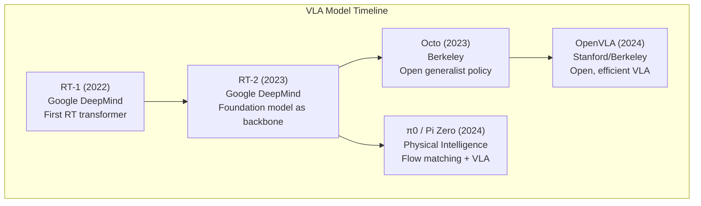
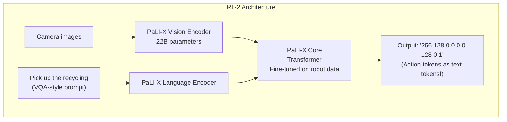
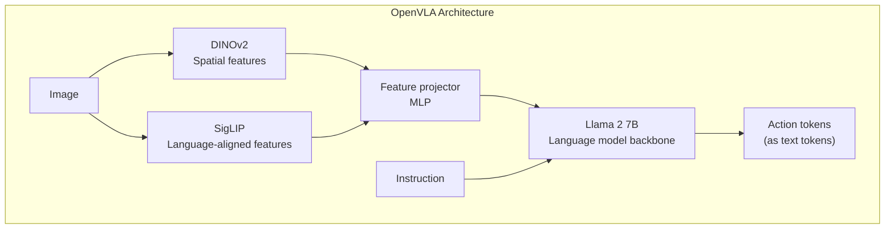
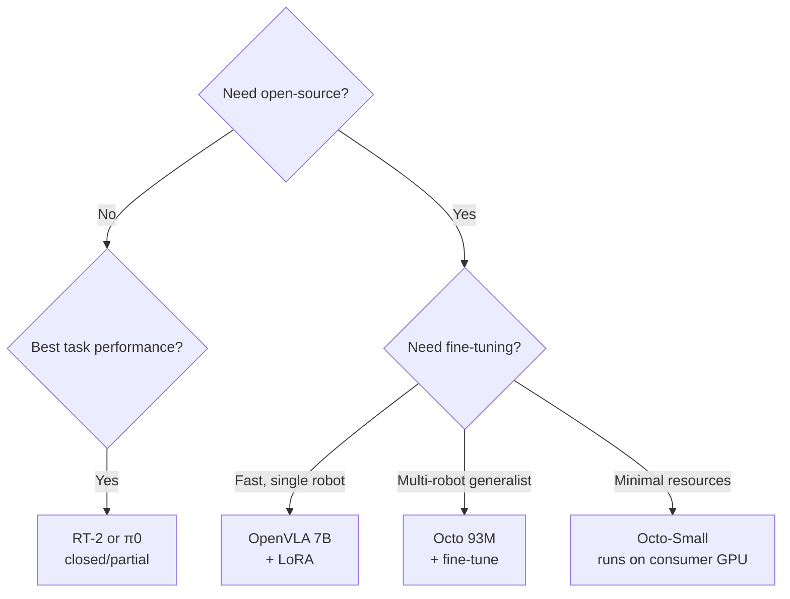

# VLA Model Survey: RT-2, OpenVLA, π0, and Octo

This chapter surveys the major Vision-Language-Action models published between 2022 and 2025. These models represent the state of the art in robot learning and provide the building blocks for practical humanoid robot systems.

## Overview Comparison



## RT-1: Robotics Transformer 1 (Google, 2022)

**RT-1** was the first demonstration that transformer models trained on large-scale robot demonstration data could generalize across hundreds of tasks.

### Key Facts
- **Organization**: Google Robotics / Brain
- **Paper**: "RT-1: Robotics Transformer for Real-World Control at Scale" (Dec 2022)
- **Data**: 130,000 episodes collected over 17 months on 13 robots
- **Tasks**: 700+ unique tasks in a kitchen/office environment
- **Architecture**: EfficientNet-B3 image encoder + TokenLearner + Transformer decoder

### Architecture

```python
import torch
import torch.nn as nn
from torchvision.models import efficientnet_b3


class RT1(nn.Module):
    """
    Simplified RT-1 architecture.

    Key innovations:
    1. FiLM conditioning: language conditions the vision encoder
    2. TokenLearner: reduces visual tokens from 81 to 8 for efficiency
    3. Transformer decoder: autoregressively predicts discrete actions
    """

    def __init__(
        self,
        num_actions: int = 11,          # 11 dimensions for Google robot
        num_action_bins: int = 256,     # Discretization bins
        token_learner_tokens: int = 8,  # Compressed visual tokens
        context_length: int = 6,        # History window (frames)
    ):
        super().__init__()

        self.num_actions = num_actions
        self.num_action_bins = num_action_bins
        self.context_length = context_length
        embed_dim = 512

        # Image encoder: EfficientNet-B3 with FiLM conditioning
        self.image_encoder = EfficientNetWithFiLM(embed_dim=embed_dim)

        # Language encoder: USE (Universal Sentence Encoder)
        # In practice, USE embeddings are precomputed
        self.lang_proj = nn.Linear(512, embed_dim)  # USE → embed_dim

        # TokenLearner: reduces spatial tokens
        self.token_learner = TokenLearner(
            input_dim=embed_dim,
            num_output_tokens=token_learner_tokens
        )

        # Transformer decoder
        self.transformer = nn.TransformerDecoder(
            decoder_layer=nn.TransformerDecoderLayer(
                d_model=embed_dim, nhead=8, batch_first=True
            ),
            num_layers=8
        )

        # Action prediction head
        self.action_head = nn.Linear(
            embed_dim, num_actions * num_action_bins
        )

    def forward(
        self,
        images: torch.Tensor,     # [B, T, 3, 300, 300]
        lang_embed: torch.Tensor, # [B, 512] precomputed USE embedding
    ) -> torch.Tensor:
        B, T = images.shape[:2]

        # Encode each frame with language conditioning
        images_flat = images.reshape(B * T, *images.shape[2:])
        lang_expanded = lang_embed.unsqueeze(1).expand(-1, T, -1).reshape(B * T, -1)

        # Image features conditioned on language via FiLM
        img_features = self.image_encoder(images_flat, lang_expanded)

        # Token learning: reduce visual tokens
        learned_tokens = self.token_learner(img_features)  # [B*T, 8, embed_dim]

        # Reshape to temporal sequence: [B, T*8, embed_dim]
        temporal_tokens = learned_tokens.reshape(B, T * 8, -1)

        # Language as memory for decoder
        lang_memory = self.lang_proj(lang_embed).unsqueeze(1)  # [B, 1, embed_dim]

        # Decode action
        decoded = self.transformer(
            tgt=temporal_tokens,
            memory=lang_memory
        )

        # Pool over temporal-spatial tokens and predict action
        pooled = decoded.mean(dim=1)  # [B, embed_dim]
        logits = self.action_head(pooled)  # [B, num_actions * num_action_bins]
        logits = logits.reshape(B, self.num_actions, self.num_action_bins)

        return logits


class TokenLearner(nn.Module):
    """
    Token Learner module: learns to select the most informative visual tokens.
    Reduces N spatial tokens to M learned tokens (M << N).
    """
    def __init__(self, input_dim: int, num_output_tokens: int):
        super().__init__()
        self.num_output_tokens = num_output_tokens

        # Attention weights for token selection
        self.selector = nn.Sequential(
            nn.LayerNorm(input_dim),
            nn.Linear(input_dim, num_output_tokens),
        )

    def forward(self, x: torch.Tensor) -> torch.Tensor:
        """
        x: [B, N, D] → output: [B, M, D]
        """
        # Compute selection weights [B, N, M]
        weights = self.selector(x).softmax(dim=1)

        # Weighted combination [B, M, D]
        return torch.einsum('bnm,bnd->bmd', weights, x)
```

### RT-1 Results

- **Task success rate**: 97% on trained tasks
- **Generalization**: 76% on novel objects/backgrounds
- **Speed**: 3 Hz inference on CPU, faster with GPU

## RT-2: Robotics Transformer 2 (Google DeepMind, 2023)

**RT-2** dramatically improved generalization by using a large Vision-Language Model (PaLI-X 55B or PaLM-E 12B) as the backbone, then fine-tuning it on robot data. The key insight: the model's internet-scale knowledge transfers to novel robot tasks.

### Key Innovation: VLM as Robot Policy



The critical insight: **actions are expressed as text tokens**. The model outputs action coordinates as ordinary text strings, leveraging the entire language model vocabulary and generation mechanism. No special action head needed — the language model naturally learns to generate action strings.

### RT-2 Code Integration

```python
from transformers import AutoProcessor, AutoModelForSeq2SeqLM
import torch


class RT2Inference:
    """
    RT-2 inference wrapper.
    Uses a pre-trained VLM backbone fine-tuned on robot data.
    """

    # RT-2 action token format:
    # "<action>base_displacement_x base_displacement_y base_displacement_theta
    #  arm_displacement_x arm_displacement_y arm_displacement_z
    #  arm_displacement_theta gripper_open</action>"
    # Each value is a bin index in range [0, 255]

    ACTION_TOKEN_COUNT = 8  # 8 dimensions for Google robot
    BIN_COUNT = 256

    def __init__(self, model_name: str = "openvla/openvla-7b"):
        """
        Note: The original RT-2 is not publicly released.
        OpenVLA uses the same paradigm with an open backbone.
        """
        self.processor = AutoProcessor.from_pretrained(
            model_name, trust_remote_code=True
        )
        self.model = AutoModelForSeq2SeqLM.from_pretrained(
            model_name,
            torch_dtype=torch.bfloat16,
            trust_remote_code=True
        ).eval().cuda()

    def predict_action(
        self,
        image,
        instruction: str,
    ) -> list:
        """
        Predict robot action from image and instruction.

        Args:
            image: PIL Image or numpy array
            instruction: Natural language instruction

        Returns:
            List of 8 continuous action values
        """
        # Build prompt in VQA format
        prompt = f"In: What action should the robot take to {instruction}?\nOut:"

        # Tokenize
        inputs = self.processor(
            text=prompt,
            images=image,
            return_tensors="pt"
        ).to(self.model.device, dtype=torch.bfloat16)

        # Generate action tokens
        with torch.no_grad():
            action_tokens = self.model.generate(
                **inputs,
                max_new_tokens=self.ACTION_TOKEN_COUNT,
                do_sample=False
            )

        # Decode to continuous actions
        action_text = self.processor.decode(
            action_tokens[0, -self.ACTION_TOKEN_COUNT:],
            skip_special_tokens=True
        )

        return self._parse_action(action_text)

    def _parse_action(self, action_text: str) -> list:
        """Parse action token string to continuous values."""
        try:
            tokens = [int(t) for t in action_text.strip().split()]
            if len(tokens) == self.ACTION_TOKEN_COUNT:
                # Normalize bins to [-1, 1] range
                actions = [(t / (self.BIN_COUNT - 1)) * 2 - 1 for t in tokens]
                return actions
        except ValueError:
            pass
        return [0.0] * self.ACTION_TOKEN_COUNT
```

### RT-2 Results

- **Novel object generalization**: 62% (vs RT-1's 32%)
- **Semantic reasoning**: 55% on emergent tasks (chain of thought)
- **Model size**: 55B parameters (PaLI-X backbone)
- **Inference**: Requires GPU; not suitable for edge deployment without distillation

## Octo: Open Generalist Policy (UC Berkeley, 2023)

**Octo** is the first fully open-source, generalist robot policy model. It was trained on 800,000 robot trajectories from the Open X-Embodiment dataset spanning 22 robot types.

### Key Features

| Feature | Details |
|---------|---------|
| Architecture | Transformer with observation and task tokenizers |
| Training data | Open X-Embodiment (800K trajectories, 22 robot types) |
| Model size | 93M parameters (small), 1B parameters (large) |
| License | Apache 2.0 |
| Inference | ~100 Hz on RTX 3090 |
| Fine-tuning | Can be fine-tuned to new robot in ~1 hour on 1 GPU |

### Octo Architecture

```python
import torch
import torch.nn as nn


class OctoTokenizer(nn.Module):
    """
    Octo's input tokenizer: converts observations and task descriptions
    into a unified token sequence for the transformer.
    """

    def __init__(self, embed_dim: int = 384):
        super().__init__()

        # Observation tokenizers
        self.image_tokenizer = ImageTokenizer(embed_dim)
        self.proprio_tokenizer = nn.Linear(14, embed_dim)  # proprioception

        # Task tokenizers
        self.language_tokenizer = LanguageTokenizer(embed_dim)
        self.goal_image_tokenizer = ImageTokenizer(embed_dim)  # for image-conditioned tasks

        # Learnable readout tokens for action prediction
        self.readout_tokens = nn.Parameter(torch.zeros(1, 1, embed_dim))

    def tokenize(
        self,
        images: torch.Tensor,        # [B, T, 3, H, W]
        proprioception: torch.Tensor, # [B, T, 14] joint states
        task_description: str,
        goal_image=None,
    ) -> torch.Tensor:
        """Combine all inputs into token sequence."""

        tokens = []

        # Image tokens
        img_tokens = self.image_tokenizer(images)
        tokens.append(img_tokens)

        # Proprioception tokens
        proprio_tokens = self.proprio_tokenizer(proprioception)
        tokens.append(proprio_tokens)

        # Task tokens (language or goal image)
        if task_description:
            lang_tokens = self.language_tokenizer(task_description)
            tokens.append(lang_tokens)

        if goal_image is not None:
            goal_tokens = self.goal_image_tokenizer(goal_image)
            tokens.append(goal_tokens)

        # Concatenate all tokens
        all_tokens = torch.cat(tokens, dim=1)

        # Append readout tokens
        readout = self.readout_tokens.expand(all_tokens.shape[0], -1, -1)
        return torch.cat([all_tokens, readout], dim=1)


class OctoPolicy(nn.Module):
    """Octo generalist robot policy."""

    def __init__(
        self,
        embed_dim: int = 384,
        num_heads: int = 8,
        num_layers: int = 12,
        action_dim: int = 7,
        action_horizon: int = 4,
    ):
        super().__init__()

        self.tokenizer = OctoTokenizer(embed_dim)

        # Main transformer backbone
        self.transformer = nn.TransformerEncoder(
            nn.TransformerEncoderLayer(
                d_model=embed_dim, nhead=num_heads,
                dim_feedforward=embed_dim * 4, batch_first=True
            ),
            num_layers=num_layers
        )

        # Diffusion action head (Octo uses diffusion for action prediction)
        self.action_head = DiffusionActionHead(
            input_dim=embed_dim,
            action_dim=action_dim,
            action_horizon=action_horizon
        )

    def forward(self, observations, task) -> torch.Tensor:
        tokens = self.tokenizer.tokenize(**observations, **task)
        features = self.transformer(tokens)
        readout_features = features[:, -1:, :]  # Last token = readout
        return self.action_head(readout_features)
```

### Fine-tuning Octo

```bash
# Install Octo
pip install octo

# Fine-tune on your robot data (minimal example)
python3 - << 'EOF'
from octo.model import OctoModel
from octo.utils.train_utils import format_batch_with_data_config

# Load pre-trained Octo
model = OctoModel.load_pretrained("hf://rail-berkeley/octo-small")

# Prepare your robot's data as RLDS format
# See Octo docs for data format specification

# Fine-tune (updates only the last transformer layers + action head)
# This typically requires 1-2 hours on a single A100
from octo.utils.train_callbacks import SaveCallback
import optax

optimizer = optax.adamw(learning_rate=1e-4)

# Training loop (simplified)
for batch in your_robot_dataloader:
    formatted = format_batch_with_data_config(batch, model.config)
    loss = model.training_step(formatted)
    print(f"Loss: {loss:.4f}")

model.save_pretrained("my_finetuned_octo")
EOF
```

## OpenVLA: Open Vision-Language-Action Model (Stanford/Berkeley, 2024)

**OpenVLA** (Open Vision-Language-Action) is a 7B-parameter VLA model that matches or exceeds RT-2 performance while being fully open-source and more efficient.

### Key Innovations

1. **Prismatic VLM backbone**: Combines DINOv2 + SigLIP for rich visual features
2. **Mixture of visual encoders**: Different encoders capture complementary information
3. **Efficient fine-tuning**: LoRA fine-tuning converges in hours on a single A100

### Architecture



### Using OpenVLA

```python
from transformers import AutoModelForVision2Seq, AutoProcessor
from PIL import Image
import torch
import numpy as np


class OpenVLAController:
    """
    OpenVLA controller for robot manipulation tasks.
    Uses the publicly released openvla-7b model.
    """

    # OpenVLA outputs 7-dimensional actions:
    # [delta_x, delta_y, delta_z, delta_rx, delta_ry, delta_rz, gripper]
    ACTION_DIM = 7

    def __init__(self):
        model_name = "openvla/openvla-7b"

        print(f"Loading OpenVLA from {model_name}...")
        self.processor = AutoProcessor.from_pretrained(
            model_name, trust_remote_code=True
        )
        self.model = AutoModelForVision2Seq.from_pretrained(
            model_name,
            attn_implementation="flash_attention_2",  # Faster attention
            torch_dtype=torch.bfloat16,
            low_cpu_mem_usage=True,
            trust_remote_code=True,
        ).to("cuda").eval()

        print("OpenVLA loaded successfully")

    def get_action(
        self,
        observation_image: Image.Image,
        instruction: str,
    ) -> np.ndarray:
        """
        Get the next robot action.

        Args:
            observation_image: Current camera observation (PIL Image)
            instruction: Natural language task description

        Returns:
            action: numpy array [7] with delta pose + gripper command
        """
        # Format prompt
        prompt = f"In: What action should the robot take to {instruction}?\nOut:"

        # Preprocess inputs
        inputs = self.processor(
            prompt,
            observation_image
        ).to("cuda", dtype=torch.bfloat16)

        # Generate action
        action = self.model.predict_action(
            **inputs,
            unnorm_key="bridge_orig",  # Normalization stats key
            do_sample=False,
        )

        return action  # numpy array [7]

    def get_action_with_history(
        self,
        images: list,     # List of PIL Images (last N frames)
        instruction: str,
    ) -> np.ndarray:
        """
        Get action conditioned on observation history for temporal consistency.
        """
        # Use the most recent image (OpenVLA is single-frame by default)
        # For multi-frame models, concatenate or use video backbone
        return self.get_action(images[-1], instruction)


# Example: integrate with ROS 2
import rclpy
from rclpy.node import Node
from sensor_msgs.msg import Image as ROSImage
from std_msgs.msg import String, Float64MultiArray
from cv_bridge import CvBridge
from PIL import Image as PILImage


class OpenVLAROS2Node(Node):
    """ROS 2 node wrapping OpenVLA for live robot control."""

    def __init__(self):
        super().__init__('openvla_controller')

        self.vla = OpenVLAController()
        self.bridge = CvBridge()

        self.current_image = None
        self.current_instruction = "pick up the red cup"

        # Subscribe to camera
        self.img_sub = self.create_subscription(
            ROSImage, '/camera/image_raw', self.image_callback, 1
        )

        # Subscribe to instruction updates
        self.instr_sub = self.create_subscription(
            String, '/vla/instruction', self.instruction_callback, 10
        )

        # Publish robot actions
        self.action_pub = self.create_publisher(
            Float64MultiArray, '/vla/action', 10
        )

        # Run inference at 10 Hz
        self.timer = self.create_timer(0.1, self.inference_step)

        self.get_logger().info('OpenVLA ROS 2 node ready')

    def image_callback(self, msg):
        cv_img = self.bridge.imgmsg_to_cv2(msg, desired_encoding='rgb8')
        self.current_image = PILImage.fromarray(cv_img)

    def instruction_callback(self, msg):
        self.current_instruction = msg.data
        self.get_logger().info(f'New instruction: {msg.data}')

    def inference_step(self):
        if self.current_image is None:
            return

        try:
            action = self.vla.get_action(
                self.current_image,
                self.current_instruction
            )

            msg = Float64MultiArray()
            msg.data = action.tolist()
            self.action_pub.publish(msg)

        except Exception as e:
            self.get_logger().error(f'Inference error: {e}')
```

### Fine-tuning OpenVLA with LoRA

```python
from transformers import AutoModelForVision2Seq, AutoProcessor
from peft import LoraConfig, get_peft_model, TaskType
import torch


def fine_tune_openvla_with_lora(
    base_model_name: str = "openvla/openvla-7b",
    dataset_path: str = "path/to/your/robot/data",
    output_dir: str = "./openvla-finetuned",
    num_epochs: int = 5,
):
    """Fine-tune OpenVLA using LoRA for efficient adaptation."""

    # Load base model
    processor = AutoProcessor.from_pretrained(
        base_model_name, trust_remote_code=True
    )
    model = AutoModelForVision2Seq.from_pretrained(
        base_model_name,
        torch_dtype=torch.bfloat16,
        trust_remote_code=True,
    )

    # Configure LoRA: update only a fraction of parameters
    lora_config = LoraConfig(
        task_type=TaskType.CAUSAL_LM,
        r=32,               # Rank: higher = more parameters updated
        lora_alpha=64,      # Scaling factor
        lora_dropout=0.05,
        target_modules=[    # Which layers to apply LoRA to
            "q_proj", "k_proj", "v_proj", "o_proj",
            "gate_proj", "up_proj", "down_proj"
        ],
    )

    model = get_peft_model(model, lora_config)

    # Print trainable parameter count
    trainable_params = sum(p.numel() for p in model.parameters() if p.requires_grad)
    total_params = sum(p.numel() for p in model.parameters())
    print(f"Trainable: {trainable_params:,} / {total_params:,} "
          f"({100 * trainable_params / total_params:.2f}%)")

    # Training setup
    from transformers import TrainingArguments, Trainer

    training_args = TrainingArguments(
        output_dir=output_dir,
        num_train_epochs=num_epochs,
        per_device_train_batch_size=4,
        gradient_accumulation_steps=8,
        learning_rate=2e-4,
        warmup_ratio=0.1,
        lr_scheduler_type="cosine",
        bf16=True,
        dataloader_num_workers=4,
        save_strategy="epoch",
        logging_steps=50,
        report_to="wandb",
    )

    # Your robot dataset (RLDS or custom format)
    # train_dataset = YourRobotDataset(dataset_path, processor)

    # trainer = Trainer(
    #     model=model,
    #     args=training_args,
    #     train_dataset=train_dataset,
    # )
    # trainer.train()

    print(f"Fine-tuning complete. Model saved to {output_dir}")
```

## π0 (Pi Zero): Flow Matching VLA (Physical Intelligence, 2024)

**π0** (pronounced "pi zero") from Physical Intelligence is the most capable open VLA model as of 2024-2025, featuring a novel **flow matching** action head that produces smoother, more precise actions than discrete tokenization.

### Key Innovation: Flow Matching

Instead of discretizing actions into bins (like RT-2, OpenVLA), π0 uses **flow matching** — a continuous generative model that learns to transform Gaussian noise into robot actions:

```mermaid
graph LR
    subgraph "Flow Matching Action Generation"
        Noise[Random noise z ~ N(0,I)] --> FM[Flow Matching<br/>Denoising network<br/>Conditioned on VLM features]
        FM --> Action[Continuous robot action<br/>No discretization needed]
    end
```

This produces **smoother, more precise actions** especially for dexterous manipulation tasks like folding laundry, making coffee, and packing boxes.

### π0 Architecture Components

```python
class Pi0Model(nn.Module):
    """
    Simplified π0 architecture.

    Combines:
    1. PaliGemma VLM backbone (3B parameters)
    2. Flow matching action head
    3. Expert mixture decoder for precision
    """

    def __init__(
        self,
        vlm_backbone: str = "google/paligemma-3b-pt-224",
        action_dim: int = 52,       # Full humanoid body (52 DOF)
        action_horizon: int = 50,   # 50-step action chunk
        num_flow_steps: int = 10,   # DDIM-style denoising steps
    ):
        super().__init__()

        self.action_dim = action_dim
        self.action_horizon = action_horizon
        self.num_flow_steps = num_flow_steps

        # Pre-trained VLM backbone
        from transformers import PaliGemmaForConditionalGeneration
        self.vlm = PaliGemmaForConditionalGeneration.from_pretrained(vlm_backbone)

        # Freeze most VLM parameters
        for param in self.vlm.parameters():
            param.requires_grad = False

        # Unfreeze last few transformer layers for fine-tuning
        for layer in self.vlm.language_model.model.layers[-4:]:
            for param in layer.parameters():
                param.requires_grad = True

        vlm_dim = self.vlm.config.text_config.hidden_size  # 2048 for PaliGemma-3B

        # Flow matching denoising network
        self.flow_network = FlowMatchingNetwork(
            condition_dim=vlm_dim,
            action_dim=action_dim * action_horizon,
            hidden_dim=1024,
        )

    def get_condition(
        self,
        images: list,        # [batch] list of PIL images
        instruction: str,
    ) -> torch.Tensor:
        """Extract VLM conditioning features."""
        # Tokenize and encode with PaliGemma
        inputs = self.processor(
            text=instruction,
            images=images,
            return_tensors="pt",
        ).to(self.vlm.device)

        with torch.no_grad():
            outputs = self.vlm(**inputs, output_hidden_states=True)

        # Use last layer hidden states as conditioning
        return outputs.hidden_states[-1].mean(dim=1)  # [B, vlm_dim]

    def predict_actions(
        self,
        condition: torch.Tensor,
    ) -> torch.Tensor:
        """
        Sample actions using flow matching.
        Iteratively denoises from Gaussian noise to action.
        """
        B = condition.shape[0]
        flat_dim = self.action_dim * self.action_horizon

        # Start from Gaussian noise
        x_t = torch.randn(B, flat_dim, device=condition.device)

        # DDIM-style denoising steps
        timesteps = torch.linspace(1, 0, self.num_flow_steps + 1)[:-1]

        for i, t in enumerate(timesteps):
            t_tensor = torch.full((B,), t, device=condition.device)

            # Predict velocity field
            v_t = self.flow_network(x_t, t_tensor, condition)

            # Euler step
            dt = 1.0 / self.num_flow_steps
            x_t = x_t - v_t * dt

        # Reshape to [B, action_horizon, action_dim]
        actions = x_t.reshape(B, self.action_horizon, self.action_dim)
        return actions


class FlowMatchingNetwork(nn.Module):
    """
    Conditional flow matching denoising network.
    Predicts velocity field v(x_t, t) for flow matching ODE.
    """

    def __init__(self, condition_dim: int, action_dim: int, hidden_dim: int):
        super().__init__()

        self.time_embed = nn.Sequential(
            SinusoidalPositionalEmbedding(hidden_dim),
            nn.Linear(hidden_dim, hidden_dim),
            nn.SiLU(),
        )

        self.condition_proj = nn.Linear(condition_dim, hidden_dim)

        self.network = nn.Sequential(
            nn.Linear(action_dim + hidden_dim * 2, hidden_dim * 2),
            nn.SiLU(),
            nn.Linear(hidden_dim * 2, hidden_dim * 2),
            nn.SiLU(),
            nn.Linear(hidden_dim * 2, hidden_dim),
            nn.SiLU(),
            nn.Linear(hidden_dim, action_dim),
        )

    def forward(
        self,
        x_t: torch.Tensor,      # [B, action_dim] noisy actions
        t: torch.Tensor,         # [B] timestep
        condition: torch.Tensor, # [B, condition_dim] VLM features
    ) -> torch.Tensor:
        """Predict velocity field v(x_t, t | condition)."""

        t_embed = self.time_embed(t)              # [B, hidden_dim]
        c_embed = self.condition_proj(condition)  # [B, hidden_dim]

        x_in = torch.cat([x_t, t_embed, c_embed], dim=-1)

        return self.network(x_in)  # [B, action_dim]
```

## Complete Model Comparison

| Model | Year | Organization | Backbone | Params | Data | License | Key Strength |
|-------|------|-------------|----------|--------|------|---------|-------------|
| **RT-1** | 2022 | Google | EfficientNet + Transformer | 35M | 130K episodes | Closed | First large-scale RT |
| **RT-2** | 2023 | Google DeepMind | PaLI-X 55B | 55B | RT-1 data + internet | Closed | Best generalization |
| **Octo** | 2023 | UC Berkeley | ViT + Transformer | 93M | Open X (800K eps) | Apache 2.0 | Most open, multi-robot |
| **OpenVLA** | 2024 | Stanford/Berkeley | DINOv2+SigLIP+Llama-2 | 7B | Open X + Bridge | MIT | Open RT-2 equivalent |
| **π0** | 2024 | Physical Intelligence | PaliGemma + Flow | 3B | Proprietary | Partial open | Best dexterous tasks |

### When to Use Each Model



## Practical Deployment Considerations

### Inference Latency

| Model | GPU | Latency | Frequency |
|-------|-----|---------|-----------|
| Octo-Small (93M) | RTX 3090 | 8ms | 125 Hz |
| OpenVLA (7B) | RTX 4090 | 45ms | 22 Hz |
| OpenVLA (7B) + quantized | RTX 3090 | 95ms | 10 Hz |
| π0 (3B) + flow (10 steps) | RTX 4090 | 120ms | 8 Hz |
| RT-2 (55B) | A100 | 500ms | 2 Hz |

For real-time robot control, 10-20 Hz is typically the minimum. OpenVLA with bfloat16 quantization on an RTX 4090 meets this requirement. Octo is suitable for edge deployment on Jetson AGX Orin.

### Integration with ROS 2

All models above can be wrapped in a ROS 2 node following the pattern shown in the OpenVLA example. The key considerations:
- Run inference in a separate thread to avoid blocking the ROS spin loop
- Use action chunking (predict N steps, execute in parallel) to reduce latency impact
- Implement safety monitors to override model outputs when needed

## Next Steps

The following chapter on **VLA Applications** shows how these models are deployed in real robotic systems — industrial manipulation, household assistance, and beyond. You will see how to build a complete perception-action pipeline using OpenVLA or Octo integrated with ROS 2.
